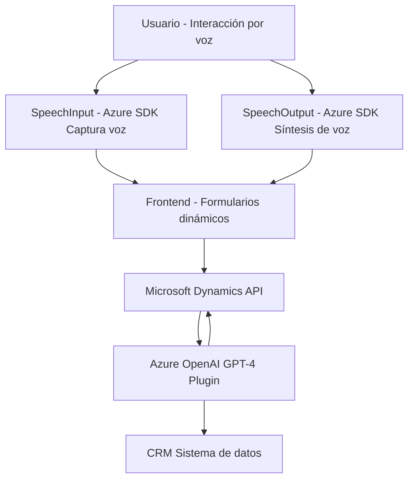

### Breve resumen técnico:
El repositorio contiene tres módulos con elementos distintos:
1. Dos módulos del **Frontend** (en JavaScript) que interactúan con formularios dinámicos y Azure Speech SDK para sintetizar y capturar datos mediante voz.
2. Un **Plugin de Dynamics CRM** (en C#) que utiliza Azure OpenAI GPT-4 para procesar texto según reglas configuradas y devolver resultados en formato JSON.

### Descripción de arquitectura:
La solución sigue una arquitectura **n-capas** para la integración de un sistema de gestión basado en formularios, probablemente relacionado con Microsoft Dynamics CRM. Las tres capas observadas son:
1. **Capa de presentación (Frontend)**: Implementa funcionalidades relacionadas con interacción y automatización de formularios, como entrada y salida de datos mediante voz con Azure Speech SDK.
2. **Capa de negocio (Plugin)**: Implementa lógica personalizada dentro del flujo de trabajo del CRM usando el patrón plugin basado en eventos.
3. **Capa de servicios**: Utiliza Azure Speech SDK y Azure OpenAI GPT-4 como servicios externos, integrándolos mediante APIs REST y SDK.

### Tecnologías usadas:
1. **Frontend (JavaScript)**:
   - **Azure Speech SDK**: Para síntesis y reconocimiento de voz.
   - APIs nativas del navegador (como `window`, `document`).
   - Microsoft Dynamics (`Xrm` namespace): Para consulta y manejo de datos de formularios.

2. **Backend/plugin (C#)**:
   - Microsoft Dynamics SDK (`Microsoft.Xrm.Sdk` y `Microsoft.Xrm.Sdk.Query`): Proporciona conexión con eventos y datos CRM.
   - **Azure OpenAI GPT-4**: Modelos generativos avanzados para transformación de texto.
   - HttpClient: Llamadas HTTP estándar para API REST.
   - **JSON Libraries**:
     - `System.Text.Json` y `Newtonsoft.Json`: Para manejo avanzado de datos JSON.

3. **Arquitectura y patrones**:
   - **Patrón de capa**:
     - Modularización en tres componentes (Frontend, Backend, Integración de servicios externos).
   - **SOA (Arquitectura Orientada a Servicios)**:
     - Fuertes dependencias de servicios externos (Azure Speech SDK, Azure OpenAI).
   - **Enfoque basado en eventos**:
     - En CRM con la implementación de `IPlugin`.
   - **Patrón de Data Mapper**:
     - Asociar datos entre interfaces mediante operaciones de mapeo y normalización (tanto en el Frontend como en el Plugin).

### Dependencias o componentes externos presentes:
1. **Azure Speech SDK**:
   - Funcionalidad para síntesis de voz y análisis de comandos de voz.
2. **Azure OpenAI GPT-4 Service**:
   - Procesamiento avanzado de texto con modelos generativos.
3. **Microsoft Dynamics API**:
   - `Xrm.WebApi` para lectura/escritura de datos en el contexto de formularios.
4. **Librerías estándar de `.NET** y JSON**:
   - `System.Net.Http`, `Newtonsoft.Json`.

### Diagrama Mermaid válido para GitHub:

### Conclusión final:
La solución es un sistema modular diseñado para operar en un entorno administrativo, como Microsoft Dynamics CRM. Utiliza una arquitectura **n-capas** con integración directa entre varios servicios de Azure, gestionando datos de formularios y permitiendo interacción por voz. El uso de patrones como SOA y Data Mapper proporciona una estructura robusta y flexible para extender funcionalidades del CRM mediante lógica personalizada y servicios externos avanzados como Azure Speech SDK y Azure OpenAI.