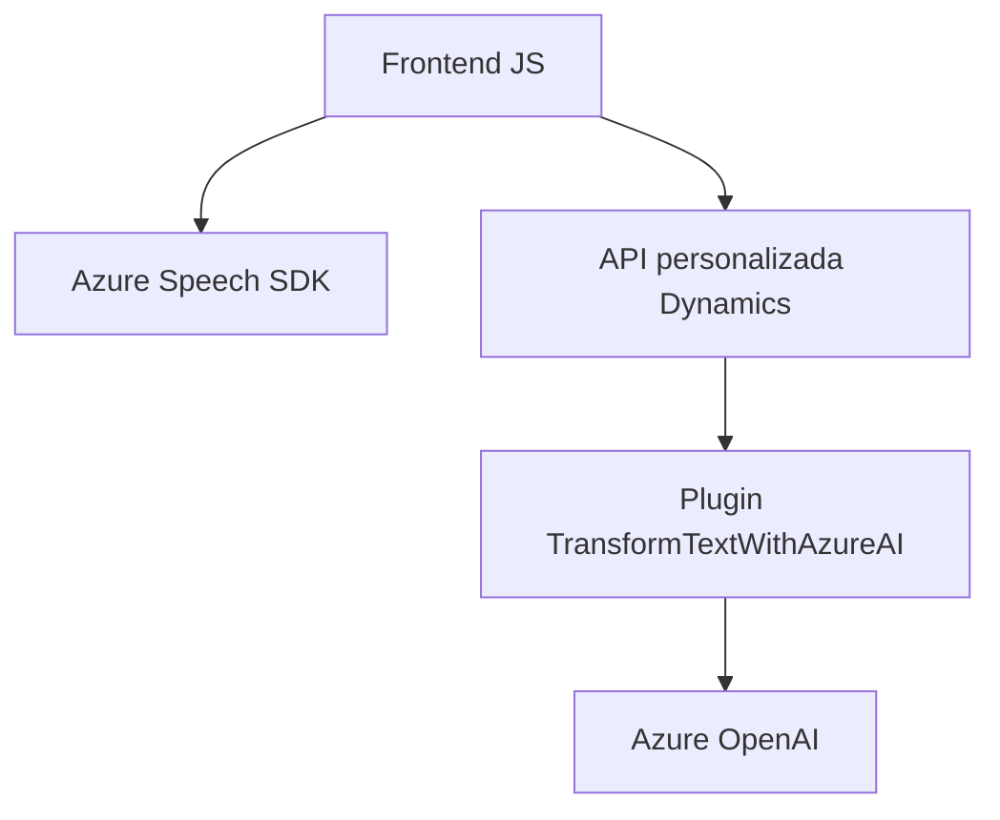

### Breve resumen técnico

El repositorio contiene archivos para una solución que integra la **sistema de procesamiento de formularios** con síntesis y reconocimiento de voz, complementada por un plugin en **Dynamics CRM**. Utiliza servicios de Azure Speech SDK y Azure OpenAI para procesamiento de voz y texto. Este enfoque está diseñado para mejorar la interacción entre el sistema y el usuario mediante un mecanismo voz-formulario. La solución engloba una arquitectura híbrida que conecta APIs, servicios externos y sistema CRM.

---

### Descripción de arquitectura

La solución representa una arquitectura modular basada en **n capas** que incluye las siguientes capas funcionales:
1. **Front-End (interacción usuario-formulario):**
   - Implementación en JavaScript que gestiona reconocimiento de voz desde el cliente utilizando Azure Speech SDK.
   - Manejo de contextos de formularios de Dynamics CRM.

2. **Back-End (plugin Dynamics CRM):**
   - Plugin diseñado para interceptar y ejecutar procesos con datos capturados y procesados por Azure OpenAI.

---

### Tecnologías usadas

1. **Microsoft Azure Speech SDK**:  
   - Reconocimiento y síntesis de voz.
   - Usado en tiempo real para interacción con formularios.

2. **Azure OpenAI**:  
   - Transformación de texto en JSON estructurado según normas configuradas.

3. **Microsoft Dynamics CRM**:
   - API y plugins personalizados para extender la funcionalidad de gestión de procesos empresariales.

4. **JavaScript**:
   - Funcionalidad en cliente para interactuar con formularios.  
   - Uso de API y patrón modular.

5. **C# (Plugins CRM)**:  
   - Implementación de lógica del lado del servidor.
   - Integración con servicios externos (Azure).

---

### Diagrama Mermaid válido para GitHub

---

### Conclusión final

Este repositorio muestra un ecosistema híbrido perfectamente modular con una arquitectura **n capas**, donde:
- El front-end (cliente) facilita interacción avanzada con formularios mediante reconocimiento y síntesis de voz (Speech SDK).
- El back-end aprovecha un plugin en Dynamics CRM para la transformación del texto en formato JSON estructurado a través de Azure OpenAI.
- La integración de servicios externos como Azure refuerza las capacidades cognitiva y auditiva del sistema, logrando ofrecer una UX avanzada y basada en voz.

En resumen, la solución tiene un fuerte enfoque en la extensión de funcionalidades sobre plataformas existentes (Dynamics CRM), con características que facilitan el uso de tecnología avanzada (reconocimiento de voz y transformación de texto) en un contexto empresarial. Es una solución atractiva, escalable e ideal para escenarios interactivos asistidos por IA.