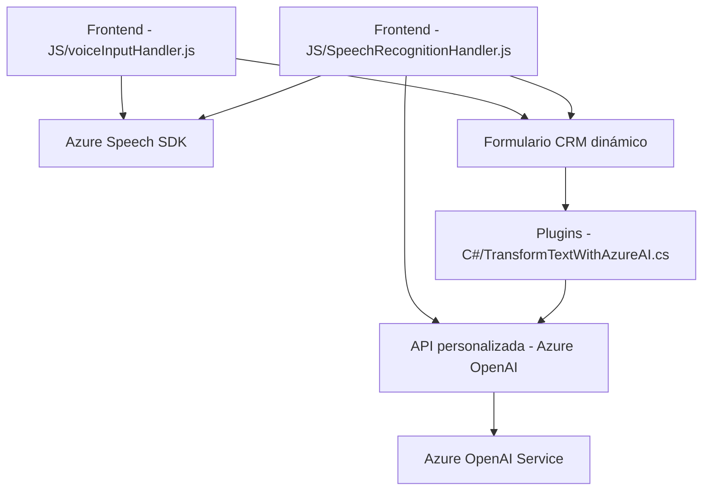

### Breve resumen técnico

Analizando los archivos proporcionados del repositorio, se puede determinar que la solución corresponde a una aplicación híbrida que interactúa con formularios en un entorno CRM, posiblemente **Microsoft Dynamics**, enriquecida con servicios de IA y reconocimiento de voz utilizando **Azure Speech SDK** y **Azure OpenAI Service**. 

La solución parece ser una combinación de tres componentes:
1. **Frontend (JavaScript)**: Interacción con formularios en el navegador, utilizando reconocimiento de voz y síntesis de texto.
2. **Backend API plugin (C#)**: Plugin dentro de Dynamics CRM que conecta con Azure OpenAI Service para procesar texto.
3. **Servicios externos**: Como **Azure Speech SDK** y **Azure OpenAI Service**.

---

### Descripción de arquitectura

La arquitectura de la solución puede considerarse un **modelo en capas** con división clara en tres partes:

1. **Capa de presentación (Frontend):**
   - Proporciona interfaces y lógica para interactuar con formularios dinámicos.
   - Utiliza entradas de voz, las normaliza y comunica los resultados al backend para actualizaciones en el CRM.

2. **Capa de integración/API:**
   - El plugin de Dynamics CRM actúa como middleware, conectando las aplicaciones Dynamics con el servicio de Azure OpenAI. Es responsable del procesamiento de texto estructural y cumplimiento de normas específicas.

3. **Capa de servicios externos:**
   - Recursos externos proporcionados por **Azure**:
     - **Azure Speech SDK**: Para reconocimiento de voz y síntesis de texto.
     - **Azure OpenAI Service**: Procesamiento avanzado de texto.

Estas capas están diseñadas para interactuar de manera asincrónica y modular, siguiendo principios de programación orientada a eventos y **modularización lógica**.

---

### Tecnologías, frameworks y patrones utilizados

#### **Tecnologías/tools/frameworks:**
- **Front-end stack:**
  - **JavaScript** como base para lógica en navegador.
  - **Azure Speech SDK** para reconocimiento y síntesis de voz.
  - **Xrm.WebApi** para integraciones con el backend del CRM.

- **Back-end stack:**
  - **C#** con SDK de Microsoft Dynamics para la ejecución de plugins.
  - **Azure OpenAI Service** para procesamiento de texto con IA avanzada.

#### **Patrones arquitecturales y técnicas:**
1. **Event-driven architecture**: Utilización de callbacks para la programación asincrónica y la respuesta a eventos internos y externos.
2. **Modular Design**: Cada archivo agrupa lógicas específicas. Las funciones están diseñadas para cumplir una responsabilidad única según el principio Single Responsibility.
3. **Factory Pattern**: Generación de configuraciones de servicios en tiempo de ejecución (como las configuraciones de audio/voz con Azure Speech).
4. **Middleware Plugin**: Implementación del patrón de intermediación entre el CRM y servicios externos utilizando el estándar de Dynamics (`IPlugin`).
5. **External Service Integration**: Amplio uso de servicios externos de Azure para tareas como síntesis de voz y procesamiento de IA, integrados mediante interfaces y APIs web.

---

### Dependencias externas

La solución depende de los siguientes componentes:
1. **Azure Speech SDK**: Para reconocimiento de voz y síntesis de texto.
2. **Azure OpenAI Service**: Para análisis semántico y estructuración de texto mediante IA.
3. **Microsoft Dynamics SDK (XRM APIs)**: Utilizado por el plugin para interactuar con los datos del formulario y realizar búsquedas en el backend.
4. **Librerías adicionales para C#:**
   - **Newtonsoft.Json** y **System.Text.Json** para serialización/deserialización de JSON.
   - **System.Net.Http** para realizar solicitudes HTTP.
   - **System.Text.RegularExpressions** para manipulación avanzada de texto.

---

### Diagrama Mermaid

---

### Conclusión final

La solución representa una arquitectura híbrida con características de capas y modularidad. Es adecuada para entornos de integración empresarial como **Microsoft Dynamics**, incorporando funcionalidades inteligentes de IA y reconocimiento de voz que mejoran la experiencia del usuario y automatizan operaciones. Los principales puntos destacables son:
- La dependencia de servicios de Azure, como Speech SDK y OpenAI, muestra una fuerte vinculación con el ecosistema de Microsoft.
- La arquitectura permite una lógica distribuida entre frontend, middleware y servicios externos, pero podría tener desafíos relacionados con la latencia debido a múltiples servicios asincrónicos.
- El uso de plugins en Dynamics CRM permite extender la funcionalidad del sistema de manera estándar.

Esta solución es adecuada para aplicaciones como asistentes inteligentes dentro de CRMs empresariales, actuando como facilitadores para la captura e interpretación de datos en tiempo real.