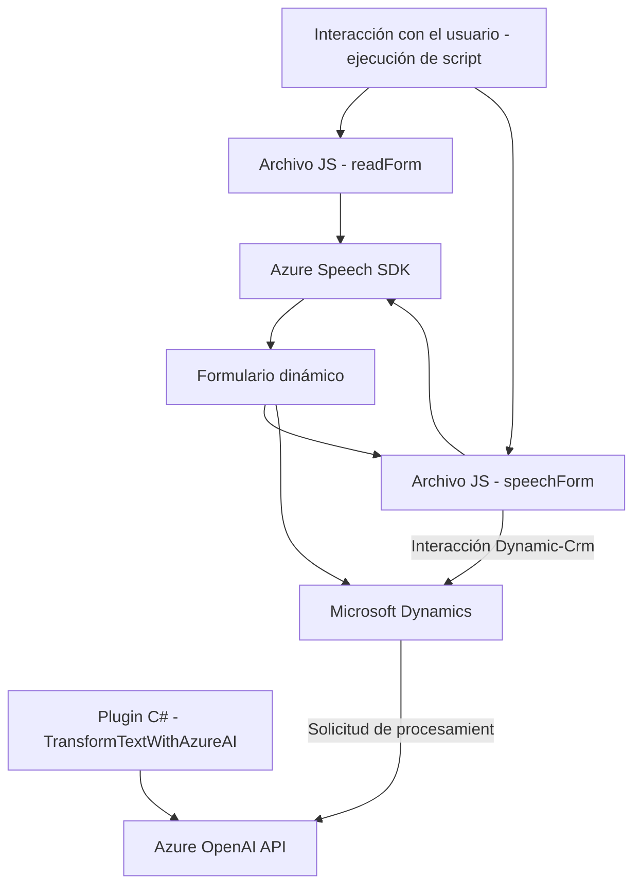

### Breve resumen técnico

Este repositorio consiste en tres archivos principales que muestran integraciones entre Microsoft Azure y Dynamics CRM. Los archivos desarrollan soluciones para interactuar con formularios dinámicos, reconocimiento y síntesis de voz, así como procesamiento de texto usando Azure OpenAI.

---

### Descripción de la arquitectura

La solución combina características del patrón de arquitectura **n capas** con integración de **servicios externos**. Las capas identificadas incluyen:

1. **Capa de presentación**: Archivos JavaScript gestionan el frontend de los formularios interactivos.
2. **Capa de lógica de negocio**: Plugins de Dynamics CRM procesan datos utilizando servicios externos como Azure Speech y OpenAI.
3. **Capa de integración**: Se comunica con APIs y servicios externos como el SDK de Azure Speech y Azure OpenAI API.

Además, los módulos en JavaScript presentan la estructuración modular del código y patrones como Strategy y Facade para procesar atributos en formularios y reconocer/sintetizar voz. El archivo C# está integrado en una solución Dynamics CRM mediante el patrón de Plugin y utiliza una arquitectura que comienza a moverse hacia un microservicio al integrar servicios Azure.

---

### Tecnologías usadas

1. **Frontend (JavaScript):**
   - Azure SDK (Azure Speech).
   - DOM Manipulation.
   - Promises/callbacks.
2. **Backend (.NET/C# Plugin):**
   - Microsoft Dynamics SDK.
   - Azure OpenAI integration (via REST API and HttpClient).
   - JSON manipulation (Newtonsoft.Json.Linq and System.Text.Json).
   
---

### Diagrama Mermaid 

---

### Conclusión final

Esta solución representa una integración entre tecnologías existentes y servicios basados en cloud para enriquecimiento de formularios y procesamiento de datos. La arquitectura utiliza un enfoque **n capas**, con claras divisiones entre las responsabilidades de presentación, lógica de negocio e integración. Sin embargo, es importante destacar que la solución tiene ciertas áreas para mejorar, como la gestión dinamizada de claves y regiones en los archivos JavaScript y una mayor seguridad para los datos sensibles que en este momento están fijados como constantes. La solución está diseñada para aplicaciones con necesidades de automatización e interacción con usuarios y servicios externos.