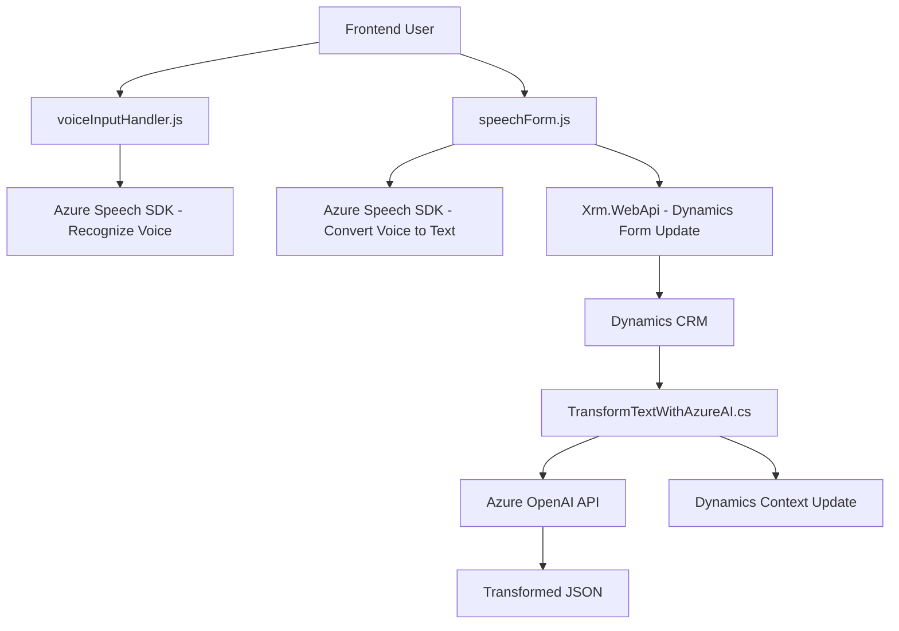

### Breve Resumen Técnico
El repositorio contiene múltiples archivos encargados de implementar funcionalidades específicas relacionadas con el reconocimiento de voz y síntesis de texto en voz, así como la integración con servicios de IA como Azure Speech SDK y Azure OpenAI. Estos archivos están organizados en dos principales áreas: una para el frontend (manipulación de datos y voz en la interfaz) y otra para la lógica de backend (plugin en Dynamics CRM).

### Descripción de Arquitectura
La solución combina una arquitectura híbrida:
1. **Frontend con funcionalidad de voz:**
   - Implementación basada en integraciones con SDK de Azure Speech y manipulación de formularios dinámicos en aplicaciones web.
   - Enfoque procedimental y orientado a funciones para manipular datos y realizar síntesis de voz.

2. **Backend basado en plugins para Dynamics CRM:**
   - Arquitectura extensible mediante el patrón **Plugin/Chain of Responsibility**, procesando eventos del sistema para transformar data utilizando Azure OpenAI.
   - El plugin actúa como un microservicio dentro del contexto específico de Dynamics, delegando tareas de procesamiento de texto en la API Azure OpenAI.

### Tecnologías Usadas
1. **Frontend:**
   - JavaScript, interactuando con el SDK de Azure Speech y APIs de dinámica de formularios.
   - Azure Cognitive Services Speech SDK.
   - Microsoft Xrm.WebApi para trabajar con Dynamics.

2. **Backend:**
   - C# como lenguaje principal.
   - Microsoft Dynamics CRM SDK para extensibilidad plugin.
   - Azure OpenAI API para procesamiento avanzado de texto y generación de JSON estructurado.
   - Herramientas de serialización como `JsonSerializer`.

### Diagrama Mermaid (Válido para GitHub Markdown)

### Conclusión Final
La solución arquitectónica presentada está diseñada para potenciar la usabilidad de los sistemas de formularios de Dynamics CRM con capacidades avanzadas de interacción mediante voz e inteligencia artificial. La integración con Azure Speech SDK en el frontend y Azure OpenAI en el backend refuerza el uso de tecnología cognitiva para mejorar la experiencia, mientras que la estructura modular y de extensibilidad en Dynamics CRM garantiza fácil mantenimiento. El híbrido de procedimientos funcionales en JavaScript con plugins en C# demuestra el potencial de combinar tecnologías para ofrecer un producto robusto y eficiente.