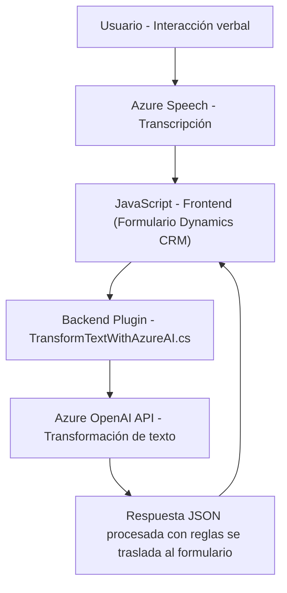

### Breve resumen técnico
El análisis de los archivos sugiere la implementación de una solución que combina la integración de dos componentes principales:
1. **Frontend JavaScript** integrado en un ambiente de Microsoft Dynamics 365 que trabaja con el formulario de dicha plataforma.
2. **Plugin Backend en C#** que extiende la funcionalidad de Dynamics CRM mediante el uso del framework de plugins y se conecta directamente a Azure OpenAI API para procesamiento de texto.

La solución está diseñada para mejorar la interacción entre usuarios y formularios en Dynamics 365, permitiendo entrada de datos a través de reconocimiento de voz y adoptando servicios de transformación avanzados con Azure OpenAI.

---

### Descripción de arquitectura
La arquitectura del proyecto tiene una aproximación *"híbrida-interconectada"*, donde interactúan múltiples componentes interdependientes:
1. **Frontend orientado a funciones**: Organización modular basada en funciones que procesan voz y texto de formularios visibles, dividiendo tareas en submódulos autónomos para mejorar la reutilización y manejo de errores.
2. **Backend de Plugin extensible**: Plugin que sigue la arquitectura de *Plug-in Framework* en Dynamics CRM, encargándose del procesamiento avanzado del texto para la integración de reglas personalizadas con Azure OpenAI API.

La solución aparenta tener una arquitectura de **n capas**, con separación explícita entre la capa de presentación (JavaScript en Dynamics CRM), capa lógica del negocio (Plugin de Dynamics CRM), y una capa de servicios externos en la nube (Azure Speech, Azure OpenAI).

---

### Tecnologías usadas
- **Frontend (JavaScript)**:
  - SDK de Azure Speech: Para sintetizar voz y realizar transcripciones.
  - Dynamics 365 Context API: Para manipular y acceder datos de formularios.
  
- **Backend (C#)**:
  - Microsoft Dynamics SDK (`Microsoft.Xrm.Sdk`): Para la creación y ejecución de plugins en el sistema CRM.
  - Azure OpenAI API: Para procesamiento de texto con Machine Learning.
  - JSON Manipulation:
    - `System.Text.Json` y `Newtonsoft.Json` para manipular y parsear datos.
  - HTTP Client: Para realizar llamadas HTTP a los servicios de Azure.

- **Patrones de diseño identificados**:
  - Diseño basado en módulos funcionales en JavaScript.
  - Abstracción del SDK con funciones de ayuda (como `ensureSpeechSDKLoaded`).
  - Estilo cliente-servidor entre los componentes Frontend, Plugin y servicios externos.

---

### Diagrama Mermaid
El siguiente diagrama representará todos los elementos relevantes de la arquitectura:

---

### Conclusión final
La solución se enfoca en extender Dynamics 365 mediante interacciones basadas en voz y procesamiento inteligente de datos con Azure OpenAI. Su arquitectura de *n capas* está bien estructurada y separa las responsabilidades. Sin embargo, depende críticamente de servicios externos (Azure Speech SDK y Azure OpenAI API) que son claves. Los patrones de diseño como el uso de funciones para modularidad en el frontend y la estructuración alrededor de plugins contribuyen a una solución bien estructurada, aunque la solución podría ser acotada en escenarios sin conexión o fuera de las API principales del proveedor en la nube.

Si se necesitan mejoras, es importante considerar:
1. Robustez ante fallas en la conexión con servicios externos.
2. Pruebas y seguridad sobre las claves API en el entorno de producción.
3. Posible evolución hacia arquitecturas avanzadas como hexagonal.

