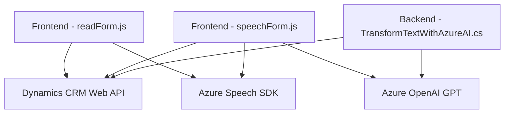

### Breve resumen técnico

El repositorio incluye componentes que implementan interacción con datos de formularios en un entorno CRM (probablemente Dynamics 365) y tecnologías relacionadas con Azure Speech SDK y Azure OpenAI. Estas implementaciones permiten la entrada/salida de voz y la transformación de texto utilizando capacidades de inteligencia artificial. Los archivos analizados muestran integración entre frontend (interacciones por voz), APIs externas (Azure y Dynamics CRM), y un plugin de backend.

---

### Descripción de arquitectura

La solución tiene una arquitectura distribuida que integra las siguientes capas y componentes:
1. **Frontend:** Archivos JavaScript (`readForm.js` y `speechForm.js`) implementan interacción directa con usuarios (entrada/salida de voz) y datos de CRM mediante SDK de voz de Azure. Es modular y basado en eventos asíncronos.
2. **Backend plugin:** `TransformTextWithAzureAI.cs` representa la capa de negocio, integrada al pipeline de eventos del CRM mediante la interfaz `IPlugin`. Usa un patrón centrado en servicios externos (OpenAI y Dynamics API).
3. **Servicios externos:** La arquitectura depende de servicios en la nube, como Azure Speech SDK para síntesis y reconocimiento de voz, Azure OpenAI (transformación de texto por IA), y API de Dynamics CRM para CRUD de datos.

Los patrones clave incluyen:
- **Arquitectura de n capas:** Separación lógica entre frontend, backend y servicios externos.
- **Interacción basada en eventos:** Uso de callbacks y métodos asincrónicos para orquestar los datos y respuestas entre capas.
- **Microservicios y servicios externos:** Enfoque distribuido donde la lógica primaria delega tareas complejas a servicios especializados (Azure Speech, OpenAI).

---

### Tecnologías usadas

1. **Frontend:** JavaScript.
   - Azure Speech SDK para procesamiento de voz (síntesis y reconocimiento).
   - Microsoft Dynamics API para manipulación de formularios (atributos, eventos).

2. **Backend:** C#.
   - Dynamics CRM SDK (`Microsoft.Xrm.Sdk`) para integración en el pipeline de negocio.
   - Azure OpenAI API para transformación y procesamiento de texto.
   - .NET Framework para backend logic.

3. **Patrones arquitectónicos:** 
   - Modularización funcional en JavaScript.
   - Plugin-oriented design para CRM backend.
   - RESTful API calls to Azure services.

4. **Dependencias externas:**
   - Microsoft Azure Speech SDK (voz).
   - Azure OpenAI (GPT-4, procesamiento avanzado de texto).
   - Dynamics CRM Web API (gestión de datos).
   - JSON libraries (`System.Text.Json` y `Newtonsoft.Json.Linq`).

---

### Diagrama Mermaid válido para GitHub

---

### Conclusión final

La solución analizada implementa una arquitectura distribuida y modular adecuada para sistemas CRM. Utiliza a fondo las capacidades de los servicios de nube de Azure (Speech SDK y OpenAI) para gestionar interacción por voz y procesamiento de textos, mientras que el plugin añade lógica de negocio en el backend. Los componentes están diseñados siguiendo principios de diseño como separación de responsabilidades, modularización y lazy loading. La arquitectura se alinea fuertemente con patrones modernos de desarrollo hacia microservicios y servicios API.