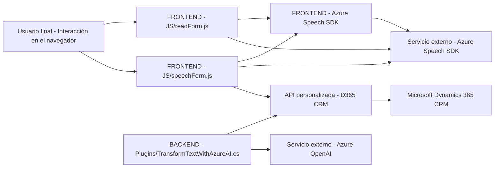

### Análisis General del Repositorio

#### **Breve resumen técnico:**
El repositorio contiene diversos archivos enfocados en la integración de tecnologías de voz y procesamiento de texto con Microsoft Dynamics CRM y el servicio Azure OpenAI. Identificamos varias implementaciones relacionadas con la lectura y procesamiento de formularios, síntesis de voz, transcripción de entrada de audio, interacción con APIs externas y una arquitectura híbrida que combina clientes frontend ricos y backend de plugins.

---

### **Descripción de arquitectura:**
La solución parece estar construida sobre una arquitectura predominantemente **n capas**, dividida en las siguientes capas:
1. **Capa de presentación (Frontend/JS):** Gestiona la interacción del usuario con el sistema mediante formularios en el navegador. Proporciona accesibilidad mediante la conversión de texto a voz y entrada por voz compatible con formulación de campos.
2. **Capa de lógica de negocio (Plugins):** Implementada en C# mediante plugins que ejecutan operaciones específicas al integrar Azure OpenAI. Esto incluye la transformación del texto en JSON para su posterior uso en el CRM.
3. **Capa de servicios externos:** La solución se comunica directamente con servicios de Azure (Azure Speech SDK y Azure OpenAI) y APIs personalizadas en el entorno de Dynamics CRM.

Los artefactos disponibles indican que se sigue un patrón **estrictamente modular**, favoreciendo una **separación de responsabilidades**. La capacidad de cargar dependencias dinámicamente, la interacción con servicios externos y el uso de plugins sugiere un diseño flexible y moderno.

---

### **Tecnologías usadas:**
1. **Frontend:**
   - **JavaScript:** Lenguaje base para implementar la lógica de interacción del cliente.
   - **Azure Speech SDK:** Para síntesis y transcripción por voz.
   - **Microsoft Dynamics CRM (Xrm.WebApi):** Para comunicación con APIs personalizadas del backend del CRM.
   
2. **Backend:**
   - **C# (Microsoft .NET Framework):**
     - Implementación de plugins mediante `IPlugin` de Dynamics CRM.
     - Uso de herramientas estándar como `HttpClient` para consumir APIs.

3. **Servicios externos:**
   - **Azure Cognitive Services Speech SDK:** Para sintetizar texto a voz y realizar transcripciones de voz.
   - **Azure OpenAI Service:** Para transformar texto en esquemas JSON con parámetros específicos establecidos por normas particulares.

---

### **Diagrama Mermaid**

El siguiente diagrama muestra la estructura de la solución y cómo los componentes interactúan:

---

### **Conclusión final:**
Esta solución combina la integración de frontend enriquecido y la lógica de negocio en plugins personalizados con servicios externos avanzados como Azure Speech SDK y OpenAI. Está diseñada para mejorar la accesibilidad (voz, texto-to-voz) y facilita la interacción dinámica con formularios en un entorno de CRM moderno (Dynamics 365). La arquitectura de capas respalda una separación clara y ordenada entre la presentación, el procesamiento de datos y la comunicación con servicios externos. Esto permite escalar la solución y extender sus características fácilmente. Un aspecto positivo adicional es la modularidad y uso adecuado de dependencias dinámicas, demostrando una aplicación bien diseñada para su propósito.