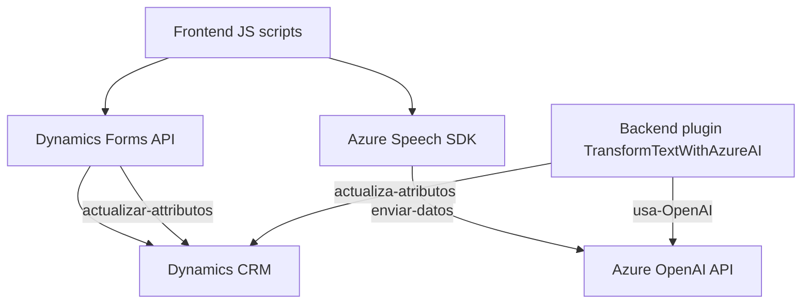

### Breve resumen técnico
El repositorio contiene un conjunto de módulos relacionados con el procesamiento de datos mediante voz y texto utilizando tecnologías de Microsoft Dynamics 365, Azure Speech SDK y Azure OpenAI Services. Los módulos están organizados en tres áreas principales:
1. **Frontend/JS**: Scripts para integración con formularios creados en Dynamics 365, gestionando entrada de datos mediante voz y su síntesis.
2. **Plugins**: Código backend extendiendo Dynamics 365 mediante un plugin que conecta con Azure OpenAI para transformar texto en JSON estructurado.

---

### Descripción de arquitectura
- **Tipo de solución**: La solución integra múltiples capas (backend y frontend) para interactuar con plataformas externas como Azure Speech y OpenAI, funcionando como una extensión personalizada para Dynamics 365.
- **Arquitectura**:
  - **Cliente/Servidor con integración basada en servicios externos**: El frontend se comunica con servicios externos (Azure Speech), mientras el backend utiliza plugin en Dynamics 365 con dependencia hacia Azure OpenAI.
  - **Eventos asincrónicos y en capas**: El frontend (capas de presentación e integración con servicios externos) interactúa con el backend mediante APIs o bibliotecas que encapsulan la lógica empresarial en una arquitectura tradicional de n capas.
  - La estructura general sugiere una **arquitectura multicapa**, ya que la lógica está distribuida entre:
    - **Frontend (JS scripts dentro del contexto del navegador/formulario)**.
    - **Dinámica del backend (implementación del plugin)**.
    - **Servicios externos (Azure Speech SDK y OpenAI)** para ejecutar IA y reconocimiento de voz.

---

### Tecnologías, frameworks y patrones usados
1. **Frontend**:
   - **JavaScript**: Utilizado en scripts para manejo del formulario de Dynamics 365.
   - **Azure Speech SDK**: Para síntesis y reconocimiento de voz.
   - **Async/Await**: Patrones de programación asíncrona para manejar procesos dependientes de servicios externos.
   - **Facade Pattern**: Encapsula la complejidad del SDK externo y las operaciones del formulario en funciones simples como `startVoiceInput`.

2. **Backend (Plugin)**:
   - **Microsoft Dynamics SDK**: Para creación de plugins personalizados en Dynamics CRM.
   - **Azure OpenAI REST API**: Para transformar datos textuales en estructuras JSON específicas.
   - **Newtonsoft.Json**: Biblioteca para manipulación avanzada de estructuras JSON.

3. **Patrones identificados**:
   - **Cliente/Servidor**: Comunicación entre cliente (formularios en navegador) y nube (Azure Speech SDK/OpenAI).
   - **Integración basada en Facade**: Simplificación del acceso a servicios externos mediante abstracciones en funciones como `speakText`.
   - **Separación de Concerns**: Los procesos del frontend y backend están distribuidos claramente en distintas áreas.

---

### Dependencias o componentes externos
1. **Azure Speech SDK**: Biblioteca JavaScript usada en el frontend para síntesis y reconocimiento de voz.
2. **Azure OpenAI Services**: Backend utiliza servicios basados en API REST para implementar transformación AI.
3. **Dynamics CRM API**: Integración con los formularios y atributos del sistema.
4. **Newtonsoft.Json** y **System.Net.Http**: Para manejo de estructuras JSON y solicitudes HTTP desde el backend.

---

### Diagrama Mermaid válido para GitHub

---

### Conclusión final
El repositorio muestra una solución distribuida que combina frontend ajustado para formularios dinámicos, servicios de Azure Speech y OpenAI para capacidades de IA y backend en Dynamics CRM utilizando plugins. La arquitectura sigue un modelo multicapa con integración a servicios externos y división de responsabilidades clara. Es necesario garantizar mejores prácticas en la seguridad del código (por ejemplo, no incluir claves de API directamente), optimizar el manejo de errores, y podría beneficiarse de la documentación más amplia sobre configuración integrada.