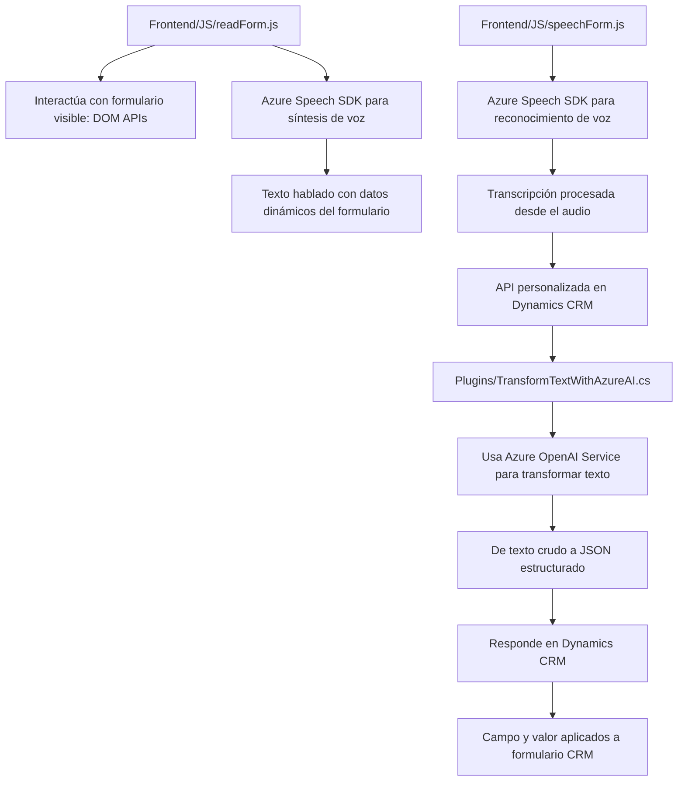

### Resumen Técnico:
La solución presentada es una integración tecnológica centrada en la interacción entre sistemas CRM (Microsoft Dynamics CRM), reconocimiento de voz (Azure Speech SDK) y procesamiento de texto mediante inteligencia artificial (Azure OpenAI). Los archivos describen tanto la interfaz de usuario en frontend como la ejecución en backend. Implica la lectura de datos en tiempo real desde formularios, conversión de voz a texto, comunicación con una API de inteligencia artificial y asignación de campos en el sistema CRM.

---

### Descripción de la Arquitectura:
La arquitectura combina un modelo híbrido de **n capas** para la interacción entre frontend y backend, y **hexagonal** en el plugin del CRM, con interfaces definidas para integrar servicios externos (Azure Speech SDK y OpenAI). El backend complementa el frontend enriqueciendo las opciones de bajo acoplamiento en el manejo de datos entre sistemas, mientras que los diferentes módulos implementan funciones encapsuladas y específicas.

---

### Tecnologías Usadas:
1. **Frontend**:
   - **JavaScript**: Modularización para lógica de lectura de formularios y síntesis de voz.
   - **Azure Speech SDK**: Usado tanto para reconocimiento como síntesis de voz.
   - **Dynamics CRM APIs (`Xrm.WebApi.online`)**: Comunicación con el CRM para manipulación de datos relacionados con el formulario.

2. **Backend**:
   - **C#**: Implementación del plugin orientado a procesamiento de texto.
   - **Microsoft Dynamics SDK (`IPlugin`)**: Desarrollo de plugins para integración directa con CRM.
   - **Azure OpenAI Service**: Usado para transformar texto de forma inteligente.

3. **Patrones de diseño**:
   - **Wrapper/Loader**: Para cargar dinámicamente el Azure Speech SDK.
   - **Plugin Pattern**: En la extensión del CRM.
   - **Observer/Callback**: Para manejar eventos asíncronos (voz y SDK dinámico).
   - **Modularidad**: Separación funcional tanto en frontend como backend.

---

### Dependencias o Componentes Externos:
1. **Azure Speech SDK**:
   - Funcionalidad principal para reconocimiento y síntesis de voz.
   - URL dinámica para carga: `https://aka.ms/csspeech/jsbrowserpackageraw`.

2. **Azure OpenAI Service**:
   - Transformación inteligente de texto. Procesa reglas y transforma contenido en JSON.

3. **Microsoft Dynamics CRM SDK**:
   - Manipulación directa de campos, control de eventos y comunicación con APIs externas.

4. **Newtonsoft.Json y System.Net.Http**:
   - Serialización de datos y llamadas HTTP en el backend.

---

### Diagrama Mermaid:

---

### Conclusión Final:
La solución implementada utiliza una arquitectura híbrida, con un enfoque modular entre frontend y backend, apoyándose en tecnologías avanzadas como Azure Speech SDK y Azure OpenAI para reconocimiento y procesamiento de voz y texto, respectivamente. El diseño es extensible, adecuado para integrar inteligencia artificial en sistemas CRM y optimizar la interacción con datos dinámicos. Además, el uso de dependencias externas y SDK especializados asegura compatibilidad y funcionalidad robusta.