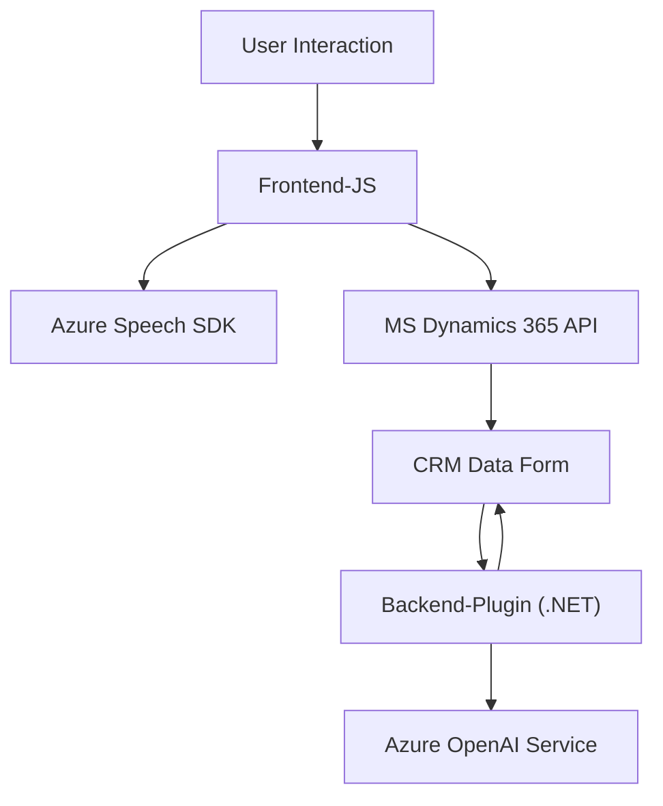

### Breve resumen técnico
El repositorio en cuestión forma parte de un sistema que parece estar diseñado para simplificar las interacciones entre usuarios y Microsoft Dynamics 365 mediante el uso de capacidades de reconocimiento de voz, síntesis de texto y procesamiento avanzado de lenguaje natural. Utiliza el Azure Speech SDK para permitir el reconocimiento y la síntesis de voz, y el servicio Azure OpenAI para transformar texto con IA. La solución está implementada como un conjunto de utilidades front-end en JavaScript y plugins .NET compatibles con Dynamics 365.

---

### Descripción de la arquitectura
La arquitectura del sistema tiene un enfoque híbrido:
1. **Frontend basado en eventos**: Los archivos de JavaScript interactúan directamente con los formularios de Dynamics 365 para manejar eventos y automatizar tareas relacionadas con registros y datos presentados al usuario. Esto refleja un patrón de aplicación centrada en eventos.
2. **Plugin de Dynamics 365**: Implementa una **arquitectura basada en plugins** dentro del ecosistema CRM, en el que lógica de negocio personalizada se ejecuta en respuesta a eventos del sistema CRM.
3. **Utilización de servicios externos**: La integración con APIs externas, como el servicio Azure Speech SDK y Azure OpenAI, utiliza el patrón de integración de API para delegar procesamiento.

Globalmente, este conjunto de utilidades sugiere un enfoque arquitectónico de **n capas** orientado a eventos, donde la capa de presentación (JavaScript) depende directamente de la capa lógica de negocio proporcionada por los plugins en el CRM.

---

### Tecnologías usadas
1. **Frontend (JavaScript)**:
   - Utilización directa del SDK de Azure Speech para trabajar con reconocimiento de voz.
   - Operaciones directamente integradas con el contexto de Dynamics 365 (`Xrm.Page` o `executionContext`) y su API de datos `Xrm.WebApi`.

2. **Backend (.NET)**:
   - **IPlugin**: Patrón específico para Dynamics 365, configurando la lógica personalizada que interactúa con el contexto de ejecución del CRM.
   - **Microsoft.Xrm.Sdk**: Framework estándar para desarrollo de plugins en Dynamics 365.
   - **Azure OpenAI (GPT-4)**: Sirve para manejar textos de entrada mediante normas predefinidas y devolver una salida estructurada.

3. **Patrones de diseño**:
   - **Observer**: Para funciones que reaccionan a eventos dentro de los formularios de Dynamics 365.
   - **Integration Pattern**: Uso de APIs externas como Azure Speech SDK y Azure OpenAI para realizar tareas específicas.
   - **Modularidad**: Código estructurado en funciones y clases para una alta cohesión y bajo acoplamiento.

---

### Dependencias o componentes externos
1. **Azure Speech SDK**:
   - Reconocimiento y síntesis de voz.
   - Cargado dinámicamente desde una URL pública.

2. **Azure OpenAI**:
   - Transformación de texto utilizando modelos avanzados (GPT-4) bajo las normas definidas.

3. **Microsoft Dynamics 365 Web API**:
   - Acceso y modificación a los datos de formularios y registros mediante técnicas asincrónicas y solicitudes API.
   
4. **Externas del backend**:
   - Newtonsoft.Json para manejo de JSON.
   - System.Net.Http para solicitudes HTTP.
   - System.Text para codificación de texto.

---

### Diagrama Mermaid

---

### Conclusión final
El sistema representado en el repositorio tiene como objetivo mejorar la interacción entre Dynamics 365 y el usuario mediante reconocimiento y síntesis de voz, junto con funciones de NLP. La arquitectura de n capas basada en eventos permite la separación lógica y el manejo ágil de los datos y eventos del formulario. Adicionalmente, la integración directa con servicios como Azure Speech SDK y Azure OpenAI asegura una solución robusta y moderna que puede escalar fácilmente y adaptarse a nuevas necesidades del negocio.