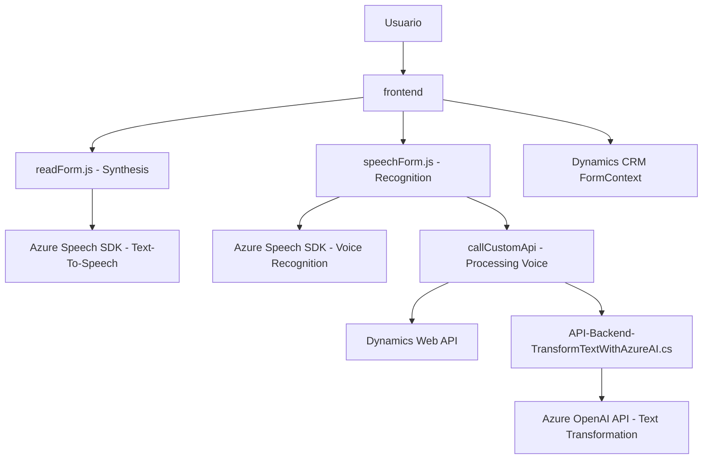

# Análisis Técnico Detallado del Repositorio

### Breve Resumen Técnico:
Este repositorio parece implementar una solución orientada a la interacción con formularios de Dynamics 365 utilizando reconocimiento de voz, síntesis de texto a voz y transformación de datos mediante Azure AI. La solución abarca funcionalidades para capturar datos desde un formulario demostrado en un entorno de Dynamics, actualizarlos dinámicamente y sintetizarlos como audio. Además, utiliza un plugin para extender la funcionalidad de Dynamics 365, conectándose a Azure OpenAI para realizar transformaciones avanzadas de texto.

---

### Descripción de Arquitectura:
La solución tiene características de arquitectura **event-driven** y **n-capas**, organizadas como sigue:

1. **Event-driven architecture**:
   - Se basa en la ejecución de procesos según eventos: la interacción por voz del usuario, la carga del SDK de Azure Speech, la generación de transcripciones, la aplicación de datos al formulario y la respuesta del plugin.

2. **Soporte multi-capas**:
   - El frontend implementa funcionalidades en JavaScript para la síntesis de voz y captura de datos. El backend incluye un plugin **backend-oriented** usando C# para Dynamics 365, lo que implica una arquitectura de **n-capas**: separación vaga entre presentación (frontend), capa de negocio representada por el plugin, y acceso a datos manejado por el `IOrganizationService`.

3. **Integración de servicios externos**:
   - Llama a APIs como Azure Speech SDK y Dynamics Web API desde el cliente (frontend) y al servicio Azure OpenAI desde el plugin del backend. La arquitectura se orienta a tareas de **microservicios**, pero el uso no está completamente desacoplado (los servicios aún dependen directamente del contexto/formulario específico de Dynamics 365).

---

### Tecnologías y Frameworks Usados:
1. **Frontend**:
   - **JavaScript**:
     - Central para la interacción web.
     - Manejo de eventos y SDK de Azure Speech.
   - **Azure Speech SDK**:
     - Utilizado para funcionalidades de reconocimiento y síntesis de voz.
   - **Dynamic 365 Contextual APIs**:
     - Facilita la interacción directa con formularios y datos de Dynamics 365.
2. **Backend**:
   - **C#**:
     - Implementa la lógica de backend mediante plugins para Dynamics.
   - **Microsoft Dynamics SDK**:
     - Interactúa con el servicio CRM.
   - **Azure OpenAI API**:
     - Transformación avanzada del texto proporcionado por el usuario.
3. **Configuración y Lógica Compartida**:
   - **System.Net.Http** y **System.Text.Json**:
     - Facilitan las solicitudes HTTP y la manipulación JSON.
   - **Newtonsoft.Json.Essentials** (opcional para JSON avanzado).

---

### Dependencias o Componentes Externos:
1. **Azure Speech SDK**:
   - Reconocimiento y síntesis de voz.
2. **Dynamics Web API**:
   - Comunicaciones, búsqueda y aplicación de datos al formulario.
3. **Azure OpenAI API**:
   - Extensión del sistema Dynamics con transformación avanzada de texto.
4. **Plugins SDK Dynamics 365**:
   - Plugin basado en "IPlugin" para adaptación directa en el CRM.

---

### Diagrama Mermaid 100% Compatible para GitHub Markdown:

---

### Conclusión Final:
Esta solución implementa principalmente funcionalidades centradas en formularios de Dynamics 365, extendiéndolos hacia interacciones modernas como reconocimiento y síntesis de voz, además de procesamiento avanzado con IA. Sus patrones incluyen **modularidad**, integración con **servicios externos** como Azure Speech SDK y OpenAI, y una arquitectura **n-capas ligeramente orientada a eventos**.

El código está bien estructurado para su propósito, pero hay áreas de mejora:
- Externalizar claves sensibles para seguridad.
- Considerar desacoplar funcionalidad haciendo uso de diseño modular más robusto para implementar microservicios reales.
- Implementar gestión refinada de errores y de datos sensibles en las peticiones a APIs externas.