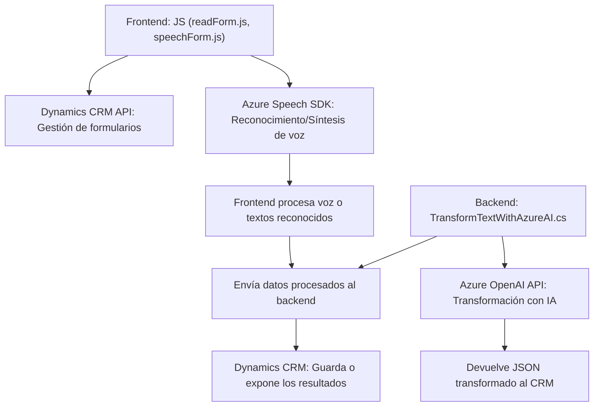

### Breve resumen técnico:
El repositorio analiza una arquitectura que integra **Azure Speech SDK** y **Azure OpenAI API** con **Microsoft Dynamics 365**. Incluye archivos para el frontend (JavaScript) y un plugin en C# para transformar textos con IA. El sistema aborda accesibilidad y automatización mediante reconocimiento y síntesis de voz, además de integración con una CRM.

---

### Descripción de arquitectura:
1. **Arquitectura general:**  
   El repositorio sigue una arquitectura **n Layers** con funciones separadas para frontend (interacción y reconocimiento de voz), backend (procesamiento y almacenamiento de textos reconocidos) e integración con **Azure Services**.  
   Además, la implementación del plugin en C# aborda características de Dynamics CRM mediante el **Plugin Pattern**.

2. **Capas identificadas:**
   - **Frontend:** Con módulos en JS que manejan la interacción de usuario, reconocimiento de voz, síntesis y entrada de datos.
   - **Backend:** Plugin que conecta Dynamics CRM con servicios de IA en Azure, delegando la transformación de textos.
   - **Servicios externos:** Uso de Azure Speech SDK y Azure OpenAI API para funciones de reconocimiento de voz y procesamiento de texto con IA.

3. **Patrones arquitectónicos:**  
   - **SOA (Service-Oriented Architecture):** Integración declarada con servicios externos como Azure Speech SDK y Azure OpenAI API.  
   - **Plugin Pattern:** Implementación modular dentro de Dynamics CRM mediante el plugin que hace uso de `IPlugin`.  
   - **Event-Driven/Observable:** La interacción del reconocimiento de voz inicia procesos asíncronos basada en eventos (callbacks y listeners).  
   - **Modularidad:** Todos los archivos tienen responsabilidades independientes, facilitan escalabilidad y mantenimiento.

---

### Tecnologías usadas:
1. **Frontend:**  
   - **JavaScript** para manipulación de formularios e integración con `Azure Speech SDK`.  
   - **Dynamics CRM API** para acceso y manipulación de entidades CRM (Xrm.Page, Xrm.WebApi).  

2. **Backend:**  
   - **C#** como lenguaje principal para el plugin de Dynamics CRM.  
   - **Dynamics CRM SDK** para ejecución dentro de eventos de CRM.  

3. **Servicios externos:**  
   - **Azure Speech SDK**: Reconocimiento y síntesis de voz.  
   - **Azure OpenAI API**: Procesamiento y transformación textual con IA.

4. **Dependencias:**  
   - **System.Net.Http** y **System.Text.Json** para comunicación directa con APIs en el plugin backend.  

---

### Diagrama Mermaid:

---

### Conclusión final:
El repositorio implementa una solución integrada con tecnologías modernas para facilitar accesibilidad y automatización dentro de Dynamics CRM. Utiliza un enfoque modular con frontend (JS) y backend (C#) trabajando sobre una arquitectura **n capas**, adoptando patrones como SOA y Plugin Pattern. El uso de servicios externos, como Azure Speech y OpenAI, potencia funciones avanzadas como síntesis de voz y procesamiento textual inteligente. Esta solución es ideal para escenarios donde la interacción con formularios en CRM necesita soportar accesibilidad o procesamiento natural del lenguaje.