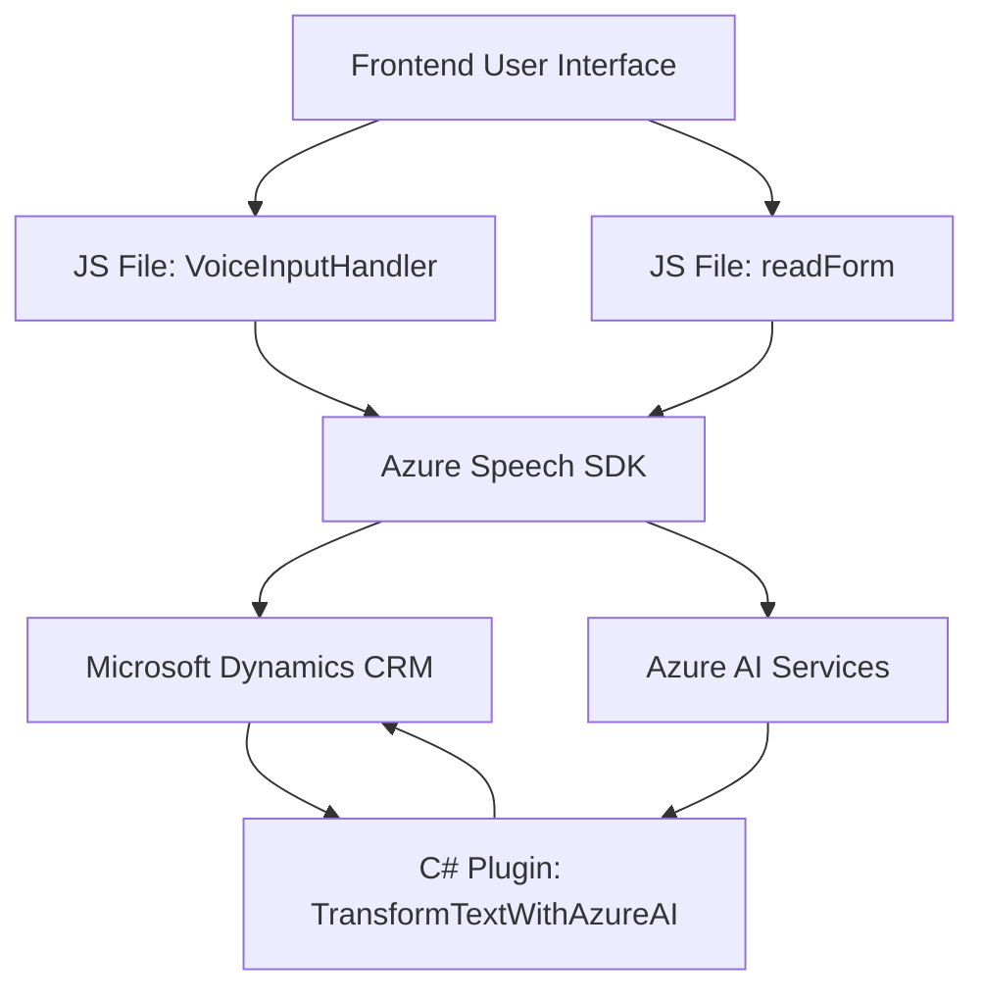

### Breve Resumen Técnico
El repositorio presenta una solución que integra tres componentes principales:
1. **Frontend**: Archivos JS (`readForm.js` y `voiceInputHandler.js`) para la interacción con formularios dinámicos en aplicaciones web, con capacidades de síntesis de voz y reconocimiento de voz vía Azure Speech SDK.
2. **Backend Plugin**: Archivo C# (`TransformTextWithAzureAI.cs`), diseñado como un plugin para Dynamics CRM, que utiliza Azure OpenAI (GPT-4) para transformar texto ingresado en JSON estructurado.
3. **Service Integration**: Comunicación bidireccional con servicios externos, especialmente Azure Speech SDK y Azure OpenAI (GPT-4).

### Descripción de Arquitectura
La arquitectura de la solución persigue un enfoque híbrido:
- **Frontal**: La interacción con usuarios se realiza desde un módulo frontend que gestiona operaciones localizadas (JS).
- **Backend CRM Plugin**: Un plugin desarrollado para Microsoft Dynamics CRM ejecuta lógica basada en eventos del contexto de ejecución. Este plugin opera con el patrón Plugin Architecture.
- **Service-Oriented Architecture (SOA)**: Utiliza servicios externos (Azure Speech SDK y Azure OpenAI API) como fuentes primarias de funcionalidad.

En términos de diseño global, la solución se divide en **dos capas principales**:
- **Frontend Layer**: Gestiona la interacción con el usuario y eventos en tiempo real.
- **Backend Layer**: Encargada de realizar traducciones complejas con Azure OpenAI y manipular la base de datos CRM.

La arquitectura puede considerarse **2 capas (n-tier)**:
1. **Presentation Layer**: (JS frontend) Implementada con una orientación funcional y basada en eventos del contexto del formulario.
2. **Service Layer**: (Azure Speech/OpenAI + Dynamics 365 Plugin). Proporciona procesamiento de API y lógica de negocio en segundo plano.

### Tecnologías Usadas
1. **Frontend**:
   - JavaScript.
   - Azure Speech SDK.
   - Microsoft Dynamics 365 JS SDK (`Xrm.WebApi`).

2. **Backend Plugin**:
   - Microsoft Dynamics CRM SDK.
   - Azure OpenAI API (GPT-4).
   - C#.
   - JSON Manipulation Libraries (`Newtonsoft.Json.Linq`, `System.Text.Json`).

3. **Servicios Externos**:
   - Azure OpenAI (`gpt-4`) para procesamiento de texto.
   - Azure Speech SDK para síntesis y reconocimiento de voz.

4. **Patrones Usados**:
   - Callback Pattern for SDK loading.
   - Service-Oriented Architecture (SOA).
   - Plugin Architecture en Dynamics CRM.
   - Event-Driven Architecture en el frontend.

### Diagrama Mermaid

### Conclusión Final
La solución presentada es un software basado en una arquitectura de **2 capas (frontend-backend)**, altamente dependiente de servicios externos de Azure. El Frontend está basado en JavaScript y se centra en la interacción con el usuario mediante eventos en formularios web, así como en la síntesis y reconocimiento de voz a través del Azure Speech SDK. Por su parte, el backend aprovecha el ecosistema de Dynamics CRM mediante plugins basados en la arquitectura estándar `IPlugin`. La integración con **Microsoft SaaS services** como Azure OpenAI y Azure Speech SDK permite extender las capacidades básicas de Dynamics CRM, ideal para entornos que usan estas herramientas comerciales y buscan enriquecer su funcionalidad mediante inteligencia artificial y manejo avanzado de voz.