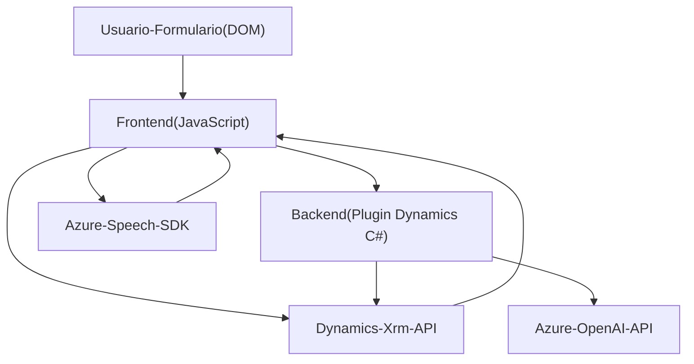

### Breve Resumen Técnico

El repositorio combina múltiples archivos orientados a la integración de tecnologías de Microsoft Dynamics CRM con servicios de Azure, principalmente Speech SDK y OpenAI, para ofrecer soluciones avanzadas de interacción con el usuario mediante entrada y salida de voz, junto con procesamiento mediante inteligencia artificial.

Los archivos principales (`readForm.js`, `speechForm.js` y `TransformTextWithAzureAI.cs`) demuestran un enfoque modular y orientado a servicios externos, implementando funciones de lectura de datos visuales de formularios, transcripción de voz a texto, síntesis de voz y transformación de texto-enriquecido mediante Azure AI.

---

### Descripción de Arquitectura

La arquitectura general puede clasificarse como **n-capas orientada a servicios**. La estructura sugiere la siguiente organización:

- **Frontend** (JavaScript): 
  - Orientado al usuario, captura datos mediante interacciones en el formulario, entrada por voz y generación de voz sintetizada.
  - Incluye integración con APIs externas como Azure Speech y Dynamics CRM, quien actúa como el "backend".
  
- **Backend (Plugins C# en Dynamics CRM)**:
  - Realiza transformaciones complejas de texto utilizando Azure OpenAI y reacciona a eventos CRM a través del modelo de plugins.

- **Integración con Servicios Externos**:
  - El sistema utiliza SDKs y APIs externas (Azure Speech, Azure OpenAI) como tecnologías fundamentales para brindar funcionalidad avanzada como síntesis de voz, transcripción y transformación inteligente del texto.

La arquitectura también adopta un patrón de **event-driven programming**, optimizando las operaciones del cliente (JavaScript) y el servidor (plugin), permitiendo comunicación fluida entre Dynamics CRM y los servicios de Azure.

---

### Tecnologías, Frameworks y Patrones Usados

1. **Frontend**:
   - **JavaScript nativo**: Manipulación del DOM y flujo lógico.
   - **Azure Speech SDK**: Para síntesis de voz y transcripción.
   - **Dynamics Xrm.WebApi**: Para llamadas API personalizadas en Dynamics CRM.
   - **Patrones**:
     - **Separación de responsabilidades**: Funciones claras para carga dinámica del SDK, extracción de datos de formularios y mapeo de valores.
     - **Event-driven**: Uso de funciones dinámicas que reaccionan a eventos de carga y procesamiento.

2. **Backend**:
   - **C# Plugin para Dynamics CRM**:
     - **Microsoft.Xrm.Sdk**: Para integración con Dynamics CRM.
     - **Azure OpenAI API**: Para procesar texto con aprendizaje profundo.
   - **Patrones**:
     - **Plugin Architecture**: Estandarizado para extensiones en Dynamics CRM.
     - **Modularidad**: Separación de lógica de negocio (procesamiento de texto) de llamadas externas (API Azure).

---

### Dependencias y Componentes Externos

1. **Azure Speech SDK**:
   - Sintetización y transcripción de audio en tiempo real.
   - Dependencia explícita en archivos frontend.

2. **Dynamics CRM API**:
   - Manipulación de formularios y datos del CRM desde frontend (JavaScript) y backend (plugin).

3. **Azure OpenAI API**:
   - Utilizada por el plugin para convertir texto en datos formateados u ordenados según reglas específicas.

4. **Librerías C#**:
   - `Newtonsoft.Json.Linq`: Manipulación y parseo JSON.

5. **Servicios del Navegador**:
   - Micrófono para capturar voz.
   - Carga dinámica de scripts para SDKs.

---

### Diagrama Mermaid

---

### Conclusión Final

Este repositorio implementa una solución n-capas orientada a servicios, combinando frontend interactivo con voz (JavaScript) y backend extensible (plugin en Dynamics CRM). Aprovecha la integración de SDKs y APIs como Azure Speech SDK y Azure OpenAI para entregar una experiencia enriquecida al usuario.

Las tecnologías y patrones adoptados, como separación de responsabilidades, modularidad y orientación hacia servicios, hacen que este proyecto sea altamente extensible, reutilizable y apto para escenarios interactivos avanzados en entornos corporativos.