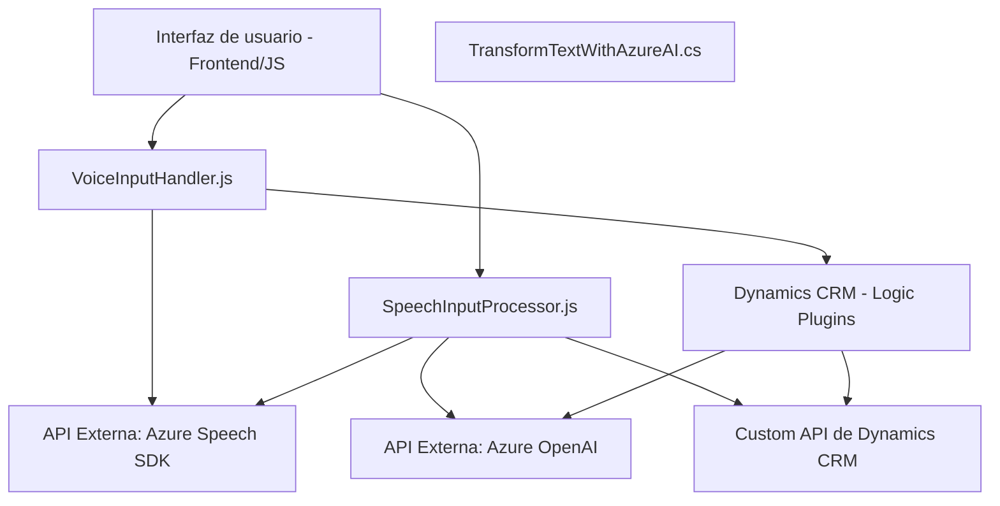

### Breve Resumen Técnico
Este repositorio contiene tres archivos clave que implementan un sistema de interacción de voz, procesamiento de formularios y transformación de texto, integrados con Microsoft Dynamics CRM y Azure AI services. En esencia, es una solución basada en **API** y funcionalidades frontend que permite la creación de un sistema de voz para lectura, ingreso y procesamiento de datos en formularios desde una plataforma de CRM.

---

### Descripción de la Arquitectura
La arquitectura de esta solución puede ser caracterizada como una **modularización en múltiples capas** combinada con la integración de APIs externas:

1. **Capa frontend (FRONTEND/JS):**
   - En `VoiceInputHandler.js` y `SpeechInputProcessor.js`, se observan todas las acciones relativas al cliente: lectura de formularios, captura de entrada de voz mediante el SDK de Azure Speech y comunicación con el backend (custom plugin y API).
   - Funcionalidad clave: lectura de textos y entrada de datos en formularios usando voz y sistema de reconocimiento de texto.

2. **Capa backend (Plugins/TransformTextWithAzureAI.cs):**
   - Este plugin se encarga de procesar los datos directamente en Dynamics CRM. Contiene lógica de negocio avanzada que transforma texto ingresado con ayuda de Azure OpenAI y envía respuestas estructuradas a la capa superior.
   - Funcionalidad clave: procesamiento avanzado de texto mediante IA.

**Patrones de Arquitectura Implementados:**
- **MVC/Organización en capas:** Separación clara entre la interfaz de usuario (Frontend), procesamiento de lógica de negocio (backend y plugins), y servicios externos (Azure Speech SDK y Azure OpenAI).
- **SDK Integration Pattern:** Integración de SDKs para recomposición de información de formularios a nivel cliente y servidor.
- **Event-Driven Architecture:** Eventos basados en el `executionContext` guían las interacciones entre usuario, formularios y servicios.
- **Microservicios:** Integración directa con APIs externas para funcionalidades específicas (e.g., Azure Speech SDK, Azure OpenAI).

---

### Tecnologías Usadas
1. **Lenguajes de Programación:**
   - **JavaScript:** Usado en el frontend para manejar formularios y servicios web con Azure Speech SDK.
   - **C#:** Orientado a la lógica de negocio y desarrollo de plugins para Dynamics CRM.

2. **Frameworks y Dependencias:**
   - **Azure Speech SDK:** Facilitación de síntesis y reconocimiento de voz.
   - **REST API (Azure OpenAI):** Comunicación con servicios externos basados en IA.
   - **Dynamics CRM SDK:** Para interacción directa con los formularios y datos de la plataforma CRM.
   - **System Libraries:** E.g., `HttpClient` para consumo de APIs REST, `Newtonsoft.Json` para estructura de JSON.

3. **Servicios y Componentes Externos:**
   - **Microsoft Azure Speech SDK** para reconocimiento y síntesis de voz integrado.
   - **Azure OpenAI API** para transformar texto basado en normas.
   - **Custom APIs de Dynamics CRM** para procesamiento específico en backend.

---

### Diagrama Mermaid

---

### Conclusión Final
Este repositorio implementa una solución avanzada orientada a la interacción entre voz y texto que proporciona accesibilidad y funcionalidad rica en la plataforma Dynamics CRM. Utiliza arquitecturas en capas, modularización y patrones de integración de SDK para lograr adaptabilidad. Por otro lado, incluye herramientas modernas de IA con enfoque en el servicio externo de Azure. Es ideal para escenarios personalizados como formularios accesibles, procesamiento de datos mediante voz y asistencia basada en inteligencia artificial.