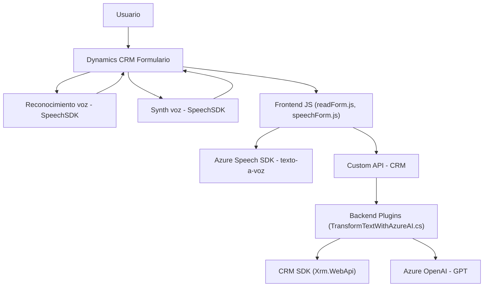

### Breve resumen técnico

El repositorio parece estar orientado a una solución integrada de Microsoft Dynamics CRM con funcionalidades de reconocimiento y síntesis de voz, además de procesamiento de texto vía Azure AI/OpenAI. Se presentan tres componentes principales:

1. **Frontend (JavaScript):** Módulos que interactúan con formularios y servicios de voz, incluyendo:
   - Azure Speech SDK para reconocimiento y síntesis.
   - APIs de Dynamics CRM (Xrm.WebApi) para interacción con formularios dinámicos.
2. **Backend (C#):** Plugins para Dynamics CRM implementando un método de transformación de texto usando Azure OpenAI.
3. **Integraciones:** Servicios externos como Azure Speech SDK y Azure OpenAI que procesan datos.

---

### Descripción de arquitectura

Se detectan varias capas en esta solución:

- **Frontend:** Composición modular de scripts JavaScript que integran lógica de procesamiento con servicios externos (Azure Speech SDK) y comunican los datos con formularios de Dynamics CRM.
- **Backend:** Plugin basado en la arquitectura extensible de Dynamics CRM que utiliza servicios externos como Azure OpenAI para transformar texto desde entradas del sistema CRM.
- La solución opera parcialmente dentro de una **n-capas** donde las responsabilidades están distribuidas entre frontend (interacción de usuarios y formularios) y backend (procesamiento y respuesta del servicio API), pero con elementos de arquitectura **Plugin-based**, dada la integración profunda en Dynamics CRM.

---

### Tecnologías usadas
1. **Frontend:**
   - **JavaScript:** Lenguaje principal del cliente.
   - **Azure Speech SDK:** Reconocimiento y síntesis de voz.
   - **Xrm.WebApi:** Operaciones con Dynamics CRM.
2. **Backend:**
   - **C# (ASP.NET):** Desarrollo de plugins.
   - **Microsoft Dynamics CRM SDK:** Para registrar y actuar como plugin.
   - **Azure OpenAI Service:** Procesamiento de texto con modelos IA como GPT.
   - **HttpClient, System.Text.Json:** Para realizar solicitudes y procesar respuestas.

3. **Patrones:**
   - **Patrón de inicialización dinámica:** En los archivos JavaScript mediante funciones como `ensureSpeechSDKLoaded`.
   - **SRP (Single Responsibility Principle):** En el diseño de funciones y clases.
   - **Plugins para CRM:** Permite ampliar dinámicamente el comportamiento del sistema CRM.
   - **Integración de Servicios (Facade):** Simplificación de comunicaciones con APIs externas.

---

### Diagrama Mermaid (GitHub Markdown-compatible)
El siguiente diagrama presenta las relaciones entre los componentes y dependencias de la solución:

---

### Conclusión final

**Tipo de solución:** Esta arquitectura define una solución integrada que usa capacidades de Microsoft Dynamics CRM, con extensiones de IA y voz. Puede clasificarse como una integración multi-tecnología: API + componentes frontend y plugins backend.

**Arquitectura:** Predominantemente de tipo **n-capas** con elementos de **plugin-based architecture** y **servicios externos**.

**Dependencias externas:**
- Azure Speech SDK para reconocimiento y síntesis de voz.
- Azure OpenAI para transformación de texto.
- Microsoft Dynamics CRM SDK y Xrm.WebApi.

La separación de responsabilidades y la integración con servicios externos son puntos fuertes de la arquitectura, mientras que la gestión de dependencias sensibles como claves de API (ej., en `TransformTextWithAzureAI.cs`) requiere mayor cautela para practicidad y seguridad.