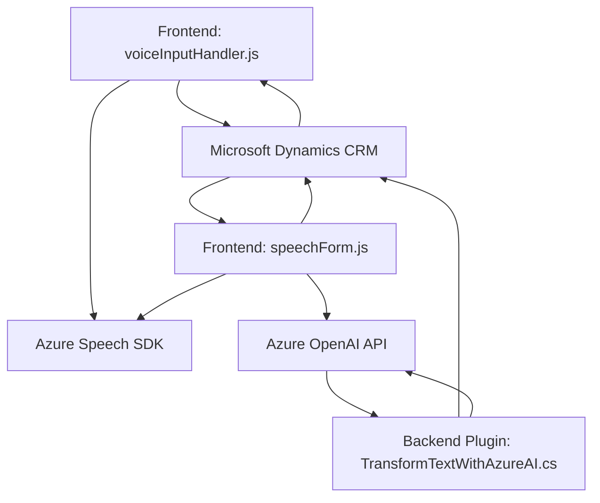

### Breve resumen técnico

El repositorio parece estar compuesto por archivos relacionados con un sistema CRM ampliado con capacidades de integración hacia servicios de Azure, en particular **Azure Speech SDK** y **Azure OpenAI service**. Los scripts en JavaScript trabajan en el frontend del CRM, gestionando la captura de datos de formularios, síntesis y reconocimiento de voz, así como la interacción con servicios externos. Por otro lado, existe un archivo en C# que implementa un plugin que interactúa directamente con el Sistema CRM de Microsoft Dynamics y la API de Azure OpenAI para realizar transformaciones de texto a JSON.

---

### Descripción de arquitectura

1. **Tipo de solución:**  
   - La arquitectura global parece responder a un **modelo híbrido** con dos componentes interconectados:  
     - **Frontend (JavaScript):** Procesa datos de formularios CRM, realiza reconocimiento de voz y síntesis, y comunica con servicios externos.  
     - **Backend (C# Plugin):** Amplia la lógica del negocio en el CRM, procesando transformaciones mediante servicios de IA.

2. **Tipo de arquitectura:**  
   - **CRM Extensible:** Una arquitectura especializada en extensibilidad del CRM, que combina plugins del backend (lógica empresarial) y scripts frontend.  
   - Patrón: **N-capas**. El código está dividido claramente en layers (presentación, lógica de negocio y almacenamiento/integración de datos).

3. **Patrones principales:**  
   - **Integración de servicios externos:** Comunicación con **Azure Speech SDK** y **Azure OpenAI**.  
   - **Plugin Pattern:** Implementación del `IPlugin` para personalizar la lógica CRM.  
   - **Procesamiento condicional:** En el frontend, lógica condicional entre "manual" e "inteligencia artificial".

---

### Tecnologías usadas

1. **Frontend (JavaScript):**  
   - **Azure Speech SDK:** Procesamiento de voz para síntesis y reconocimiento.  
   - **Contexto Dynamics API:** Para manipular datos en formularios CRM.  

2. **Backend (C# .NET Framework):**  
   - **Azure OpenAI**: Transformación avanzada de texto (GPT-4).  
   - **Microsoft Dynamics CRM SDK:** Extensibilidad del sistema mediante plugins.  

3. **Otros:**  
   - **JSON/HTTP:** Manejo de peticiones y respuestas al servicio de Azure OpenAI.  

---

### Diagrama Mermaid

---

### Conclusión final

La solución reúne componentes frontend y backend para extender funcionalidades de un **Microsoft Dynamics CRM**, integrando servicios avanzados de Azure para procesamiento de voz e IA. Esto permite la automatización parcial de tareas de gestión de formularios CRM basadas en voz y transformaciones de texto. Aunque funcional, el manejo de claves API directamente en el código presenta un posible reto de seguridad que debería ser revisado. La arquitectura está alineada con estándares de extensibilidad en sistemas CRM, haciendo uso de tecnologías modernas para interacción SaaS y procesamiento de datos.