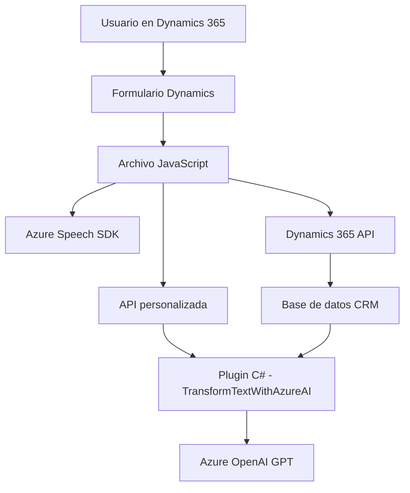

## Breve resumen técnico

Este repositorio describe una solución basada en múltiples componentes que integran Microsoft Dynamics 365, Azure Speech SDK y Azure OpenAI Services para la generación, captura, transformación y procesamiento de texto y datos mediante inteligencia artificial y voz. Incluye archivos JavaScript para la interacción con formularios en Dynamics 365 (frontend) y un plugin en C# que se ejecuta en el backend de Dynamics CRM.

---

## Descripción de arquitectura

1. **Tipo de solución**: Multicomponente. Principalmente un mezclado entre funcionalidades frontend y backend en un contexto de integración con Dynamics CRM y servicios de Azure (Speech y OpenAI). 
   - Los archivos en la carpeta `FRONTEND/JS` representan componentes frontend funcionales.
   - El archivo de backend (`TransformTextWithAzureAI.cs`) es un plugin para Microsoft Dynamics CRM.

2. **Arquitectura**:
   - **Aplicación multicapa (n-capas)**:
     - **Capa de presentación**: Archivos JavaScript interactuando con el usuario en formularios.
     - **Capa de lógica de negocios**: Plugin C# para procesamiento de texto con OpenAI.
     - **Capa de servicios externos**: Integración con APIs de Azure Speech SDK y OpenAI.

---

## Tecnologías usadas

### **Frontend**:
1. **JavaScript**: Idioma principal para lógica de cliente.
2. **Azure Speech SDK**:
   - Procesamiento de voz.
   - Captura, síntesis y transcripción de audio.
3. **APIs de Dynamics 365 Web API**: Gestión dinámica de atributos en formularios.
4. **DOM Manipulation**: Para manipular y extraer datos de formularios y cargar scripts dinámicamente.

### **Backend**:
1. **C#**: Idioma base del plugin.
2. **Microsoft Dynamics SDK**: Para creación e integración de plugins en Dynamics CRM.
3. **Azure OpenAI Services (GPT models)**: Procesamiento de texto mediante inteligencia artificial.
4. **RESTful APIs**: Comunicación con servicios en la nube.
5. **Newtonsoft.Json / System.Text.Json**: Manejo de estructuras en JSON.
6. **HttpClient**: Consumo de servicios REST mediante requests HTTP.

---

## Diagrama Mermaid

Representa la interacción entre componentes y servicios externos:

---

## Conclusión final

Esta solución implementa una arquitectura multicapa donde el frontend gestiona la interacción directa en formularios de Dynamics 365 mediante JavaScript, integrando funcionalidades de voz con Azure Speech SDK. El backend extiende la funcionalidad con un plugin escrito en C#, que utiliza Azure OpenAI para realizar transformaciones más complejas basadas en inteligencia artificial.

La estructura es modular, permite fácil integración y actualización de componentes, y aprovecha múltiples servicios externos de Microsoft, conectando una interfaz moderna y dinámica en cliente con una lógica de negocio potente en el servidor. En términos de diseño arquitectónico, esta implementación combina patrones como **n-capas**, **API Gateway**, y **plugin-based architecture** para soportar la funcionalidad y la extensibilidad en el contexto de Dynamics 365.