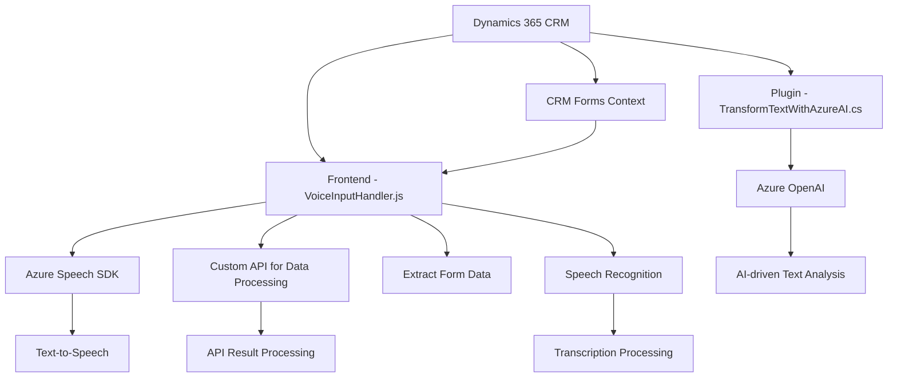

### Breve Resumen Técnico

El repositorio parece estar enfocado en el desarrollo de una solución que integra entrada y salida de voz utilizando **Azure Speech SDK** y **Azure OpenAI**, en combinación con datos provenientes de un entorno de CRM (Dynamics 365). Esta solución tiene dos componentes principales:
1. **Frontend**: Funcionalidades para sintetizar voz de datos visibles del formulario y capturar entrada de voz para actualizar campos del formulario.
2. **Backend**: Plugin para Dynamics CRM que utiliza **Azure OpenAI** para procesar datos en formas más estructuradas.

---

### Descripción de Arquitectura

La arquitectura de este sistema tiene características **orientadas a servicios (SOA)**. El componente frontend opera como una capa cliente que integra servicios externos (Azure Speech SDK y una API personalizada). Por su parte, el backend, en forma de plugin de Dynamics CRM, actúa como extensión del sistema de servidor CRM, procesando los datos directamente cuando se desencadenan eventos específicos.

Esto muestra elementos de **arquitectura híbrida entre SOA y monolítica**:
- **Monolítica en el contexto del CRM**: El plugin se inserta directamente en el entorno de eventos del CRM.
- **Integración SOA (Servicios externos)**: El uso de Azure Speech y OpenAI manifiesta un enlace hacia servicios externos bajo peticiones contextuales.

---

### Tecnologías Usadas

- **Frontend**:
  - **Azure Speech SDK**: Para sintetizar y reconocer voz.
  - **ES5/6** (JavaScript): Codebase con propuestas modernas para modularización.
  - **Dynamics CRM JS APIs**: Administración del contexto del formulario y entidades en Dynamics 365.
  - **DOM manipulation**: Dinámicamente carga el SDK.

- **Backend**:
  - **Microsoft.Xrm.Sdk** para el plugin de Dynamics CRM.
  - **Azure OpenAI API**: Transformación cognitiva de texto en estructuras útiles.
  - **ASP.NET Framework**: Implementación como parte de Dynamics CRM (utilización del framework estándar).
  - **JSON** Manipulation:
    - `System.Text.Json` para operaciones nativas con JSON.
    - `Newtonsoft.Json` para manipulación avanzada.

- **Comunicación de servicios externos**:
  - API personalizada (callCustomApi).
  - HTTP requests con `System.Net.Http`.

- **Patrones empleados**:
  - **Orquestación de procesos** en el frontend mediante callbacks y promesas.
  - **Modularización**: Código dividido en funciones específicas y enfocado en casos de uso delimitados.
  - **Plugins**: Extensión del software con eventos ad-hoc en el CRM para backend.
  - **Dependency Injection (DI)**: Uso del proveedor de servicios dentro del plugin.
  - **Cliente-Servidor REST**: Llamadas a servicios de Azure OpenAI y APIs personalizadas.

---

### Diagrama Mermaid

---

### Conclusión Final

La solución en el repositorio es una **software híbrido** que combina la entrada y salida de voz con **Azure Speech SDK**, junto al procesamiento cognitivo avanzado con OpenAI para dinámica CRM. El frontend muestra una integración sofisticada con SDKs externos para capacidades de voz, mientras que el backend permite extender dinámicamente las capacidades del CRM con análisis y procesamiento más avanzados. Aunque funcional, podría beneficiarse de mejores prácticas de arquitectura como la introducción de principios de **hexagonal o microservicios** para desacoplar el CRM y sus integraciones externas.