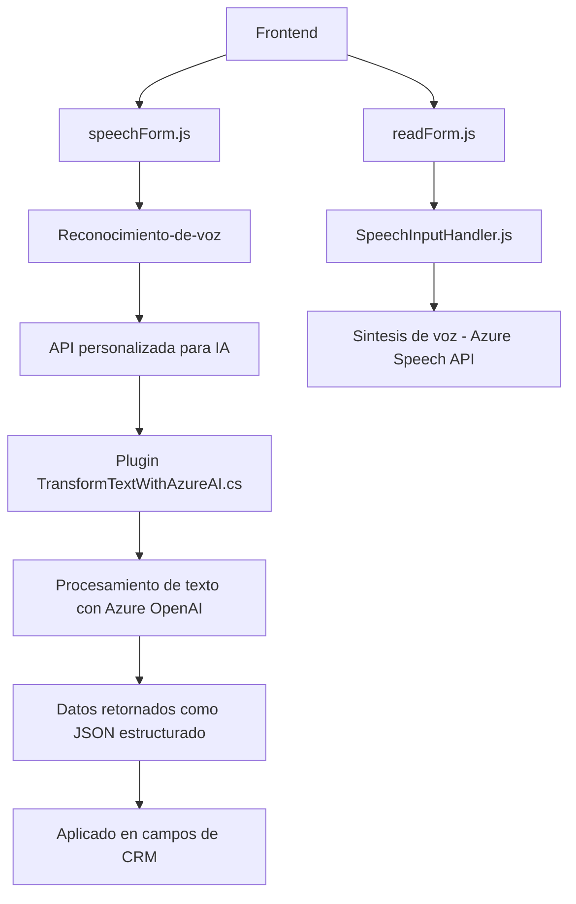

### Breve resumen técnico
El repositorio describe el diseño y funcionalidad de un sistema extensible que conecta un frontend dinámico con un backend basado en Microsoft Dynamics CRM y tecnologías de inteligencia artificial alojadas en Azure. Las piezas de este sistema están orientadas a captura, procesamiento y síntesis de datos de formularios mediante reconocimiento de voz e integración con servicios de OpenAI en Azure.

---

### Descripción de arquitectura

1. **Arquitectura general**:
   - La solución sigue una arquitectura de **cliente-servidor** que integra frontend, backend plugins, y servicios externos (Azure Speech SDK y OpenAI). 
   - Se observa un enfoque **n capas** donde se separa la lógica de entrada de datos (frontend), core de procesamiento (plugin CRM) y servicios externos (API de Azure).

2. **Componentes observados**:
   - **Frontend**:
     - Codificación en JavaScript para interacción en tiempo real con formularios de CRM utilizando el Azure Speech SDK.
   - **Backend/plugin**:
     - Componente en C# para procesamiento avanzado de texto mediante Azure OpenAI. Encapsula lógica como plugin dinamizado bajo el modelo de Dynamics CRM.
   - **Interacción con servicios externos**:
     - API de Azure Speech SDK y Azure OpenAI como puntos clave para características avanzadas (reconocimiento y generación de voz; procesamiento y transformación de texto).

---

### Tecnologías usadas

1. **Frontend**:
   - JavaScript en navegadores.
   - SDK de Azure Speech cargado desde: `"https://aka.ms/csspeech/jsbrowserpackageraw"`.
   - Integración con DOM y Dynamics CRM (estructura Xrm).
   
2. **Backend/plugin**:
   - Lenguaje: C#.
   - Framework: Microsoft Dynamics CRM SDK.
   - Librerías:
     - Newtonsoft.Json para manejo dinámico de JSON.
     - System.Text.Json para serialización/deserialización.
   
3. **Servicios externos e integración**:
   - **Azure Speech SDK**: Reconocimiento y síntesis de voz.
   - **Azure OpenAI**: Procesamiento de texto avanzado (GPT).

---

### Diagrama Mermaid válido para GitHub

---

### Conclusión final

Esta solución muestra un diseño modular con múltiples componentes:
- Un frontend interactivo que utiliza el reconocimiento y síntesis de voz mediante Azure Speech SDK para extraer y procesar datos directamente desde formularios dinámicos en un entorno CRM.
- Un backend que extiende capacidades del CRM mediante plugins personalizados conectados a servicios de IA hospedados en Azure para enriquecer la experiencia del usuario y procesar datos textuales avanzados.

La arquitectura está bien estructurada siguiendo el paradigma **cliente -> API Gateway -> servicios externos**, lo que garantiza escalabilidad y alta integración con servicios en la nube. Su implementación modular tanto en frontend como en backend permite fácil extensión y pruebas unitarias para cada componente por separado.