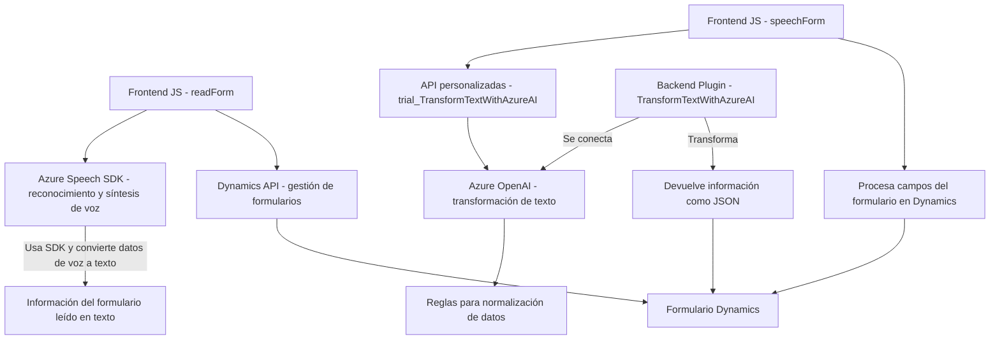

### Breve resumen técnico:

El análisis cubre tres archivos JavaScript y un archivo C# Plugin en el repositorio de GitHub para una solución que integra:
- Reconocimiento y síntesis de voz con **Azure Speech SDK**.
- Procesamiento de texto con **Azure OpenAI**.
- Automación de formularios y funciones de complemento en **Dynamics 365 CRM**.

Esta solución implementa características de una **API personalizada**, funcionalidades de un **frontend web en JavaScript**, e integra un **plugin backend en C#**.

---

### Descripción de arquitectura:

1. **Tipo de solución:**  
   - Una integración entre módulos de front-end y back-end, dirigida a automatizar procesos en Dynamics 365 CRM.  
   - La funcionalidad incluye:
     - **Frontend JavaScript** para manejo de formularios y procesamiento local.
     - **Plugin C# en el backend** para ejecutar operaciones avanzadas y conectarse con Azure OpenAI.  
     - Uso de **SDKs Externos y APIs personalizadas**, apuntando a una arquitectura client-server con un enfoque modular.  

2. **Arquitectura:**  
   - **Monolítica pero modular**:  
      - Los módulos están bien definidos. La lógica del frontend se comunica con las APIs, mientras que las operaciones más críticas se gestionan en el nivel backend con plugins.  
   - La arquitectura sigue principios de **N-capas**, con separación de responsabilidades entre frontend (procesamiento local) y backend (transformaciones avanzadas).  
   - Algunos elementos reflejan prácticas de integración con software externo (microservicios), aunque el contexto sigue manejándose dentro de un monolito (Dynamics CRM).

---

### Tecnologías usadas:

1. **Frontend JavaScript:**
   - **Azure Speech SDK**: Implementación de reconocimiento y síntesis de voz.
   - **APIs en Dynamics 365 CRM**: Para manipulación directa de datos y formularios.

2. **Backend Dynamics Plugin (C#):**
   - **Microsoft.Xrm.Sdk**: Extensiones para desarrollo de plugins en Dynamics CRM.
   - **JSON libraries**: `Newtonsoft.Json` y `System.Text.Json`.
   - **Azure OpenAI REST API**: Procesa la generación de texto avanzado.

3. **Patrones de Diseño y Arquitectura:**
   - **N-Capas**: Separación entre front-end y back-end.
   - **Encapsulación y principios SOLID**: Modularización clara en funciones y clases.
   - **Uso de SDKs externos**: Azure Speech SDK cargado dinámicamente para optimizar recursos.
   - **Plugin-Architecture**: para extender Dynamics CRM.
   - **Callback Pattern**: Para garantizar la carga del SDK de forma asíncrona.

---

### Diagrama **Mermaid**:

---

### Conclusión final:

La solución proporcionada consiste en una arquitectura **monolítica** que integra un **frontend basado en JavaScript** y un **backend con plugins en C#** para extender functionality en Dynamics 365 CRM. El diseño modular y la separación de responsabilidades son claros, con distintos componentes especializados:
- Uso de **Azure Speech SDK**: reconocimiento y síntesis de voz en el cliente.
- **Azure OpenAI API**: transformación avanzada de texto en el backend.
- Plugins diseñados con el patrón estándar de Dynamics CRM.

El diagrama **Mermaid** presentado captura las interacciones claves entre los módulos, SDKs y servicios externos, siendo una representación válida para GitHub Markdown.