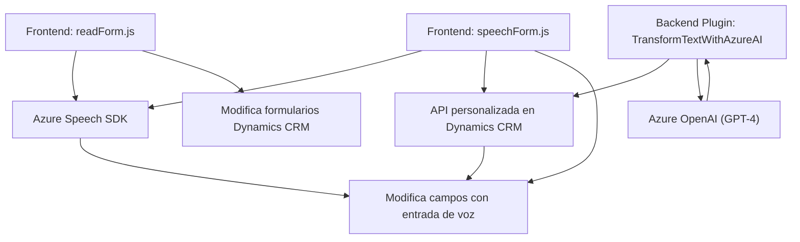

### Resumen técnico
El repositorio implementa funcionalidades avanzadas en un sistema Dynamics CRM utilizando componentes frontend en JavaScript, plugins backend en C#, y servicios externos como Azure Speech SDK y Azure OpenAI. El diseño está orientado a mejorar la accesibilidad y la interacción tanto en formularios como en procesamiento de entrada de usuario mediante voz y textos transformados por inteligencia artificial.

---

### Arquitectura  
La solución sigue una arquitectura **Cliente-Servidor** extendida con integración a servicios externos. Los módulos de JavaScript trabajan en el frontend para interactuar con formularios en Dynamics CRM, mientras que el backend utiliza el patrón de plugins basado en eventos de Dynamics CRM.  
Se observa un patrón de **microservicios** en el uso del API de Azure OpenAI y Azure Speech SDK, mientras que el diseño de los componentes es mayoritariamente **modular**. Además, la solución tiene capas bien separadas:  
1. **Presentación (Frontend)**: `readForm.js` y `speechForm.js` procesan datos del formulario y capturan/interactúan con entrada de voz.  
2. **Integración API**: Módulos como `callCustomApi` (frontend) y el plugin `TransformTextWithAzureAI.cs` trabajan con APIs externas y servicios en Azure.  
3. **Backend/Servicios**: El plugin encapsula lógica compleja para transformar y devolver datos, mientras las APIs realizan operaciones externas.  

---

### Tecnologías Usadas
1. **Frontend**:
   - **JavaScript** (vanilla): Para interacción en tiempo real con Dynamics CRM.
   - **Azure Speech SDK**: Para reconocimiento y síntesis de voz.
   - **Dynamics 365 WebAPI**: Para modificar datos directamente en el CRM.

2. **Backend**:
   - **C# (Microsoft.Xrm.Sdk)**: Desarrollo de plugins para Dynamics CRM.
   - **Microsoft.NET Framework**: Lógica del servidor para operaciones del CRM.
   - **System.Net.Http**: Para consumir servicios web (Azure OpenAI).
   - **JSON APIs**: Manipulación avanzada para estructuras de datos complejas.

3. **Servicios Externos**:
   - **Azure OpenAI**: Para transformar texto según reglas definidas.
   - **Azure Speech SDK**: Soporte para entrada/salida por voz en tiempo real.

---

### Dependencias y Componentes Externos Potenciales
1. **Microsoft Dynamics 365**: Entorno base para los formularios y ejecución del plugin.
2. **Azure Speech SDK & Azure OpenAI**: Servicios externos utilizados para reconocer texto de voz o aplicar transformaciones al texto.
3. **Newtonsoft.Json**: Biblioteca para manipulación de JSON en el backend.
4. **Browser APIs (DOM)**: En el frontend, para manipular y leer formularios.
5. **Promesas y async/await**: Entramado en los métodos asincrónicos para manejar solicitudes y respuestas.

---

### Diagrama Mermaid (100% compatible con GitHub Markdown)

---

### Conclusión Final
La solución muestra una integración sólida entre Dynamics CRM y servicios de Azure, con una arquitectura distribuida que utiliza principios de modularidad y patrones Cliente-Servidor. Su diseño modular permite procesar datos accesibles dinámicamente, manejar entrada de voz en frontend, y realizar transformaciones avanzadas de texto en el backend mediante inteligencia artificial. Esta implementación es apta para entornos comerciales que requieren accesibilidad extendida y operaciones robustas con datos dinámicos.