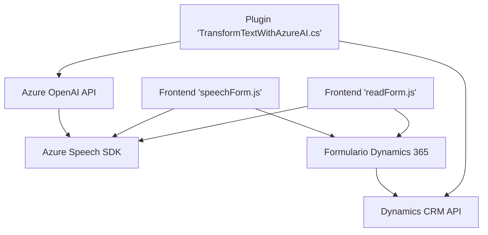

## Breve resumen técnico
La solución consiste en un conjunto de componentes que integran interfaces de usuario (frontend) con servicios de inteligencia artificial y voz (Azure Speech SDK y Azure OpenAI), además de plugins personalizados para Dynamics 365. Está diseñado para mejorar la interacción con los formularios mediante voz y procesamiento de texto, utilizando tecnologías modernas de nube y modularidad.

---

## Descripción de arquitectura
La solución tiene una arquitectura basada en integración modular y orientada a servicios:
1. **Frontend Modularizado:** Archivos JavaScript (`readForm.js` y `speechForm.js`) implementan funciones para convertir datos de formularios en voz, y para reconocer comandos de voz con Azure Speech SDK. Cada funcionalidad está separada en métodos independientes.
2. **Backend Extendido:** El archivo `Plugins/TransformTextWithAzureAI.cs` es un plugin para Dynamics CRM que interactúa con Azure OpenAI para transformar texto según reglas dinámicas y estructurarlo en formato JSON.
3. **Interacción con APIs Externas:** Tanto el frontend como el plugin están diseñados para consumir servicios de Azure (Speech SDK y OpenAI) mediante solicitudes HTTP, lo que refleja una alta dependencia de microservicios externos.
4. **Patrones usados:** 
   - Modularización
   - Asynchronous Programming
   - API-first
   - Gestión de dependencias externas
   - Extensibilidad mediante plugins en CRM

En conjunto, sigue un enfoque híbrido que combina:
- **Arquitectura de N Capas:** Para manejar la interacción frontend-API-backend.
- **Microservicios:** Para consumir servicios externos como Azure Speech SDK y OpenAI desde módulos independientes.

---

## Tecnologías usadas
1. **Frontend:**
   - JavaScript.
   - Azure Speech SDK (https://aka.ms/csspeech/jsbrowserpackageraw).
   - Dynamics 365 DOM integration context.

2. **Backend:**
   - Dynamics CRM SDK (`IPlugin`, `IOrganizationService`).
   - Azure OpenAI Service (`gpt-4`).
   - Librerías de .NET: `System.Net.Http`, `System.Text.Json`, `Newtonsoft.Json.Linq`.

3. **Patrones:**
   - Callback pattern.
   - Promesas para programación asíncrona.
   - API consumption pattern.
   - Plugin-based extensibility en Dynamics CRM.

---

## Diagrama Mermaid

---

## Conclusión final
La solución presentada es un sistema híbrido que combina implementación modular en el frontend con extensibilidad dinámica en el backend. Se conecta directamente con servicios de Azure (Speech y OpenAI) para manejar voz y procesamiento de texto. Esta arquitectura modular y orientada a servicios hace que la solución sea escalable, extensible y muy adecuada para entornos empresariales como Dynamics CRM.