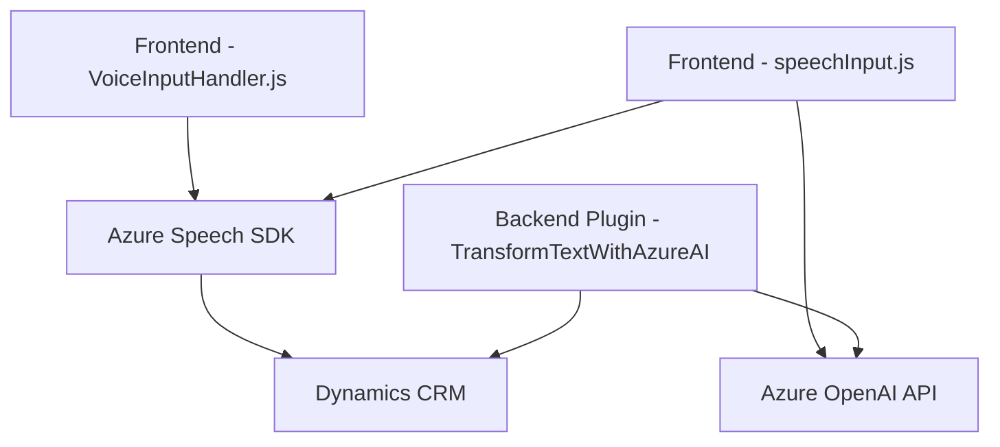

## **Breve resumen técnico**
Este repositorio implementa una solución de reconocimiento y síntesis de voz que interactúa con formularios existentes en una interfaz, aparentemente para un sistema basado en Dynamics CRM. Adicionalmente, incluye un plugin .NET que transforma texto en JSON estructurado mediante Azure OpenAI. 

---

## **Descripción de arquitectura**
1. **Frontend**:
   - Arquitectura modular: El sistema está diseñado para manejar por separado la lógica de reconocimiento de voz, extracción de datos de formularios, síntesis de voz y asignación dinámica de valores al formulario.  

2. **Backend (plugin)**:
   - Plugin basado en Dynamics CRM, que sigue un modelo de solución desacoplada y orientado a realizar transformaciones del texto con Azure OpenAI.

Ambos componentes interactúan con servicios de Microsoft Azure (Speech SDK y Azure OpenAI), utilizándose como microservicios externos. La solución general tiene un **modelo de arquitectura híbrida cliente-servidor**, con separación entre el frontend que realiza la síntesis/reconocimiento de voz y el backend plugin que procesa texto avanzado.

---

## **Tecnologías usadas**
1. **Frontend**:
    - **JavaScript**: Principal lenguaje para la lógica de frontend, procesando eventos y realizando conexiones externas.
    - **Azure Speech SDK**: Utilizado para la síntesis de voz en `VoiceInputHandler.js` y para reconocimiento de voz en `speechInput.js`. Proporciona capacidades de texto a voz y reconocimiento de comandos de voz.
    - **Microsoft Dataverse/Xrm.WebApi**: Interacción con las APIs para manipular formularios y datos del CRM.

2. **Backend**:
    - **.NET Framework**: El componente `TransformTextWithAzureAI.cs` está desarrollado en .NET, específicamente para la ejecución dentro del entorno de Dynamics CRM.
    - **Azure OpenAI API**: Utilización del modelo GPT-4 alojado en Azure para transformar texto en JSON estructurado.
    - **Newtonsoft.Json**: Procesamiento avanzado de datos JSON.
    - **System.Net.Http**: Comunicación con servicios externos mediante llamadas HTTP.

3. **Frameworks y Patrones**:
    - Modularidad: Código organizado en funciones independientes con responsabilidades específicas.
    - Integración con APIs: Patrones de comunicación con servicios externos como SDKs y APIs.
    - Mediator: Funciones como `startVoiceInput` y `Execute` actúan como mediadores centrales.

---

## **Diagrama Mermaid**

---

## **Conclusión final**
Este repositorio implementa una solución enfocada en accesibilidad y automatización, aplicando síntesis y reconocimiento de voz en formularios DOM y transformando texto mediante inteligencia artificial. La solución muestra una arquitectura híbrida con módulos frontend desacoplados para interacción con usuarios, dependencias en servicios externos de Azure, y una capa backend representada por un plugin en Dynamics CRM.

El diseño modular y el uso de servicios externos como Azure Speech SDK y OpenAI son buenas prácticas que facilitan la escalabilidad y el mantenimiento. Sin embargo, podría beneficiarse de mayor estandarización en la interacción con APIs y una arquitectura definitiva tipo hexagonal para separar más claramente las capas del sistema.