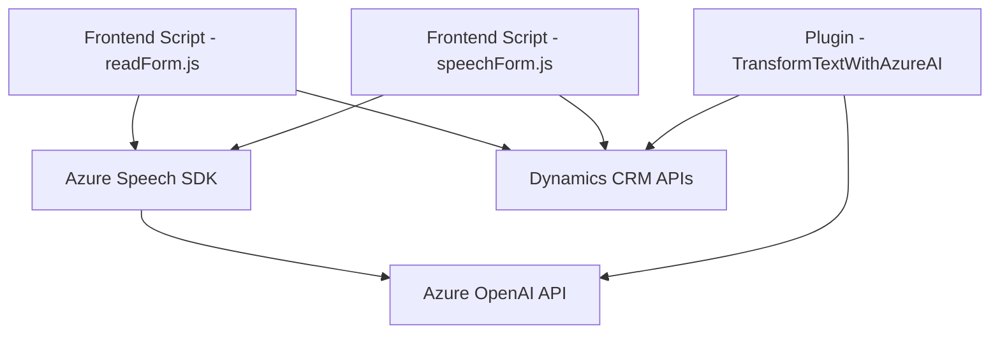

### Breve resumen técnico

El repositorio y los archivos analizados pertenecen a una solución que integra Microsoft Dynamics CRM con servicios de inteligencia artificial (GPT-4) y reconocimiento y síntesis de voz (Azure Speech SDK). Funciona como un conjunto de módulos frontend (interfaz de usuario) con soporte adicional por microservicios externos (Azure OpenAI, Azure Speech SDK, Dynamics API) y plugins backend personalizados para la plataforma CRM.

---

### Descripción de arquitectura

La arquitectura parece dividirse en tres capas funcionales principales:

1. **Frontend**:
   - Relacionado con la interfaz de uso por el cliente en el entorno CRM. Consiste en archivos JavaScript que interactúan con los formularios del CRM, extraen valores del formulario, procesan la entrada/salida de voz mediante Azure Speech SDK y realizan tareas como mapeo de datos y validación.
   - Se basa en integraciones asincrónicas y carga dinámica de SDKs.

2. **Backend (Mediante Plugins)**:
   - Plugins personalizados diseñados para usar APIs de Dynamics y realizar transformaciones avanzadas de datos con servicios externos, como la API de Azure OpenAI (GPT-4).
   - El plugin actúa como un puente entre las operaciones de los formularios y las funciones de Microsoft Dynamics CRM.

3. **Servicios externos**:
   - Servicios de nube utilizados para ampliar las capacidades de la solución:
     - **Azure Speech SDK**: Para transcripciones de voz y síntesis text-to-speech (TTS).
     - **Azure OpenAI**: Para procesamiento de lenguaje natural y generación de respuestas estructuradas en formato JSON.
     - **Dynamics 365 Custom APIs**: Para dinámica de negocio, manipulación de datos del CRM y operaciones extendidas.

### Tipo de arquitectura

Este sistema se clasifica como **arquitectura híbrida**, combinando:
- **Modelo n-capas**: Segmentación clara entre lógica del frontend (UI y manipulación en el navegador) y lógica backend (Plugins, OpenAI).
- **Integración de Microservicios**: Uso de servicios externos (Azure Speech SDK, Azure OpenAI).
- **Plugin Architecture**: En el backend, utiliza plugins directamente conectados a Dynamics 365 CRM que responden a eventos específicos.

---

### Tecnologías y frameworks usados

1. **Frontend**:
   - JavaScript para funciones de extracción de datos desde formularios y síntesis/transcripción de voz.
   - Dependencia del SDK de Azure Speech para realizar tareas relacionadas con la voz.
   - Microsoft Dynamics API para interactuar con entidades y formularios del CRM.

2. **Backend**:
   - `.NET` y `Microsoft.Xrm.Sdk` para plugins de Dynamics CRM.
   - HttpClient y JSON libraries (Newtonsoft.Json.Linq y System.Text.Json) para interacciones API.

3. **Servicios externos**:
   - Azure Speech SDK para TTS y STT (Text-to-Speech y Speech-to-Text).
   - Azure OpenAI API para procesamiento avanzado de lenguaje con GPT-4.

4. **Patrones de diseño**:
   - Modularidad en las funciones del frontend (cada función aborda un aspecto específico de la lógica).
   - Callback/Event Handling para cargar dinámicamente el SDK y manejar tareas asíncronas.
   - Request/Response Pattern para las interacciones con APIs externas.
   - Dependency Injection en el Plugin para acceder a servicios del entorno CRM.

---

### Dependencias externas y componentes presentes

1. **Azure SDKs**:
   - Speech SDK: Para síntesis de voz y entrada mediante reconocimiento vocal.
   - OpenAI API: Para procesamiento del lenguaje, transformación de texto en JSON estructurado.
   
2. **Microsoft Dynamics CRM Custom APIs**:
   - API personalizada: Ejemplo `trial_TransformTextWithAzureAI` para manipulación del texto transcripto en servicios de Dynamics CRM.

3. **Plataforma Dynamics 365**:
   - Formulario y modelo de datos estructurado bajo la API de Dynamics (`Xrm.WebApi`).

4. **Herramientas de JSON y HTTP**:
   - Newtonsoft.Json.Linq, System.Text.Json, y HttpClient para el manejo de datos JSON y solicitudes HTTP al interactuar con APIs externas.

5. **Infraestructura de hosting y configuraciones externas**:
   - Azure hosting para servicios API.
   - Claves de credenciales integradas para servicios OpenAI y Speech API.

---

### Diagrama Mermaid

---

### Conclusión final

El repositorio combina elementos de frontend con servicios de voz e inteligencia artificial, integrados en una solución CRM avanzada. La arquitectura está basada en un modelo híbrido con divisiones entre capas de presentación (frontend), lógica de negocio (plugins) y servicios externos (Azure). El uso de plataformas modernas como Azure Speech SDK y OpenAI proporciona una alta flexibilidad para futuras mejoras. Sin embargo, es fundamental asegurar correctamente las credenciales API y realizar pruebas extensivas para manejar excepciones en escenarios críticos como pérdidas de conectividad o errores de los servicios externos.