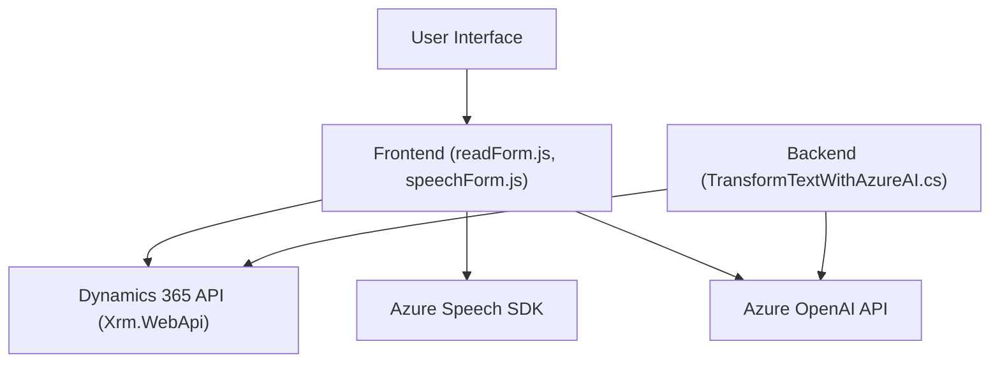

### Breve resumen técnico

El repositorio consta de tres archivos principales que colaboran para integrar servicios cognitivos de Azure en un sistema basado en Microsoft Dynamics 365. Las dos primeras implementaciones (`readForm.js` y `speechForm.js`) están destinadas al frontend y se conectan con formularios de Dynamics 365 para interactuar con datos visibles mediante procesamiento de voz (entrada y salida). Por otro lado, el archivo `TransformTextWithAzureAI.cs` corresponde a un plugin del backend que utiliza Azure OpenAI para procesar texto de entrada a través de peticiones HTTP y devolver un JSON estructurado.

---

### Descripción de Arquitectura

La solución utiliza una arquitectura **basada en servicios desacoplados** que integra un frontend interactivo con servicios de Azure, mientras que el backend utiliza plugins personalizados para extender las capacidades de Dynamics CRM. La arquitectura combina elementos de **microservicios**, al utilizar APIs externas para procesamiento, con un esquema de capas orientado al modelo de desarrollo en Dynamics 365.

- **Frontend**: Implementa funcionalidades para interactuar con formularios mediante el reconocimiento de voz y la síntesis de texto a voz, además de la capacidad de delegar ciertos procesos a un API externa (Azure AI). Existe un fuerte desacoplamiento entre la lógica del frontend, los servicios externos y el sistema CRM.
- **Backend**: Extiende la funcionalidad del CRM mediante un plugin que actúa como middleware para interactuar con la API de Azure OpenAI, mostrando un enfoque modular y reutilizable.

---

### Tecnologías Usadas

#### Frontend:
- **JavaScript**: Lógica interactiva para formularios en Dynamics 365.
- **Azure Speech SDK**: Manejo de entrada y salida de voz.
- **Dynamics 365 Web API (Xrm.WebApi)**: Para la interacción con datos dentro del sistema CRM.

#### Backend:
- **C#:** Implementación del plugin.
- **Microsoft Dynamics SDK:** Integración directa con la plataforma CRM.
- **Azure OpenAI API**: Transformación avanzada de texto.
- **Newtonsoft.Json**: Lectura y manipulación de datos JSON.
- **HttpClient**: Para realizar solicitudes HTTP al API de Azure.

---

### Diagrama Mermaid

---

### Conclusión Final

La solución implementada es una **extensión profesional orientada a Dynamics 365** que utiliza tecnología avanzada para integrar procesamiento de voz (Azure Speech SDK) y transformación de texto mediante IA (Azure OpenAI). Su arquitectura enfatiza el desacoplamiento entre frontend, servicios externos y backend del CRM, siguiendo principios de modularidad y reutilización. Esto posiciona la solución como escalable, adaptable y fácilmente expandible hacia nuevos casos de uso. 

Los patrones de diseño aplicados, como **event-driven programming** y **repository pattern**, así como las integraciones avanzadas con servicios cognitivos, son puntos fuertes del diseño arquitectónico.