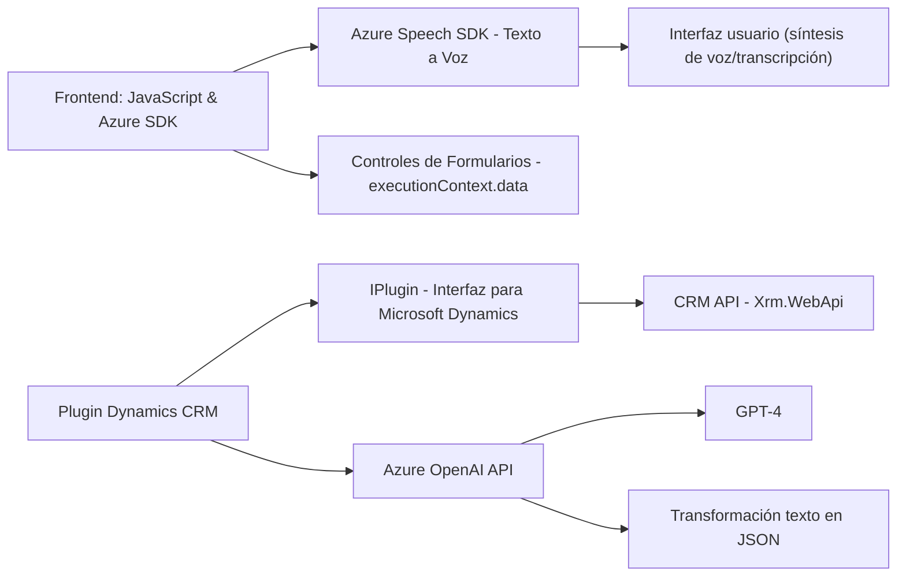

### Breve resumen técnico

La solución descrita se centra en la integración de reconocimiento de voz y síntesis de texto a voz con formularios interactivos en una interfaz de usuario, y un plugin para Microsoft Dynamics CRM que emplea el modelo Azure OpenAI para transformar texto. Esto implica dos partes principales:

1. **Frontend (JavaScript)**: Funcionalidades como lectura y escritura de formularios con voz usando Azure Speech SDK. Los componentes JavaScript están diseñados para interactuar con formularios basados en CRM, realizando tareas como síntesis y transcripción de voz.
2. **Backend Plugin (.NET)**: Un plugin que extiende las capacidades de Microsoft Dynamics CRM, utilizando Azure OpenAI para analizar y transformar texto mediante reglas específicas.

---

### Descripción de arquitectura

1. **Frontend**:
   - La arquitectura sigue un enfoque basado en funciones autónomas para la gestión de eventos en la interfaz de usuario. 
   - Integra servicios externos (Azure Speech SDK) para llevar a cabo funcionalidades específicas de voz.

2. **Backend (Plugin)**:
   - La arquitectura del plugin sigue el diseño estándar de Microsoft Dynamics CRM con la interfaz `IPlugin`.
   - Utiliza una arquitectura orientada a servicios para realizar solicitudes al modelo de Azure OpenAI.

**Global Architecture**:
La solución se asemeja a un enfoque de arquitectura de software en capas:
   - **UI Layer:** JavaScript componentes para la interfaz interactiva con el usuario.
   - **Business-to-Integration Layer:** La comunicación entre los componentes del frontend y el plugin que actúa como middleware.
   - **API Service Layer:** Azure Speech SDK y Azure OpenAI son componentes externos que implementan sus capacidades de AI.

En términos de concepto general, la solución podría encajar en un diseño de **arquitectura n-capas** debido al desacoplamiento entre frontend, backend y servicios externos.

---

### Tecnologías usadas
1. **Frontend**:
   - Lenguaje: JavaScript.
   - SDK: Azure Speech SDK.
   - Frameworks CRM: Microsoft Dynamics CRM API (`executionContext`, `formContext`).

2. **Backend**:
   - Lenguaje: C# (.NET Framework).
   - SDKs/Libs: Microsoft Dynamics CRM SDK, Newtonsoft.Json, System.Text.Json, System.Net.Http.
   - Servicios externos: Azure OpenAI (GPT-4), REST API.

---

### Diagrama Mermaid

---

### Conclusión final

La solución integra herramientas avanzadas de reconocimiento de voz, síntesis de texto a voz y transformación inteligente de datos mediante Azure AI en un entorno de formularios dinámicos. Utiliza una arquitectura en capas y patrones de integración que facilitan la comunicación entre el frontend y herramientas backend con soporte de servicios externos, como Azure Speech SDK y OpenAI. Aunque funcional, el diseño podría mejorarse mediante estrategias de desacoplamiento, como servicios REST especializados entre el frontend y el plugin. Es robusta para el ámbito de CRM, pero su adaptabilidad a otros sistemas podría requerir modificaciones arquitectónicas adicionales.