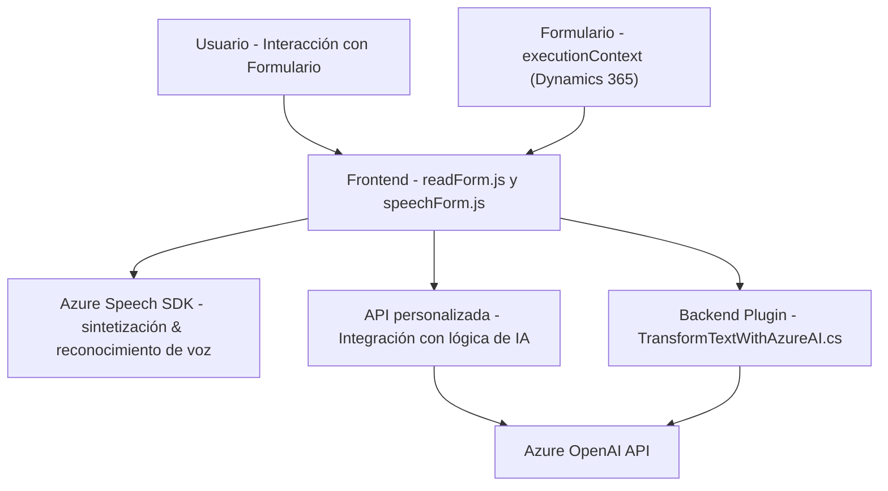

### Breve resumen técnico
Este repositorio implementa funcionalidades relacionadas con la voz (entrada y salida) para formularios dinámicos en un sistema CRM basado en Dynamics 365. Utiliza el Azure Speech SDK para la síntesis de voz (texto a audio) y el reconocimiento de voz (audio a texto). Además, integra un plugin que conecta Dynamics 365 con Azure OpenAI API para transformar texto en estructuras JSON.

---

### Descripción de arquitectura
1. **Tipo de solución:** 
   - Sistemas frontales que interactúan con formularios (`readForm.js`, `speechForm.js`) están basados en JavaScript y operan en el navegador como parte del frontend de Dynamics 365.
   - La pieza backend (`TransformTextWithAzureAI.cs`) es un plugin desarrollado según las reglas y arquitectura de Dynamics 365.

2. **Arquitectura:** 
   - El diseño frontend aplica una arquitectura **en capas**: presenta una capa de entrada de datos (voz), procesamiento (código local), y comunicación con APIs externas (Azure Speech SDK y APIs personalizadas).
   - La arquitectura backend en el plugin sigue un enfoque típico de **SOA (Service-Oriented Architecture)**, donde se delega la lógica compleja a servicios externos de Azure OpenAI.

---

### Tecnologías usadas
1. **Frontend:**
   - **Microsoft Dynamics 365 JavaScript SDK:** Para interactuar con formularios dinámicos y sus campos (`executionContext`, `Xrm.WebApi`, etc.).
   - **Azure Speech SDK:** Manejo de sintetización y reconocimiento de voz.
   - **AJAX / Fetch API:** Para comunicación con APIs externas.
   - **Azure API:** Servicios personalizables para lógica con inteligencia artificial.
   - **JavaScript estándar.**

2. **Backend (plugin):**
   - **C# .NET Framework:**
     - Usando interfaces estándares de Dynamics 365, como `IPlugin` y servicios de CRM.
   - **System.Net.Http:** Acceso a servicios RESTful (Azure OpenAI API).
   - **Newtonsoft.Json:** Serialización y deserialización de estructuras JSON.
   - **Azure OpenAI API:** Procesamiento de texto en formatos estructurados.

3. **Patrones de diseño:**
   - Modularización: Cada funcionalidad se encapsula como un módulo independiente.
   - Event-Driven Architecture (EDAs): Procesos desencadenados por eventos del usuario (captura de voz, interacción con formularios).
   - Wrapper: `GetOpenAIResponse` actúa como un intermediario para simplificar el acceso a la API externa.
   - SOA: Desacoplamiento de responsabilidades utilizando APIs externas para lógica de negocio (Azure Speech y OpenAI).

---

### Dependencias externas y componentes externos
1. **SDKs / APIs:**
   - **Azure Speech SDK**: Implementado como script en el frontend.
   - **Azure OpenAI API**: Para transformar texto en formato JSON estructurado en el plugin backend.
2. **Microsoft Dynamics 365 CRM JavaScript SDK**: Para manejar los datos del formulario y su interacción en el lado cliente.
3. **Librerías adicionales:** `Newtonsoft.Json`, `System.Net.Http`, y recursos web alojados externamente como el script del Speech SDK (`https://aka.ms/csspeech/jsbrowserpackageraw`).

---

### Diagrama Mermaid válido para GitHub

---

### Conclusión final
El repositorio implementa funcionalidades avanzadas de interacción con voz para mejorar la experiencia de usuario y accesibilidad en un entorno CRM como Dynamics 365. La arquitectura desacoplada, basada en eventos y servicios externos, refleja principios de diseño modernos como SOA. La integración con Azure Speech SDK y OpenAI API demuestra un enfoque en aprovechar las capacidades de la nube para lógica avanzada (IA y síntesis de voz).