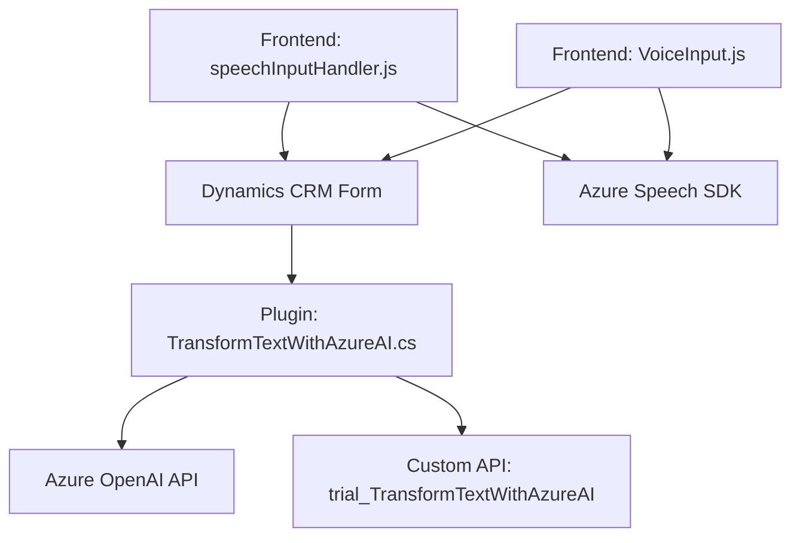

### Breve resumen técnico

El repositorio contiene un conjunto de componentes orientados principalmente a facilitar la interacción basada en voz y texto con formularios en el contexto de Dynamics CRM. Utiliza tecnologías como Azure Speech SDK para el reconocimiento de voz y síntesis de texto, y el servicio Azure OpenAI para transformar texto con AI.

### Descripción de arquitectura

La solución está organizada como una **aplicación distribuida basada en servicios**. Por un lado, el frontend permite capturar voz, procesar comandos y manipular formularios usando el SDK de Azure Speech para funcionalidades de Text-To-Speech (TTS) y Speech-To-Text (STT). Por otro lado, un plugin de Dynamics CRM está diseñado para realizar transformaciones avanzadas del texto obtenido mediante integración con la API de Azure OpenAI. Este tipo de arquitectura tiene aspectos de **arquitectura de capas** debido a la separación entre presentación (frontend), lógica de aplicación, y una capa de datos (Dynamics CRM + OpenAI API). También tiene elementos de **arquitectura hexagonal** por la integración explícita con servicios externos como Azure Speech y OpenAI.

### Tecnologías usadas

1. **Frontend:**
   - JavaScript (para lógica del navegador).
   - Azure Speech SDK (Reconocimiento/STT y síntesis/TTS).
   - Dynamics 365 WebApi (manipulación de formularios CRM).

2. **Backend:**
   - Plugins en C# (`Microsoft.Xrm.Sdk`) sobre Dynamics CRM.
   - Servicios REST de Azure OpenAI para procesamiento avanzado de texto.
   - Newtonsoft.Json y System.Text.Json para serialización de datos JSON.

3. **Servicios Azure:**
   - Azure Speech Service (STT y TTS).
   - API REST de Azure OpenAI.

### Diagrama Mermaid

El siguiente diagrama describe las relaciones funcionales entre los componentes:

### Conclusión final

Este repositorio encapsula una solución para interacción vocal en aplicaciones CRM, combinando múltiples servicios de Azure. La arquitectura correctamente separa las responsabilidades entre el frontend (captura y manejo de voz), el sistema CRM (interacción con formularios), y el backend (integración con servicios de AI y datos). El uso de Azure Speech SDK y OpenAI API para reconocimiento y transformación de texto ejemplifica un diseño extensible y moderno para aplicaciones centradas en interacción natural y automatización avanzada basada en inteligencia artificial.