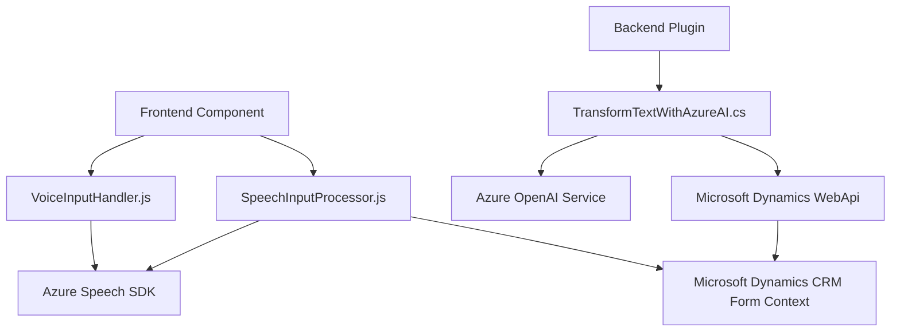

### Breve resumen técnico
El repositorio combina **Microsoft Azure Speech SDK**, **Microsoft Dynamics CRM plugins** y **Azure OpenAI** para construir un sistema interactivo que utiliza entrada/salida de voz, procesamiento inteligente de datos, y transformación del texto con IA. Este sistema tiene componentes frontend y plugin backend diseñados para procesamiento dinámico de formularios y APIs, integrando interactividad, IA, y comunicación en tiempo real.

### Descripción de arquitectura
La solución tiene una arquitectura híbrida con dos componentes principales:
1. **Frontend:**
    - Modular, basado en eventos. Usa JavaScript para interactuar con formularios, capturar input de voz, mapear campos y sintetizar texto a voz mediante Azure Speech SDK.
  
2. **Backend:**
    - Implementa plugins de Microsoft Dynamics CRM en C#. Las acciones específicas del CRM funcionan como extensiones a la plataforma, usando el patrón **Plugin Architecture**, procesando datos usando Azure OpenAI.

El sistema sigue **n capas**, donde cada capa cumple funciones específicas y aprovecha integración de APIs externas.

### Tecnologías usadas
1. **Frontend:**
    - Lenguaje: JavaScript.
    - Framework/API: **Microsoft Azure Speech SDK**.
    - Contexto: Formularios dinámicos de **Microsoft Dynamics**.

2. **Backend:**
    - Lenguaje: C#.
    - Framework/API: **Microsoft Dynamics Plugin Framework**, **Azure OpenAI**, **Newtonsoft Json.NET**.

3. **En el sistema general:**
    - Procesamiento de datos con patrones de SRP (Single Responsibility Principle).
    - Integración con APIs mediante **RESTful Communication**.
    - Técnicas de asincronía y callbacks.

### Dependencias o componentes externos
- **Azure Speech SDK**: Para entrada/salida de voz.
- **Microsoft Dynamics Web API**: Consulta e interacción con datos internos de CRM.
- **Azure OpenAI**: Procesamiento avanzado de texto con modelos como GPT-4.
- **Newtonsoft.Json**: Para operaciones JSON (backend).
- **Browser-Agnostic SDK Loader**: En frontend, para carga dinámica del Speech SDK en navegadores donde no está preinstalado.

---

### Diagrama Mermaid

---

### Conclusión Final
La solución analiza formularios dinámicos en Microsoft Dynamics, utiliza entrada y salida de voz con Azure Speech SDK, y potencia el procesamiento de texto mediante Azure OpenAI. Su arquitectura es una implementación de **n capas**, adecuada para sistemas empresariales que requieren modularidad y extensibilidad. Aunque el sistema muestra robustez técnica, debería optimizar aspectos de seguridad como la configuración de API keys dentro del código.