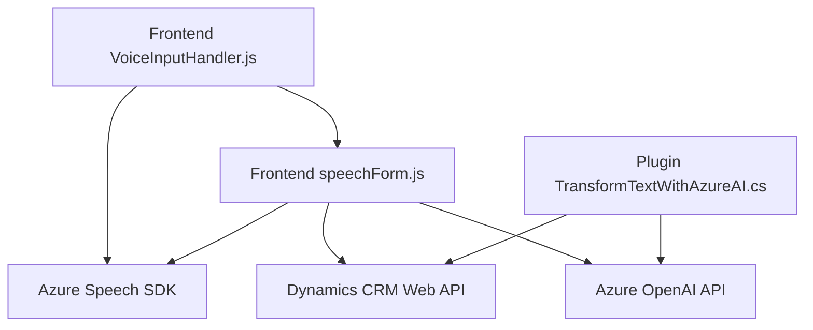

### Breve Resumen Técnico

Con base en los archivos analizados (`readForm.js`, `speechForm.js`, y `TransformTextWithAzureAI.cs`), el repositorio parece ser parte de una solución que integra **voz y procesamiento automatizado de texto** en **formularios empresariales** dentro de una plataforma SaaS como **Microsoft Dynamics CRM**, junto con el uso de **Azure Speech Services** y **Azure OpenAI**. La solución involucra un **frontend basado en JavaScript** para interacción con el usuario (speech-to-text y manejo de formularios) y un **backend basado en plugins** de Dynamics CRM (en C#).

---

### Descripción de Arquitectura

La solución tiene una arquitectura **híbrida basada en capas y servicios**:
- El **frontend** (JavaScript en los archivos del directorio `FRONTEND/JS`) se basa en un patrón n-capas, con una mezcla de lógica de presentación (lectura de formularios y generación de voz mediante Azure Speech SDK) y negocio (procesamiento de datos transcritos). Además, emplea modularización con funciones independientes y componentes específicos.
- El **backend** (C# en el archivo de `Plugins/TransformTextWithAzureAI`) implementa lógica de negocio como un **plugin** de Dynamics CRM, permitiendo la transformación de datos de texto a JSON estructurado mediante Azure OpenAI y aprovechando los estándares de la arquitectura extensible de CRM.
- Se observa una estrecha integración con servicios en la nube, como Azure Speech SDK y Azure OpenAI, lo cual evidencia una orientación hacia **event-driven architecture** con microservicios. Sin embargo, el dominio específico permanece cohesionado, lo que reduce la dispersión de lógica de negocio.

---

### Tecnologías Usadas

1. **Frontend**:
   - **JavaScript**: Base del desarrollo del cliente y procesamiento de formularios.
   - **Azure Speech SDK**: Reconocimiento de voz, síntesis de voz y conversión de texto en audio.
   - **Dynamics CRM Web API**: Operaciones de datos en tiempo real, como inserción y mapeo de contenido dinámico en formularios empresariales.
   - **Dynamic content processing**: Permite trabajar con atributos y valores visibles en formularios web gestionados por Dynamics CRM.

2. **Backend**:
   - **C#**: Lenguaje empleado para la lógica del plugin.
   - **Azure OpenAI Service API**: Generación de texto estructurado utilizando inteligencia artificial (modelo GPT-4).
   - **Newtonsoft.Json**: Libra API para manejo de objetos JSON.
   - **Microsoft.Xrm.SDK**: Framework para integración en la arquitectura de plugins del CRM.

---

### Diagrama Mermaid

---

### Conclusión Final

La solución implementa una **integración entre tecnologías cloud y plataformas empresariales** para facilitar el llenado de formularios y el procesamiento automatizado de datos con **reconocimiento de voz** y **IA**. Su arquitectura híbrida combina **una capa de presentación desarrollada en JavaScript** y **plugins en C# dentro de Dynamics CRM**. La estrategia incluye patrones como **estructura modular**, **integración de servicios externos** (Azure Speech SDK y Azure OpenAI), y facilita la adaptabilidad mediante puntos de entrada centralizados (functions que actúan como facades). 

**Áreas de mejora:**
1. **Seguridad**: Las claves de servicios como Azure Speech y Azure OpenAI se declaran directamente en el diseño de algunos archivos del frontend, lo que representa un riesgo considerable. Estas claves deberían estar protegidas en variables de entorno.
2. **División más estricta de capas**: Parte de la lógica de negocio está en los archivos del frontend, lo que podría ser más escalable a largo plazo si se trasladan ciertos procesos al backend.
3. **Refactorización orientada a objetos**: Utilizar lógica basada en clases en vez de funciones podría mejorar la extensibilidad del código.

En términos generales, la solución es robusta y parece bien enfocada a su propósito empresarial de facilitar la integración entre voz, APIs, inteligencia artificial y formularios web en el contexto de un CRM.