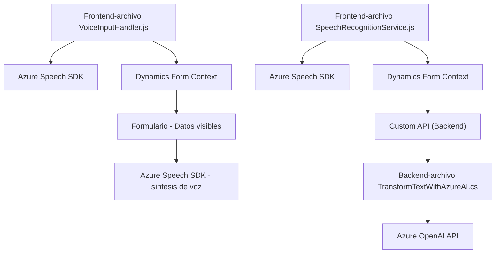

### Breve resumen técnico
El repositorio descrito parece ser una solución basada en la interacción entre formularios de Dynamics 365 y servicios de voz e inteligencia artificial proporcionados por Azure. Los archivos analizados forman parte de una estructura que combina un **frontend en JavaScript** y **backend en C#** con integración directa a APIs de Azure y Dynamics 365.

### Descripción de arquitectura
La arquitectura de este sistema se asemeja al estilo **arquitectura en n capas**, más específicamente con:
- **Frontend**: Scripts en JavaScript que se ejecutan en el navegador y interactúan directamente con formularios (Dynamics). Procesan datos del usuario y sintetizan/comprenden voz usando **Azure Speech SDK**.
- **Backend**: Plugins en C# que utilizan **Dynamics CRM SDK** y **Azure OpenAI** para realizar tareas de procesamiento más avanzadas (transformaciones de texto utilizando IA).

A pesar de que el sistema usa varios servicios externos (Azure Speech/AI), sigue operando bajo un esquema monolítico, dado que las componentes frontend y backend están estrechamente acopladas al ecosistema Dynamics.

### Tecnologías usadas
1. **Frontend**:
   - JavaScript (nativo).
   - Azure Speech SDK: Para reconocimiento de voz y síntesis de texto a lenguaje hablado.
   - Dynamics 365 Form API.
2. **Backend**:
   - C# (.NET Framework).
   - Dynamics CRM SDK: Para crear plugins y manejar eventos del sistema CRM.
   - Azure OpenAI Service: Para llamar al modelo GPT y procesar texto con reglas avanzadas.
   - Newtonsoft.Json y System.Text.Json: Para manipulación de JSON.
3. **Otros detalles**:
   - Arquitectura n-capas.
   - Servicios externos vía HTTP.
   - Modularización en el código.
   - Uso de patrones como cargador dinámico, interacción con API, y separación de preocupaciones.

### Diagrama Mermaid válido para GitHub

### Conclusión final
El sistema descrito es una solución híbrida que integra **frontend dinámico** (manipulación de formularios y servicios de voz) con un **backend empresarial** basado en Dynamics CRM. La arquitectura sigue el esquema clásico de **n capas** al vincular capas de presentación, lógica de negocio y servicios externos. La dependencia de Azure Speech y OpenAI muestra una inclinación por soluciones en la nube, lo cual habilita importantes capacidades para accesibilidad y procesamiento de datos avanzados. Sin embargo, hay riesgos a considerar como la exposición de claves API (en el caso del plugin de C#), que requieren atención para una implementación segura.