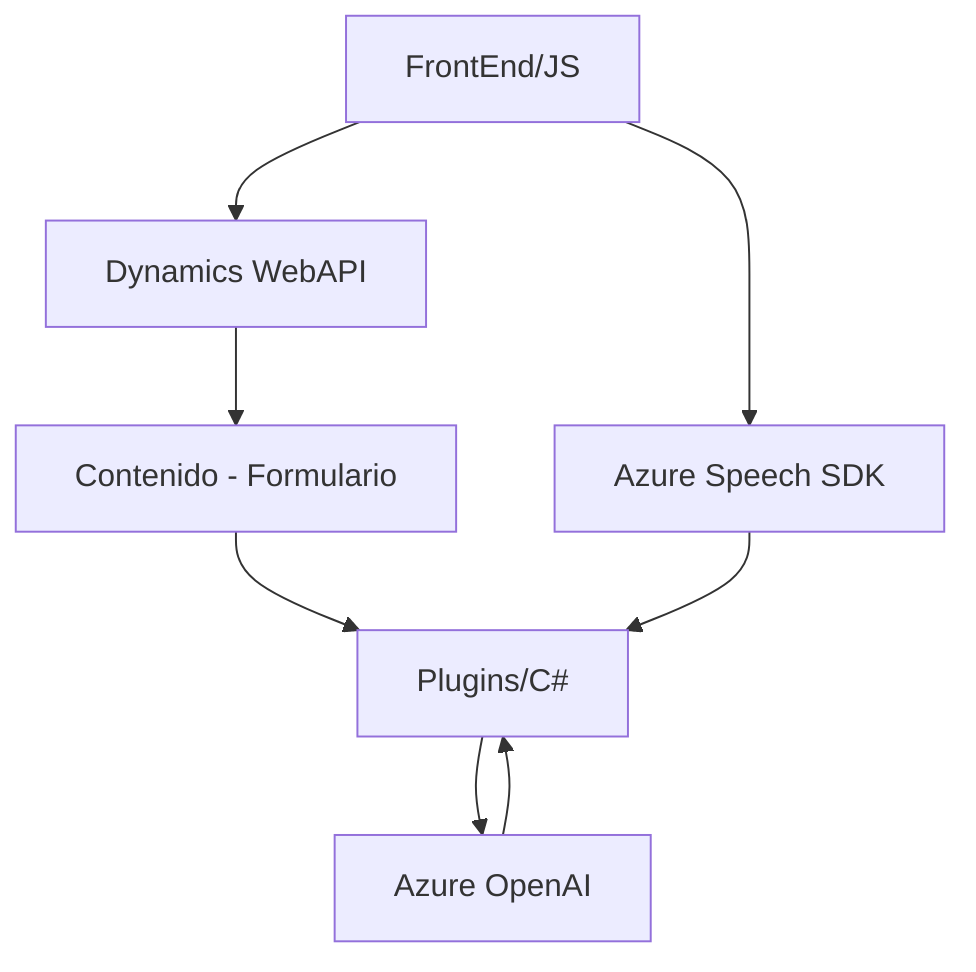

## Breve resumen técnico
El repositorio presenta una solución integrada con Microsoft Dynamics 365 y servicios de Azure que facilita el reconocimiento de voz, lectura de formularios y transformación de texto mediante IA. Los archivos se estructuran en tres partes principales: un frontend en JavaScript, un backend con un plugin en C#, y APIs de Azure para servicios de voz y procesamiento de texto.

---

## Descripción de arquitectura
La arquitectura de esta solución está basada en un **Patrón n4 (cuatro capas)**: Presentación (Frontend en JS), Lógica (manejo y transformación de datos mediante Azure/AI), Integración (backend Dynamics CRM vía Plugins) y Data (estructura interna de Dynamics 365). También podríamos considerar ciertos aspectos de patrones como **Microservicios** debido a la dependencia de servicios externos (Azure Speech SDK y Azure OpenAI).

Una descripción más específica:
1. **Frontend** (JavaScript): Procesa formularios con capacidad de sintetizar y reconocer texto a voz con Azure Speech SDK.
2. **Backend (Plugins en Dynamics)**: Utiliza `TransformTextWithAzureAI.cs` para extender las capacidades de texto con Azure OpenAI, transformándolo según reglas definidas.
3. **Integración Cloud**: Ambos módulos (frontend y backend) dependen directamente de **Azure Speech SDK** y **Azure OpenAI Service** para ofrecer capacidades avanzadas como procesamiento de voz e interpretación por IA.
4. **Evento y Callback**: Muchas operaciones son asíncronas y dependen de eventos disparados por el SDK.

---

## Tecnologías usadas
1. **Frontend**:
   - JavaScript.
   - Azure Speech SDK para reconocimiento y síntesis de voz.
   - Dynamics WebAPI (`Xrm.WebApi`) para integración con formularios.
   
2. **Backend**:
   - C#.
   - Microsoft Dynamics SDK (`Microsoft.Xrm.Sdk`) para ejecución de plugins.
   - Azure OpenAI (procesamiento avanzado de texto).
   - JSON (manejo de salida y entrada procesada).
   - HTTP para llamadas al servicio externo.

3. **Servicios externos dependientes**:
   - **Azure Speech SDK** (procesamiento de voz: síntesis y reconocimiento).
   - **Azure OpenAI API** (transformación avanzada de texto con IA).
   - Dynamics 365 API (manejo de datos en el CRM).

---

## Diagrama Mermaid

---

## Conclusión final
Este repositorio implementa una solución específica que utiliza servicios de Azure (IA y voz) para mejorar la interacción y procesamiento de formularios en Dynamics CRM. La arquitectura se basa en separación por capas n4, con fuerte modularidad y dependencia de APIs externas. La integración tanto en el frontend (JS) como en el backend (plugin C#) garantiza una solución bien distribuida para escenarios complejos como reconocimiento de voz, síntesis, y transformación mediante IA.