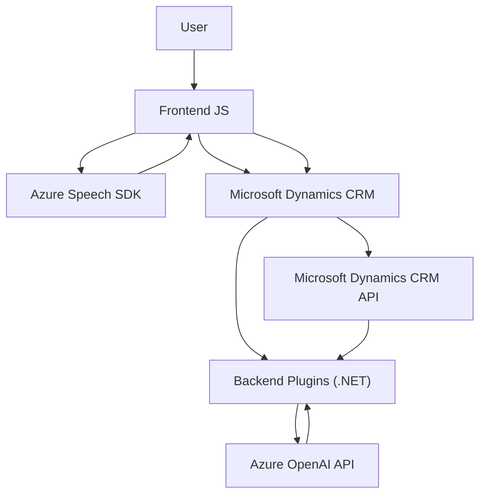

### Breve resumen técnico  
El repositorio en cuestión forma parte de una solución orientada a la interacción usuario-plataforma utilizando sistemas de reconocimiento y síntesis de voz. Se integra con Microsoft Dynamics CRM, el SDK de Azure Speech, y Azure OpenAI para transformar información textual y voz en datos procesables dentro de formularios dinámicos.  

---  
### Descripción de arquitectura  
La arquitectura del sistema es **multicapa con integración de servicios externos**, donde cada componente cumple roles específicos:  
1. **Frontend**: Implementa funcionalidad relacionada con interacción directa del usuario como síntesis y reconocimiento de voz (`readForm.js`, `speechForm.js`).  
2. **Backend**: Contiene lógica de negocio como plugins de Dynamics CRM y extensiones de Azure AI para transformación y manejo de datos (`TransformTextWithAzureAI.cs`).  
3. **Servicios externos**: Azure Speech SDK y Azure OpenAI actúan como puntos de integración para reconocimiento de voz, síntesis de voz y procesamiento de texto basado en IA.  
El diseño general refleja un patrón basado en **n-capas** con módulos altamente cohesivos que encapsulan lógica específica y promueven la separación de responsabilidades.  

### Tecnologías usadas  
1. **Frontend**:  
   - **JavaScript**: Para integración de SDKs y manipulación de APIs del CRM.  
   - Azure Speech SDK (dinámico desde navegador): Para la síntesis y reconocimiento de voz.  

2. **Backend**:  
   - **C#** en plugins de Dynamics CRM: Para extensibilidad de la plataforma.  
   - **Azure OpenAI API**: Envío de solicitudes HTTP para transformar texto basado en reglas inteligentes.  
   - **Microsoft.Xrm.Sdk**: Interacción con API de organización de Dynamics CRM.  
   - Dependencias comunes como `Newtonsoft.Json` y `System.Text.Json`.  

3. **Servicio externo**:  
   - Integraciones con `Azure Speech SDK` y `Azure OpenAI API`.  

### Dependencias y componentes externos  
1. **Azure Speech SDK** y API (para reconocimiento y síntesis de voz).  
2. **Azure OpenAI API** (para procesamiento avanzado de texto con inteligencia artificial).  
3. **Microsoft Dynamics CRM Environment**: Extensibilidad mediante plugins y APIs (como `IPluginExecutionContext`, `Xrm.WebApi`).  
4. **Standard .NET libraries**: Manejo de JSON y HTTP requests.  

---  
### Diagrama Mermaid válido para GitHub  

---  
### Conclusión final  
Este es un **sistema web avanzado de interacción con Dynamics CRM en una arquitectura multicapa** que utiliza Azure Speech SDK y Azure OpenAI para reconocimiento de voz, síntesis, y transformación de texto en datos procesables. Su integración con Dynamics CRM permite automatizar la actualización de formularios y usar inteligencia artificial como soporte para generar respuestas y realizar asignaciones.  

El diseño modular facilita el mantenimiento y escalabilidad, mientras que la arquitectura basada en servicios externos promueve una alta capacidad de integración con tecnología avanzada.