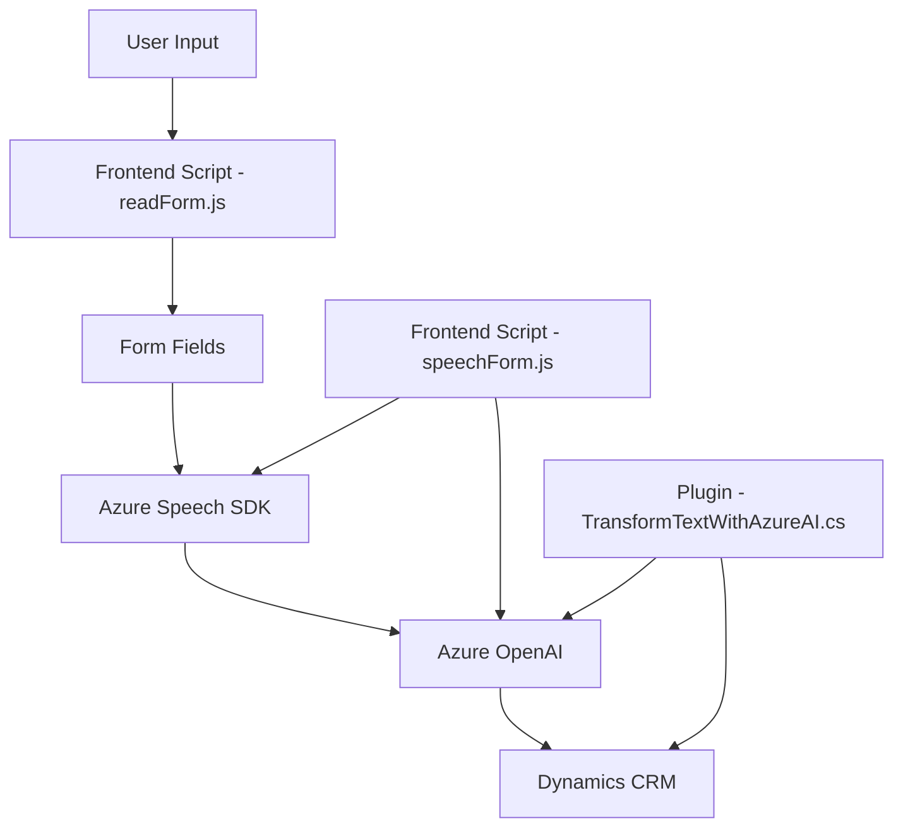

### Breve resumen técnico
El repositorio contiene tres componentes principales:  

1. **Frontend/JS/readForm.js**: Un script de JavaScript que lee datos de formularios y genera síntesis de voz usando el Azure Speech SDK.  
2. **Frontend/JS/speechForm.js**: Implementa funcionalidad de grabación, transcripción de voz y procesamiento para actualizar un formulario o interactuar con APIs personalizadas.  
3. **Plugins/TransformTextWithAzureAI.cs**: Un plugin de Dynamics CRM que utiliza Azure OpenAI para transformar texto y sus normas en JSON estructurado, integrándose con sistemas empresariales.

---

### Descripción de arquitectura
El sistema combina una **arquitectura híbrida**, donde se observan módulos de frontend (scripts JS) que interactúan directamente con APIs y SDKs para realizar tareas de síntesis y transcripción de voz, con un backend compuesto por un **plugin** en un sistema CRM, basado en la interfaz de extensibilidad `IPlugin`. Los componentes se comunican con servicios externos, como **Azure Speech SDK** y **Azure OpenAI**, integrados como microservicios.

Elementos principales:  
1. **Frontend API Integration**: Los scripts JS en el frontend interactúan directamente con Azure Speech SDK para tareas relacionadas con voz.  
2. **Plugin-based CRM Architecture**: El módulo `TransformTextWithAzureAI.cs` está diseñado para ejecutarse como parte de Dynamics CRM, realizando extensiones para el procesamiento avanzado de texto.  
3. **External Dependencies**: Uso de servicios de Azure (Speech SDK, OpenAI) y APIs personalizadas (Xrm.WebApi).

---

### Tecnologías usadas
1. **Frontend (JavaScript)**:
   - Azure Speech SDK: Para funcionalidades de síntesis y transcripción de audio a texto.  
   - Promesas (async/await): Gestión de operaciones asíncronas.  
   - Client-side Dynamics CRM (Xrm.WebApi): Manipulación y actualización de formularios CRM desde el navegador.

2. **Backend (C#.NET)**:
   - Microsoft Dynamics CRM SDK: Para plugins que extienden la lógica del sistema CRM.  
   - System.Net.Http: Comunicación HTTP con el servicio Azure OpenAI.  
   - Newtonsoft.Json: Procesamiento avanzado de JSON.  
   - Azure OpenAI Service: Uso del modelo `gpt-4o` para procesamiento del lenguaje natural.

---

### Diagrama Mermaid

---

### Conclusión final
Este repositorio presenta una solución altamente integrada que combina tecnologías de frontend (JavaScript) y backend (C#.NET) con dependencias de microservicios en Azure. La arquitectura es híbrida, con características de un sistema **multicapa** que interactúa con sistemas externos (Azure SDKs, Dynamics CRM) para procesar audio, texto y realizar operaciones asociadas. La elección de patrones como modularidad y APIs externas demuestra un enfoque moderno y escalable para casos de uso de procesamiento de voz y texto en tiempo real, dirigido hacia el desarrollo de aplicaciones empresariales.