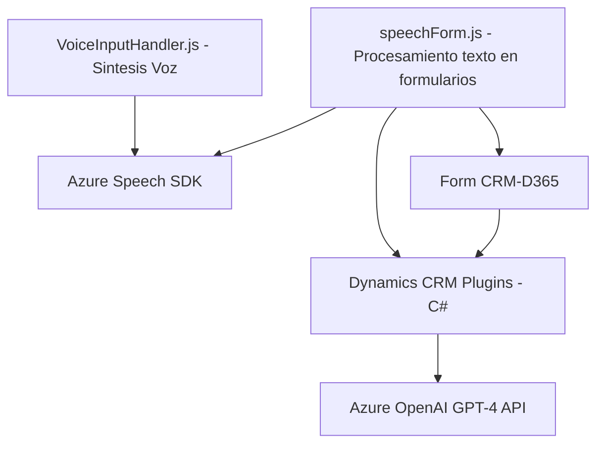

### Breve Resumen Técnico:
El repositorio presenta archivos que implementan funcionalidades relacionadas con la interacción de la voz, formularios en la web y Dynamics CRM mediante la integración con external APIs como **Azure Speech SDK** y **Azure OpenAI GPT-4**. Cada componente tiene un propósito modular con interoperabilidad, destacándose en la transformación de datos, procesamiento de voz y su aplicación en formularios.

### Descripción de Arquitectura:
La arquitectura utilizada parece estar basada en el **estilo de arquitectura modular**, donde cada componente dentro del repositorio tiene una responsabilidad específica. Además, existen integraciones con múltiples servicios de Azure (Azure Speech y Azure OpenAI). Esto permite escalar e implementar funcionalidades como:* procesar texto mediante IA*, realizar síntesis de voz y gestionar atributos dinámicos en aplicaciones de formularios (CRM Dynamics).

A nivel de archivos, identifica patrones por funcionalidad:
1. **Frontend:** Modular con funciones específicas para integración con SDKs. La arquitectura implementa una variación de diseño n-capas o capa de presentación, aumentando la flexibilidad.
2. **Plugin:** Implementa un patrón basado en **Hexagonal Architecture** (puerto-adaptador), asegurando independencia del Core CRM cuando se interactúa con APIs externas como OpenAI.
  
### Tecnologías Usadas:
1. **Frontend (JavaScript):**
   - **Azure Speech SDK** (para síntesis y reconocimiento de voz).
   - **ES6+ JavaScript**: Sintaxis moderna con promesas para procesos asíncronos.
   - **Fetch y XRM WebAPI**: Integración directa con APIs de Dynamics CRM.
   - **Dynamic Object Field Mapper:** Interacción con formularios D365.
2. **Backend (Plugins - C#):**
   - **Dynamics CRM APIs (Microsoft.Xrm.Sdk)**: Extensiones del CRM.
   - **Azure OpenAI GPT-4 API:** Integración RESTful para transformación texto-to-JSON.
   - **System.Net.Http**: Para REST API Calls.
   - **JSON Handling Libraries (System.Text.Json, Newtonsoft.Json)**.
3. Patrones:
   - **Modular design** en frontend.
   - **Facade Pattern** para encapsular interacción con APIs externas (Backend).
   - **Callback Based Programming.**
   - **Hexagonal Architecture** para máximo desacoplamiento (en plugin con CRM y Azure OpenAI).

### Diagrama Mermaid

### Conclusión Final:
El repositorio presenta una solución integral y bien estructurada para gestión de voz, formularios y procesamiento text-to-voice con integración en una solución Dynamics CRM. La arquitectura, aunque modular, muestra un uso combinado de patrones funcionales en el frontend y un enfoque desacoplado en el plugin del backend. Esto permite escalabilidad y reutilización del código, destacándose en la integración con servicios avanzados IA como **Azure OpenAI GPT-4 API**.

Este diseño es adecuado para aplicaciones que requieren alta conectividad con APIs externas, especialmente cuando se trabaja en un entorno empresarial de Microsoft Dynamics CRM. Sin embargo, es crucial que mejores prácticas de seguridad, como el manejo de claves API, sean implementadas para proteger información sensible.