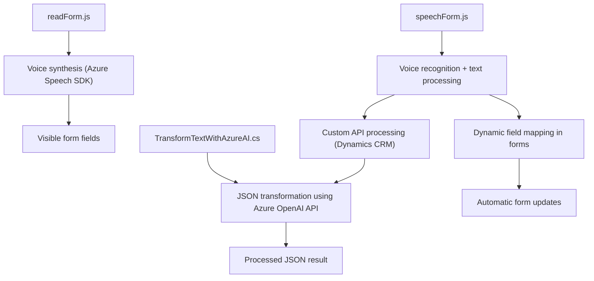

### Breve Resumen Técnico:
El repositorio analiza tres componentes esenciales para una solución que combina capacidades de reconocimiento y síntesis de voz, procesamiento de datos de formularios dinámicos y transformación de texto basado en inteligencia artificial utilizando APIs de Azure (Azure Speech SDK y Azure OpenAI). Está diseñado, principalmente, para integrarse con sistemas como Microsoft Dynamics CRM y enriquecer la experiencia del usuario a través de funciones inteligentes (entrada/salida de voz y manipulación automatizada de formularios).

---

### Descripción de Arquitectura:
La solución emplea una **arquitectura de n capas**:
1. **Capa de presentación**: Los archivos `readForm.js` y `speechForm.js` implementan funcionalidades de integración con la interfaz de usuario mediante formularios dinámicos (en Dynamics CRM), además de ofrecer entrada/salida por voz usando el SDK de Azure.
2. **Capa de lógica de negocio**: El plugin `TransformTextWithAzureAI.cs` se encarga de procesar y transformar textos con reglas específicas utilizando Azure OpenAI, aportando una capa adicional de inteligencia sobre la información reconocida.
3. **Capa de integración con servicios externos**: Ambas capas interactúan con microservicios (SDK de Azure Speech, Azure OpenAI), lo cual permite la interacción eficiente entre la UI, los servicios cognitivos y el procesamiento lógico en Dynamics CRM.

---

### Tecnologías Usadas:
1. **Frontend (JavaScript)**:
   - **Azure Speech SDK**: Reconocimiento de entrada de voz y síntesis de texto a voz.
   - **Dynamic UI operations**: El código interactúa directamente con formularios de Dynamics CRM (`executionContext`, `formContext`).

2. **Backend (C#)**:
   - **Microsoft Dynamics CRM SDK**: Interfaz de extensibilidad mediante plugins personalizados para el sistema CRM.
   - **Azure OpenAI Service**: Consumo de API mediante HTTP para transformar texto en JSON estructurado.
   - **Libraries**: Uso de `Newtonsoft.Json`, `System.Text.Json` y `System.Net.Http`.

3. **Patrones y buenas prácticas**:
   - Modularidad de funciones.
   - Delegación de responsabilidades (lógica encapsulada en funciones específicas).
   - Integración con servicios externos mediante SDKs y APIs.
   - Uso efectivo de dinámicas en formularios en sistemas CRM.

---

### Diagrama Mermaid:

---

### Conclusión Final:
Este repositorio representa una solución integrada para interfaces de usuario dinámicas en Microsoft Dynamics CRM, con capacidades ampliadas por inteligencia artificial y servicios cognitivos. Su arquitectura modular y basada en n capas permite una separación de responsabilidades, facilidad para integrarse con microservicios externos y escalabilidad. Las tecnologías (Azure Speech SDK, Microsoft Dynamics CRM SDK, Azure OpenAI) y los patrones aplicados reflejan un diseño moderno, versátil y orientado a la interoperabilidad.