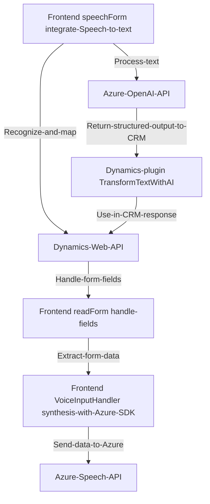

### Breve resumen técnico:
Este repositorio contiene la estructura de una solución que integra varias tecnologías para realizar procesamiento avanzado de texto y voz. En particular, se enfoca en funciones ligadas a APIs externas como Azure Speech SDK y Azure OpenAI, y en la interacción con formularios CRM (Dynamics 365). Los diferentes módulos trabajan para mapear datos de formularios, realizar sintetización/transformación de texto y ejecutar acciones basadas en IA.

---

### Descripción de la arquitectura:
La solución implementa una arquitectura **modular basada en capas (n capas)**. Esta permite segregar responsabilidades en distintos niveles:
1. **Frontend**: Implementación de funciones JavaScript para interactuar con el usuario y los servicios externos (SDK de Azure Speech, reconocimiento de voz).
2. **Backend (Plugins)**: Extensiones en Dynamics CRM (C#) que integran procesamiento con servicios como Azure OpenAI para transformar textos.
3. **Servicios externos**: Consumo de APIs remotas (Azure Speech, Azure OpenAI) para ejecutar funcionalidades avanzadas como reconocimiento de voz y procesamiento de lenguaje natural con IA.

En este contexto, el sistema utiliza un **SOA (arquitectura orientada a servicios)** con múltiples dependencias externas (Azure APIs), complementado por la implementación de plugins/modularidad en Dynamics CRM.

---

### Tecnologías, frameworks y patrones utilizados:
1. **Frontend**:
   - JavaScript: Para gestionar la lógica del formulario y realizar el reconocimiento de voz.
   - Integración con **Azure Speech SDK** para la síntesis y el reconocimiento de voz.
   - Uso de funciones JavaScript con manejo de eventos asincrónicos y promesas.
   - Callback para carga dinámica del SDK.

2. **Backend (Plugins)**:
   - C# con Microsoft Dynamics SDK: Para extender la funcionalidad del CRM con procesamiento de texto.
   - Consumo de **Azure OpenAI API** mediante HTTP Requests.
   - Uso de JSON Serialization Libraries como `System.Text.Json` y `Newtonsoft.Json.Linq`.

3. **Patrones y principios**:
   - **Single Responsibility Principle**: Cada archivo tiene una función específica dentro del flujo completo de la solución.
   - **Service-Oriented Architecture (SOA)**: Integración con servicios de Microsoft Azure.
   - **Modular programming**: División de roles y responsabilidades por función/módulo (lectura de formulario, síntesis de voz, procesamiento con IA).
   - **Error Handling Practices**: Manejo de excepciones codificado en JavaScript y C#.

---

### Dependencias o componentes externos:
1. **Azure Speech SDK**:
   - Responsable de la integración de la síntesis y transcripción de voz en el frontend.
   - Dinámicamente cargado desde `https://aka.ms/csspeech/jsbrowserpackageraw`.

2. **Azure OpenAI**:
   - Utilizado en los plugins C# para transformar texto basado en normas predefinidas.
   - Requiere acceso a un modelo GPT (como `gpt-4o`) a través de la API de Azure.

3. **Dynamics 365 CRM Web API**:
   - Maneja interacciones como la asignación de datos a los formularios y búsqueda en entidades con referencias a datos relacionados.

4. Otros:
   - `System.Net.Http`: Para solicitudes HTTP desde los plugins C#.
   - `Newtonsoft.Json.Linq`: Para estructurar datos en JSON.

---

### Diagrama Mermaid válido para GitHub Markdown:

---

### Conclusión final:
Este repositorio representa un sistema basado en **n capas con integración a servicios externos y plugins backend en Dynamics CRM**. Combina las capacidades de síntesis de voz, reconocimiento gracias a Azure Speech SDK y procesamiento de texto avanzado vía Azure OpenAI API. Está diseñado de forma modular, lo que facilita la extensión y el mantenimiento del código en un entorno empresarial.