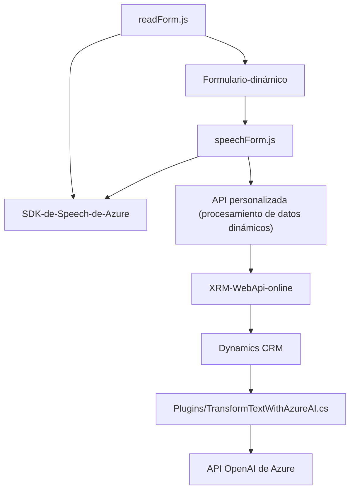

### Breve resumen técnico

El repositorio contiene una solución modular que integra reconocimiento de voz, síntesis de texto en voz, y transformación avanzada de texto en JSON mediante servicios de Microsoft Azure. Está compuesto por tres artefactos principales:

1. **Frontend (JavaScript):** Funcionalidades para interacción del usuario en formularios.
2. **Plugins (C#):** Extensiones para la plataforma Dynamics CRM, integradas con Azure OpenAI API y diseñadas para formateo y procesamiento de texto ingresado.
3. **Integración de APIs externas:** Uso del SDK de Azure Speech para manejar reconocimiento y síntesis de voz, junto con una API de Azure OpenAI para transformación de datos.

---

### Descripción de arquitectura

La solución sigue una arquitectura de **n capas** conformada por los siguientes bloques:

1. **Capa de presentación (Frontend):** Archivos JS como `readForm.js` y `speechForm.js` interactúan con formularios del cliente en navegadores y ofrecen funcionalidades de voz y texto.
2. **Capa lógica de negocio (Plugins):** Plugins escritos en C# como `TransformTextWithAzureAI.cs` procesan los datos transformados y los integran con la plataforma Dynamics CRM.
3. **Capa de APIs externas:** Utilización de Azure Speech SDK para voz y Azure OpenAI API para procesamiento avanzado de texto.
4. **Capa de servicios internos:** Manejo de datos dinámicos en la plataforma CRM con `IPluginExecutionContext`, junto con conexiones a `WebApi` y otras integraciones.

La modularidad evidente en la organización de funciones y clases indica un diseño básico pero bien estructurado, con separación de responsabilidades y empleo de servicios externos.

---

### Tecnologías usadas

1. **Lenguajes:**
   - **JavaScript:** Para funcionalidades en el frontend.
   - **C#:** Desarrollo de plugins para Dynamics CRM.

2. **Herramientas y Frameworks:**
   - **Azure Speech SDK:** Reconocimiento y síntesis de voz.
   - **Dynamics CRM SDK (Microsoft.Xrm.Sdk):** Gestión de datos en el sistema CRM.
   - **Azure OpenAI API:** Procesamiento avanzado de texto.

3. **Patrones:**
   - **Modularización:** Individualización de funciones con tareas específicas.
   - **Event-driven programming:** Uso de eventos y callbacks para gestionar la interacción usuario-servicio.
   - **External APIs:** Integración con servicios externos para delegar operaciones específicas (voz y texto).
   - **Singleton en el SDK:** Validación y carga única del Azure Speech SDK.
   - **Dynamic form processing:** Adaptación del frontend a los datos obtenidos de la IA o recogidos del usuario.

---

### Dependencias o componentes externos

1. **Azure Speech SDK:** Manejo dinámico del reconocimiento y síntesis de voz.
2. **Azure OpenAI API:** Transformaciones avanzadas mediante modelos GPT.
3. **APIs personalizadas:** Implementación de reglas de negocio sobre datos transmitidos desde el frontend.
4. **Dynamics CRM SDK:** Para obtención y almacenamiento de datos contextuales del sistema CRM.
5. **Sistemas de red:** Conexión vía `HttpClient` (C#) para interacción con servicios RESTful.

---

### Diagrama Mermaid válido para GitHub

---

### Conclusión final

El repositorio muestra una solución bien integrada diseñada para entornos empresariales donde Dynamics CRM es la herramienta principal. La estructura modular se adapta perfectamente a una arquitectura de **n capas**, con roles bien definidos para presentación, lógica de negocio, y servicios externos. El fuerte uso de APIs como Azure Speech SDK y Azure OpenAI refleja un enfoque moderno basado en servicios externos para funcionalidades avanzadas. La implementación podría beneficiarse de la externalización de configuraciones sensibles como claves de API y endpoints.

Considerando las reglas y dependencias implicadas, esta solución está orientada hacia entornos corporativos con una alta integración entre **frontend**, **backend (Plugins)** y **APIs avanzadas basadas en la nube**.