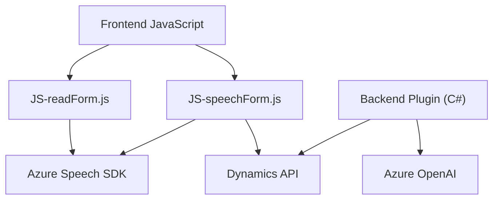

### Breve Resumen Técnico
El repositorio busca habilitar la interacción accesible entre formularios web basados en Dynamics y servicios de reconocimiento de voz, síntesis y procesamiento de datos a través de Azure Speech SDK y Azure OpenAI API. Está compuesto por tres módulos principales: dos archivos JavaScript para frontend y uno backend (C# plugin) para Dynamics CRM. Estas piezas trabajan de forma conjunta para brindar accesibilidad, procesar entradas de voz y transformar datos según la lógica definida.

---

### Descripción de Arquitectura
La solución sigue una **arquitectura de integración de servicios basada en cliente-servidor**:
1. **Frontend (JavaScript)**:
   - Componente de entrada de voz y síntesis que utiliza el navegador para integrarse con Azure Speech SDK.
   - Módulo que interpreta y transforma la voz en datos estructurados en formularios de Dynamics.
   - Módulos están organizados como archivos separados que interactúan funcionalmente con Azure SDK y Dynamics API.

2. **Backend (C#)**:
   - Plugin para **Dynamics CRM** que utiliza Azure OpenAI API para transformar texto en formato JSON (procesos IA).
   - Se implementa siguiendo el **Plugin Pattern** del SDK de Dynamics.

El diseño propone procesos modulares y escalables divididos en cliente y servidor. Utiliza una combinación de **patrones de integración de servicios**, **callback functions**, y el estándar de Dynamics CRM y plugins.

---

### Tecnologías Usadas
- **Azure Speech SDK**: Servicios de entrada de voz y síntesis de texto a voz que se integran en frontend.
- **Dynamics CRM Web API**: Framework RESTful para manipular datos y formularios en el entorno de Dynamics.
- **Azure OpenAI API**: Servicios de transformación inteligente de texto usando IA.
- **Microsoft Dynamics SDK (.NET)**: Utilizado por plugins backend para comunicación con CRM.
- **JavaScript**: Manejo y procesamiento en frontend interactivo.
- **C#/.NET**: Backend para lógica de negocio extendida y conexión con Azure.

---

### Diagrama Mermaid 100 % Compatible con GitHub Markdown

---

### Conclusión Final
Esta solución se centra en la accesibilidad, interacción con voz y procesamiento basado en IA para formularios de Dynamics. Siguiendo una arquitectura **cliente-servidor** con integración directa en servicios externos (Azure Speech y OpenAI), la solución ofrece extensibilidad para futuros módulos. Es apta para escenarios de CRM conectados con funcionalidades avanzadas de accesibilidad y automatización. Aunque modular, sigue un enfoque parcial de **arquitectura n-capas** con un backend complementado por plugins de Dynamics y un frontend integrado con servicios de Azure.