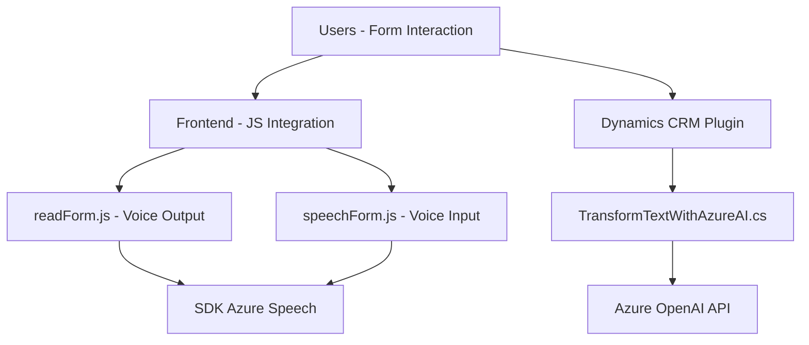

### Breve resumen técnico
El repositorio contiene tres aspectos principales:
1. **Archivos front-end (`readForm.js` y `speechForm.js`)**: Implementan una integración basada en voz mediante el SDK de Azure Speech, facilitando entrada y salida de datos y aplicando accesibilidad en los formularios. Incluyen manipulación de DOM y funciones de integración con servicios externos.
2. **Archivo back-end (`TransformTextWithAzureAI.cs`)**: Define un plugin para Dynamics CRM que utiliza Azure OpenAI para transformar texto, integrándose en el ecosistema del CRM como un proceso de back-office con procesamiento de datos.

---

### Descripción de arquitectura
La arquitectura del repositorio tiene características híbridas:
1. **Frontend**:
   - Es modular y organizado como una capa de interacción con el usuario. Usa el patrón de *event-driven programming* para gestionar acciones por voz y manipular datos en formularios.
   - Utiliza integración con SDKs de Azure Speech para síntesis y reconocimiento de voz, y procesamiento basado en IA.

2. **Backend**:
   - Utiliza una capacidad de extensibilidad de Dynamics CRM (patrón plugin), que acopla funcionalidades específicas en términos de ejecución.
   - Las solicitudes externas al servicio de Azure OpenAI son realizadas mediante comunicación HTTP desde el servidor CRM.

3. **Arquitectura general del sistema**: Arquitectura de **n capas** donde hay una separación entre:
   - Capa de presentación (frontend).
   - Capa de lógica de negocio (plugin de CRM).
   - Servicios externos de terceros como Azure Speech y Azure OpenAI para reconocimiento de voz e IA.

---

### Tecnologías usadas
1. **Frontend (JavaScript)**:
   - SDK de Azure Speech como dependencia clave para síntesis y reconocimiento de voz.
   - DOM Manipulation para integración con formularios web (CRM).
   - Promises para control de asincronía en llamadas API.

2. **Backend (.NET)**:
   - Dynamics CRM SDK: `Microsoft.Xrm.Sdk`.
   - Azure OpenAI: API para el modelo GPT-4.
   - Comunicación HTTP: `System.Net.Http` para solicitudes externas.
   - Serialización/Deserialización JSON: `System.Text.Json` y `Newtonsoft.Json.Linq`.

---

### Diagrama Mermaid válido para GitHub

---

### Conclusión final
El repositorio presenta dos capas interconectadas pero independientes:
1. **Frontend accesibilidad basada en voz**: Mejorando la interacción de usuarios con formularios en sistemas CRM mediante síntesis y reconocimiento de voz (Azure SDK).
2. **Backend inteligencia avanzada**: Usando un plugin de Dynamics CRM para transformar textos con el modelo GPT-4 de OpenAI.

La integración con APIs externas y el uso del diseño modular hace que este repositorio esté orientado a adaptar y mejorar el uso de tecnologías modernas en un ecosistema empresarial.