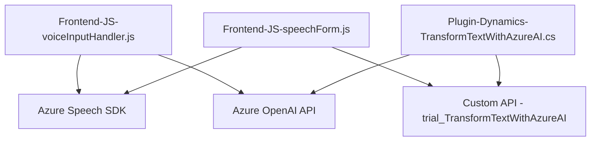

### Breve resumen técnico:
Este repositorio forma parte de una solución integrada que combina un **frontend JavaScript** y plugins en **Microsoft Dynamics CRM**, con soporte para servicios **Azure Speech SDK** y **Azure OpenAI**. El objetivo es procesar datos de formularios mediante interacción de voz y convertirlos en objetos JSON estructurados para su manipulación en el CRM.

---

### Descripción de arquitectura:
La arquitectura sigue el patrón **n-capas**, donde el frontend JavaScript actúa como capa de interacción con el usuario, los plugins son parte de la capa de lógica empresarial en Dynamics CRM, y los servicios de Azure (Speech SDK y OpenAI) cumplen funciones en la capa de integración tecnológica y servicios externos. La solución posee modularidad, con separación clara entre funcionalidades como entrada de voz, destino del procesamiento (formulario), y transformación del texto en formato estructurado utilizando plugins y APIs externas.

---

### Tecnologías usadas:
1. **Frontend**:
   - **JavaScript**: Desarrollo modular para manipulación de eventos y datos del formulario.
   - **Azure Speech SDK**: Para interacción vocal (síntesis de voz y transcripción).
   - **Browser APIs**: Manipulación de DOM y eventos del navegador.
   - **Custom API**: Llamadas a una API personalizada para procesamiento avanzado.

2. **Backend**:
   - **C# Plugins para Dynamics CRM**:
     - Uso del SDK de Dynamics CRM (`Microsoft.Xrm.Sdk`) para lógica empresarial.
     - Integración directa con **Azure OpenAI API** para transformación inteligente de texto.
   - **Azure OpenAI**: Procesamiento avanzado de texto mediante GPT.

3. **Servicios Externos**:
   - Azure Speech SDK (JavaScript API & browser loader).
   - Azure OpenAI para comunicación y generación de JSON basado en reglas definidas.

---

### Diagrama Mermaid válido para GitHub:

---

### Conclusión final:
La solución presentada organiza una arquitectura basada en **n-capas** con fuerte dependencia de servicios externos como **Azure Speech SDK** y **Azure OpenAI**. El frontend JavaScript y el uso de plugins dentro de Dynamics CRM muestran un diseño robusto y modular, enfocado en la manipulación dinámica de formularios mediante entrada de voz y procesamiento avanzado. Sin embargo, se recomienda mejorar la seguridad de las integraciones asegurando que las claves de API no estén directamente expuestas en el código y que se configure un sistema de secretos para su gestión.