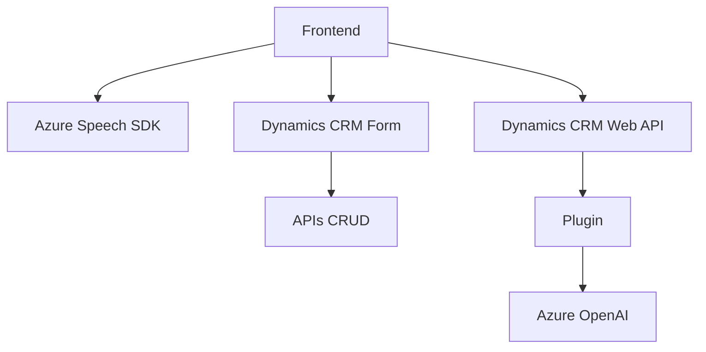

## Breve resumen técnico
El repositorio contiene archivos con implementación del lado del cliente (frontend) para manipulación de formularios en Dynamics CRM y un plugin del lado del servidor para realizar procesamiento avanzado de texto con Azure OpenAI. La solución permite funcionalidad de entrada y salida de voz, interacción con formularios en Dynamics CRM, y transformación de datos mediante IA.

---

## Descripción de arquitectura
La arquitectura detectada combina elementos de **n capas** y **microservicios**. Mientras que el frontend se organiza en una capa clara de presentación basada en la interacción con formularios y Azure Speech SDK, el plugin del lado del servidor funciona como una capa de negocio que delega procesamiento avanzado de texto a una API externa (Azure OpenAI). La integración con Dynamics CRM y Azure Speech SDK refuerza un enfoque de **arquitectura basada en servicios**.

---

## Tecnologías usadas
1. **Frontend**:
   - **JavaScript**
   - **Azure Speech SDK**: Para conversión de texto a voz y reconocimiento de voz.
   - APIs nativas de Dynamics CRM para manipulación de formularios.

2. **Backend (plugin)**:
   - **C#**
   - **Microsoft Dynamics CRM SDK**: Para crear plugins que extienden la funcionalidad nativa de CRM.
   - **Azure OpenAI via REST APIs**: Para procesamiento de texto (uso de GPT o similar).
   - **Newtonsoft.Json**: Para manipulación de JSON.

3. **Patrones**:
   - **N capas**: Separación de responsabilidades entre frontend y backend.
   - **Carga dinámica de dependencias**: En el frontend, se cargan bibliotecas como el SDK de Azure Speech bajo demanda.
   - **Microservicios**: Uso de APIs externas como Azure OpenAI para modularizar el procesamiento de texto.

---

## Diagrama Mermaid válido para GitHub

---

## Conclusión final
La solución muestra un diseño claro y extiende la funcionalidad de Dynamics CRM con capacidades innovadoras como síntesis y entrada de voz utilizando Azure Speech SDK, así como procesamiento avanzado de texto con Azure OpenAI. La arquitectura combina enfoque **n capas** en la relación entre el frontend y backend del sistema CRM, con un apoyo parcial en **microservicios** para delegar tareas computacionalmente intensivas (IA). El uso de servicios externos como Azure Speech SDK y Azure OpenAI sugiere que la solución es flexible y escalable.