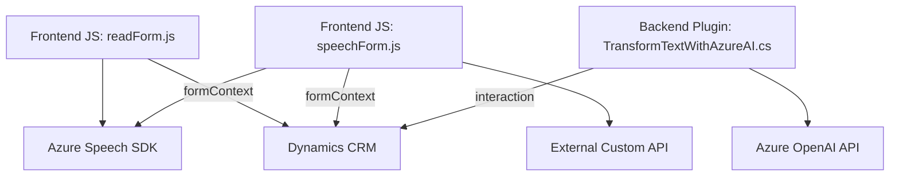

# Análisis Técnico Completo

## Breve Resumen Técnico
El repositorio contiene tres archivos que implementan funcionalidades relacionadas con la integración de voz y procesamiento de texto en aplicaciones desarrolladas sobre Dynamics CRM. Estas funcionalidades hacen uso del **Azure Speech SDK** para entrada/salida de voz y del **Azure OpenAI API** para procesamiento avanzado de texto, incorporando además lógica específica para interactuar con formularios y realizar transformaciones de datos.

## Descripción de Arquitectura
Este sistema se configura bajo una **arquitectura modular orientada a servicios**, donde cada archivo desempeña un rol especializado:
1. **Frontend/JS/readForm.js**: Responsable de la síntesis de voz, transformando datos del formulario dinámico en texto legible y reproduciéndolo mediante el Azure Speech SDK.
2. **Frontend/JS/speechForm.js**: Facilita la entrada de voz mediante el Azure Speech SDK, mapeando valores reconocidos hacia un formulario en Dynamics CRM. Adopta adicionalmente el uso de APIs personalizadas e integración con IA externa para enriquecer el procesamiento de texto.
3. **Plugins/TransformTextWithAzureAI.cs**: Un plugin que expande la funcionalidad del CRM, permitiendo transformar texto utilizando el modelo GPT-4 desplegado en la Azure OpenAI API, proporcionado como respuesta estructurada en formato JSON.

La arquitectura está diseñada para integrar tecnologías externas y manejar eventos específicos (procesos de voz y transformación de texto). En términos generales:
- **Frontend**: Modularidad con funciones reutilizables y orientadas a tareas específicas (procesamiento de formularios, síntesis de voz, entrada de voz, etc.).
- **Backend/Plugins**: Sigue el patrón de plugins de Dynamics CRM y está configurado para ser extensible mediante la integración de APIs externas.
- **Patron Cliente-Servidor**: El frontend establece comunicación directa con APIs externas mientras que el backend actúa como intermediario para Dynamics CRM.
- **Elementos de Carga Dinámica**: El SDK de Azure Speech se integra de forma dinámica, optimizando el uso de recursos y asegurando que solo se cargue cuando es necesario.

## Tecnologías Usadas
1. **Frontend**:
   - **Azure Speech SDK**: Para síntesis y reconocimiento de voz.
   - **HTML/JS (ECMAScript)**: Estructura principal del frontend, incluyendo manipulación DOM, Promises, y uso intensivo de `async/await`.
   - **Dynamic Behavior**: Carga script del SDK en tiempo de ejecución y adapta funciones según datos dinámicos de formularios.

2. **Backend (Plugins)**:
   - **Microsoft.Xrm.Sdk**: Para la integración con Dynamics CRM como plugin.
   - **Azure OpenAI API**: Utilizada para procesamiento avanzado de texto mediante modelos de lenguaje.
   - **HTTP Client Libraries**: Para comunicación con servicios REST de Azure.
   - **JSON Serialization**: Procesamiento de respuestas estructuradas utilizando System.Text.Json.

3. **Patrones de Diseño**:
   - Event-driven Architecture.
   - Modular Design.
   - Encapsulation.
   - Plugin Pattern.

## Dependencias o Componentes Externos
1. **Azure Speech SDK**: Sistema de entrada y salida de voz para procesamiento en el frontend.
2. **Azure OpenAI API**: API para implementar GPT-4 o similar modelo de lenguaje.
3. **Dynamics CRM API**: Para manejar entidades y realizar operaciones internas en el CRM.
4. **Microsoft Libraries**: Incluyendo `Microsoft.Xrm.Sdk` para interacción segura con Dynamics Plugins.
5. **HTTP Clients**: Para consumir servicios REST externos, como APIs personalizadas o la OpenAI API.
6. **JSON Processing Libraries**: System.Text.Json para codificar respuestas JSON estructuradas.

## Diagrama **Mermaid**

## **Conclusión Final**
El repositorio implementa funcionalidades avanzadas para entrada y salida de voz y procesamiento de texto utilizando servicios de **Azure Speech SDK** y **Azure OpenAI API**, en el contexto de aplicaciones relacionadas con Dynamics CRM. La arquitectura es modular, basada en eventos y orientada a servicios, lo que facilita la extensibilidad y escalabilidad. Aunque algunos aspectos podrían optimizarse (como el manejo de asíncronía en el plugin), el diseño técnico está bien fundamentado para su propósito.