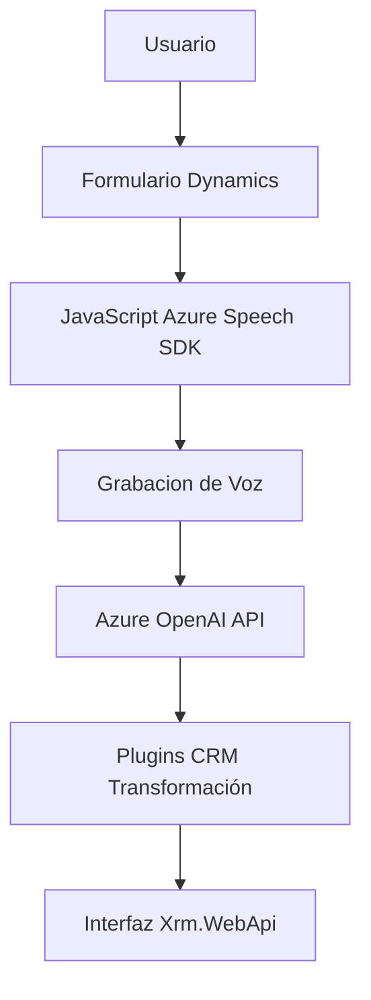

### Resumen Técnico
El repositorio en general contiene archivos que parecen estar distribuidos por diferentes áreas de una solución vinculada a la captación, análisis y transformación de datos vía entrada de voz y servicios de inteligencia artificial (Azure Speech SDK y Azure OpenAI API). Está diseñado para integrar capacidades de voz y procesamiento de texto en un contexto de formularios en Dynamics CRM, utilizando plugins y scripts integrados.

---

### Descripción de Arquitectura
La solución presenta una arquitectura híbrida:
1. **Modularidad Funcional**: Los scripts JavaScript y plugins están organizados por responsabilidades individuales. Esta separación favorece la reutilización y mantenibilidad.
2. **N-Capas**: La segmentación entre "Frontend" y "Plugins" sigue una separación lógica entre presentación y capa de negocio.
3. **Integración con Servicios Externos**: La carga dinámica del SDK y las llamadas a API reflejan un diseño orientado a la interacción con entornos externos (Azure y Dynamics 365).
4. **Patrones Observados**:
   - *Delegación*: Uso de callbacks para cargar dinamicamente SDK.
   - *Encapsulación*: Cada función encapsula un proceso definido (procesar texto, sintetizar voz, aplicar valores).
   - *Plugin-Oriented*: En el archivo de plugins se sigue el estándar de Microsoft Dynamics CRM.

---

### Tecnologías Usadas
1. **Frontend (JS)**
   - Azure Speech SDK: Reconocimiento y síntesis de voz.
   - Microsoft Dynamics (Xrm.WebApi): API para operaciones con formularios.
   - Uso de bibliotecas estándar (ej. DOM, JSON), sin frameworks de frontend externos.

2. **Backend (.NET/C# Plugin)**
   - Microsoft Dynamics CRM SDK (interfaz `IPlugin`).
   - IIS con soporte para plugins personalizados.
   - Azure OpenAI API: Transformación de texto con modelos GPT.
   - `Newtonsoft.Json.Linq`: Manipulación de respuestas JSON.

---

### Dependencias y Componentes Externos
1. **Azure Speech SDK**: Para entrada de voz, síntesis vocal y reconocimiento.
2. **Azure OpenAI API**: Para procesamiento de texto y generación estructurada.
3. **Xrm.WebApi**: Interacciones con formularios y datos de Dynamics CRM.
4. **Newtonsoft.Json**: Manejo de JSON en .NET.
5. **HTTP/Web Requests**: Comunicación bidireccional con APIs externas.

---

### Diagrama Mermaid

---

### Conclusión Final
La solución está basada en una arquitectura modular que combina frontend ligero con capacidad de procesamiento avanzada proporcionada por servicios de Azure. Con un diseño de N-capas y un fuerte enfoque en integración API, esta arquitectura maximiza las ventajas de servicios externos en combinación con una sólida infraestructura basada en Dynamics CRM. La estructuración de las funciones es clara y sigue principios de modularidad y responsabilidad única, facilitando la extensión y el mantenimiento.