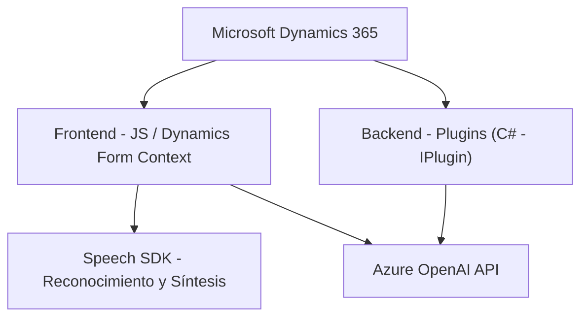

### Breve resumen técnico
El repositorio analizado contiene múltiples componentes que conforman una solución que integra funcionalidades avanzadas de inteligencia artificial (como síntesis y reconocimiento de voz) y su interacción con formularios en Dynamics 365. Los scripts de frontend se encargan de capturar entrada de audio, sintetizar texto a voz y procesar formularios, mientras que el plugin de backend conecta Dynamics 365 con el servicio de Azure OpenAI para realizar transformaciones de datos. La arquitectura parece orientada a expandir la usabilidad de Dynamics 365 con capacidades de IA inteligente y fluida.

---

### Descripción de la arquitectura
- **Arquitectura**: La solución implementa una arquitectura **n capas** con una separación clara entre capas frontend (interacción del cliente con el formulario y voz) y backend (plugin para procesamiento mediante Azure OpenAI y manejo de datos en Dynamics CRM).
- **Integraciones**:
  - Interfaz dinámica del cliente (Dynamics 365 Form Context API) y uso de SDKs en frontend.
  - Integración de plugins de Dynamics CRM para extender la lógica de negocio de los formularios hacia servicios externos.
  - Uso de Microsoft Azure Speech SDK para la síntesis de voz y reconocimiento de voz.
  - Integración con la API de Azure OpenAI para procesamiento avanzado del texto.
- **Patrones**:
  - Carga dinámica (Lazy Loading): En los scripts JS, el SDK de Speech se carga solo cuando es requerido.
  - Adapter Pattern: Transformación de datos de formularios y texto mediante lógica específica para compatibilidad con Dynamics 365.
  - Plugin Architecture: Los plugins de Dynamics CRM implementan `IPlugin` para personalizar las operaciones que se realizan dentro del sistema.

---

### Tecnologías usadas
- **Frontend**:
  - **JavaScript**: Para implementar lógica de síntesis de voz y reconocimiento de entrada por voz.
  - **Azure Speech SDK**: Realiza conversión texto-a-voz y reconocimiento de audio.
  - **Dynamics Form Context API**: Permite manipular datos internos del formulario y asignar valores dinámicamente.
- **Backend**:
  - **C# (Net Framework)**: Implementa lógica de plugins para Dynamics CRM.
  - **Azure OpenAI API**: Proporciona procesamiento y transformación de texto avanzado basado en IA.
  - **Newtonsoft.Json / System.Text.Json**: Serialización y manipulación de datos JSON.
  - **HTTP Requests**: Para comunicarse con servicios externos como Azure OpenAI.

---

### Dependencias o componentes externos que podrían estar presentes
1. **Servicios de Microsoft Azure**:
   - Speech SDK (síntesis de voz y reconocimiento).
   - Azure OpenAI API (procesamiento avanzado de texto).
2. **Dynamics CRM APIs**:
   - Dynamics WebAPI SDK para el modelo de datos y atributos de formularios.
   - Integración de plugins mediante el modelo `IPlugin`.
3. **Frameworks y librerías de C#**:
   - `Newtonsoft.Json` o `System.Text.Json` para tratamiento JSON.
   - `System.Net.Http` para llamadas a servicios web.
4. **Contexto Cliente**:
   - API de formularios de Dynamics 365 para acceder/modificar atributos y datos del formulario.

---

### Diagrama Mermaid
Representación gráfica de los componentes mencionados:

---

### Conclusión final
La solución está configurada como una arquitectura basada en **n capas**, con frontend y backend trabajando en conjunto mediante la integración de APIs de Dynamics CRM y Microsoft Azure. Utiliza patrones de adaptación para traducir datos entre las diferentes capas y un enfoque modular y orientado a la responsabilidad para desarrollar componentes desacoplados pero integrables. Es una solución bien diseñada para habilitar capacidades avanzadas de inteligencia artificial en entornos corporativos que hacen uso de Dynamics 365.