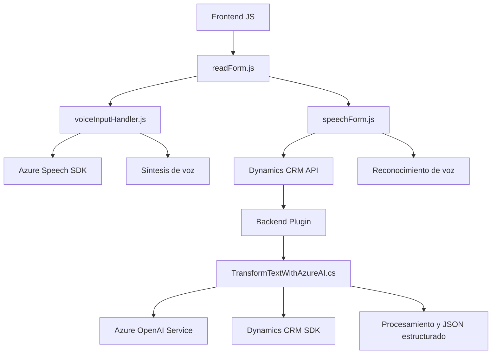

### Breve resumen técnico:
El repositorio presenta una implementación que combina una solución frontend en JavaScript y un plugin backend para Microsoft Dynamics CRM. Ambos interactúan con servicios de Azure (Speech SDK y OpenAI) para proporcionar accesibilidad (síntesis de voz en formularios) y procesamiento basado en IA (actualización de campos desde transcripciones de voz o texto estructurado).

---

### Descripción de la arquitectura:
La solución representa una arquitectura híbrida dividida en:
1. **Frontend**: Implementa funciones de accesibilidad y captura de voz con el **Azure Speech SDK** y APIs de Dynamics CRM relacionadas con formularios. Este módulo sigue una arquitectura de capas con lógica modular: obtención de datos, procesamiento, y presentación basada en síntesis de voz o transcripciones por IA.
2. **Backend**: Un plugin de Dynamics CRM, que utiliza un enfoque **API-driven** para transformar texto mediante **Azure OpenAI**, siguiendo el patrón típico de extensibilidad basado en `IPlugin`.
3. **Integración SOA**: Ambos módulos interactúan con servicios externos (Azure Speech SDK, Azure OpenAI) y dependen de APIs internas de Dynamics CRM.

---

### Tecnologías, frameworks y patrones usados:
**Tecnologías**:
- **Frontend**: Azure Speech SDK, Dynamics CRM API (JavaScript).
- **Backend**: Azure OpenAI, Dynamics CRM SDK (.NET).
- **General**: REST API, JSON.
  
**Frameworks y librerías**:
- `Microsoft.Xrm.Sdk`: Extensión del CRM.
- `Newtonsoft.Json.Linq` y `System.Text.Json`: Trabajando con JSON en el backend (plugin).

**Patrones**:
- **Frontend**: Cargador dinámico de SDK, patrón modular, interpretación de datos con adaptadores (`processTranscript`, `applyValueToField`).
- **Backend**: Plugin extensible (`IPlugin`), SOA, patrón Repository para operaciones con entidades de CRM.
- **Arquitectura**: El frontend presenta una arquitectura en capas mientras el backend sigue una arquitectura SOA integrándose con servicios externos y Dynamics CRM.

---

### Dependencias o componentes externos:
- **Azure Speech SDK**: Dinámicamente cargado en el frontend para reconocimiento y síntesis de voz.
- **Azure OpenAI Service**: Para procesamiento de texto en el backend (`TransformTextWithAzureAI.cs`).
- **Dynamics CRM API**: Se usa en ambos módulos (frontend para manejar campos de formularios y backend para ejecutar extensiones en eventos dinámicos).

---

### Diagrama Mermaid compatible con GitHub Markdown:

---

### Conclusión final:
Este repositorio implementa una solución de accesibilidad y procesamiento de datos basada en IA para formularios de Dynamics CRM. A nivel arquitectónico, combina un frontend de múltiples capas con procesamiento de voz y un backend basado en extensibilidad mediante plugins de Dynamics CRM. Destaca el uso de servicios de Azure (Speech SDK y OpenAI) para cubrir aspectos como accesibilidad y automatización impulsada por IA.

Se trata de una arquitectura **modular, híbrida y orientada a servicios** (SOA). La integración con servicios cloud y APIs internas de CRM es significativa, lo que posiciona esta solución como un buen ejemplo de desarrollo corporativo avanzado.