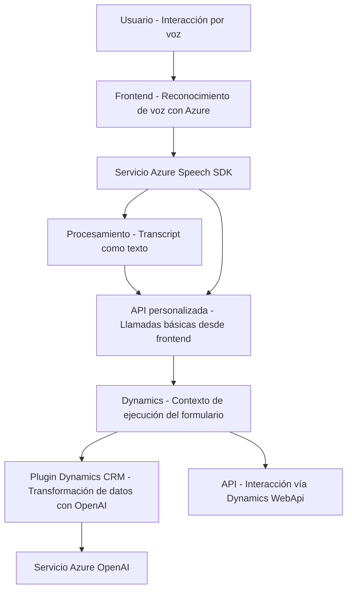

### **Resumen técnico**
La solución analizada es una aplicación enfocada en la interacción entre usuarios, reconocimiento de voz, y manipulación de datos en formularios dinámicos dentro de un ecosistema CRM, que además se conecta a servicios externos de Azure Speech y OpenAI para implementar funcionalidades avanzadas. El código del repositorio está orientado a convertir el reconocimiento de voz en acciones y transformaciones procesables mediante estos servicios y APIs.

---

### **Descripción de arquitectura**
La solución muestra una arquitectura **cliente-servidor**, con una combinación de un sistema frontend y lógica de plugins en Dynamics CRM. Los componentes del frontend están diseñados para capturar, procesar datos de voz, enviar información mediante APIs, y actualizar formularios en Dynamics. Por otro lado, los plugins en el servidor CRM interactúan con un servicio externo (Azure OpenAI) para la transformación de texto en objetos JSON estructurados.

El patrón dominante es **n capas**:
1. **Frontend**: Procesos que manejan la interfaz con el usuario, reconocimiento de voz, y procesamiento de transcripts en tiempo real.
2. **Capas en Dynamics CRM**: Plugins que representan la lógica de negocio, incluyendo interacciones con Azure AI.
3. **Servicios externos**: Azure AI y Speech SDK actúan como capas auxiliares externas.

También se pueden observar características de una arquitectura **orientada a servicios**, mediante APIs que conectan diferentes partes del sistema entre sí y con servicios externos.

---

### **Tecnologías usadas**
1. **Frontend**:
   - SDK: **Azure Speech SDK (JavaScript)** para reconocimiento de voz y síntesis de texto.
   - APIs de Dynamics 365: Conexión con CRM mediante `Xrm.WebApi`.
   - Microsoft Dynamics: Contexto de ejecución para formularios dinámicos.

2. **Backend**:
   - .NET Framework: Creación de plugins que extienden la funcionalidad de Dynamics CRM.
   - **Azure OpenAI Service**: Utilizado para la transformación de texto en JSON estructurado.
   - Bibliotecas adicionales:
     - `System.Text.Json` para manejar datos JSON.
     - `System.Net.Http` para solicitudes HTTP.

---

### **Diagrama Mermaid**

---

### **Conclusión final**
La solución implementa una aplicación que combina reconocimiento de voz en frontend, manipulación de datos en Dynamics CRM, e interacción con servicios avanzados de Azure (Speech y OpenAI). Está diseñada con una arquitectura **n capas** y maneja dependencias externas orientadas a servicios. Sin embargo, hay áreas de optimización en el manejo de excepciones y algunas dependencias sobrantes en el plugin del backend.

El diseño modular del frontend y lógico del backend facilita la evolución del sistema con futuras extensiones. Por otro lado, el uso de servicios integrados y estándares como SDKs de Azure permite una robustez que mejora la experiencia de usuario y la calidad del procesamiento de voz. Sin embargo, su dependencia en servicios externos como Azure puede ser un punto de vulnerabilidad en términos de disponibilidad y costos operativos.