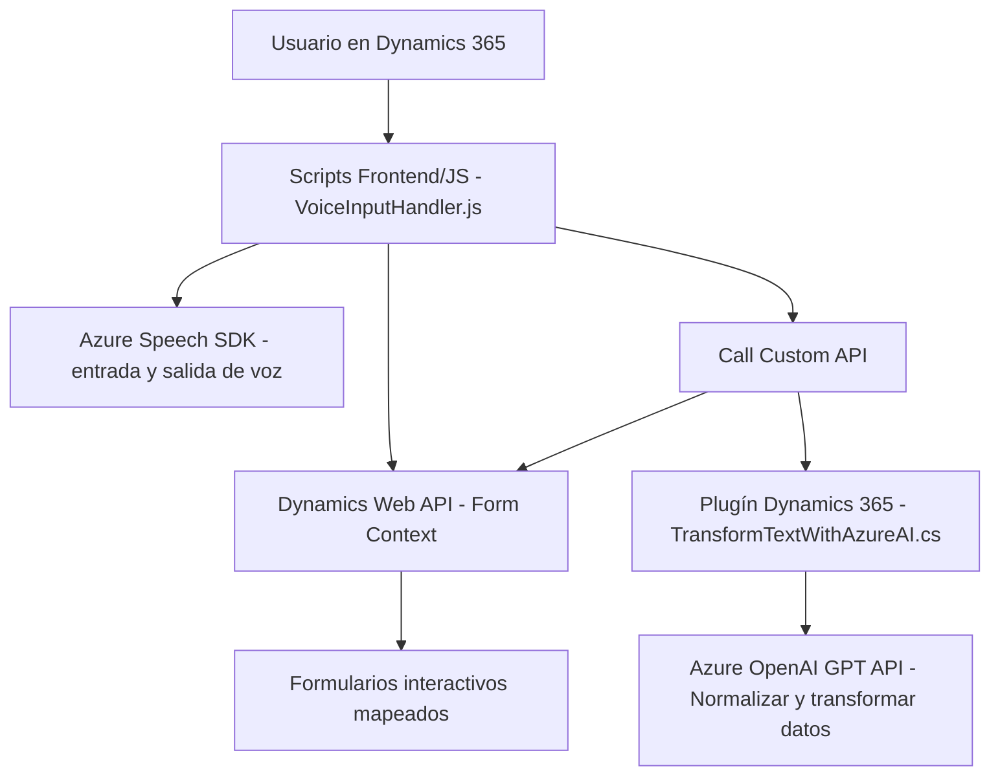

# Breve resumen técnico
El repositorio contiene una solución que se centra en implementar funcionalidades relacionadas con el reconocimiento y síntesis de voz a través de Azure Speech SDK, y el uso de Azure OpenAI Services. Los archivos están fragmentados para trabajar principalmente con formularios Dynamics 365, permitiendo interacción por voz con IA y procesamiento avanzado de datos. El proyecto es híbrido, combinando componentes frontend (JavaScript) y backend (.NET/C# Plugins).

---

# Descripción de arquitectura
### Tipo de arquitectura:
Se detecta una implementación de arquitectura **n-capas**, con componentes independientes para el frontend y el backend. El frontend (JavaScript) maneja la interfaz y la interacción directa de los usuarios con formularios, mientras que los plugins en backend (C#) procesan y transforman los datos mediante Azure OpenAI y Dynamics CRM.

### Organización:
1. **Frontend/JS**: Scripts JavaScript que integran con formularios de Dynamics 365 y Azure Speech SDK.
2. **Backend/Plugins**: Plugins que se ejecutan en Dynamics CRM y procesan interacciones más avanzadas con Azure OpenAI.

La solución también tiene elementos de servicio externo (Service-Oriented), donde Azure Speech SDK y Azure OpenAI actúan como componentes externos.

---

# Tecnologías usadas
### Frontend:
- **JavaScript ES6**: Lógica directa para manejar datos de formularios y sintetizar o reconocer texto mediante Azure Speech SDK.
- **Azure Speech SDK**: Para conversión de texto a voz, y para reconocimiento de voz.
- **Dynamics Web API:** Para acceder y modificar datos en formularios del CRM.

### Backend:
- **C# (.NET Framework)**:
  - Implementación de plugins con la interfaz `IPlugin` de Dynamics CRM.
  - HTTPClient para interactuar con la API de Azure OpenAI.
  - `Newtonsoft.Json` para manipulación de JSON.
- **Azure OpenAI GPT API**: Procesamiento avanzado de texto según normas definidas.

### Patrones detectados:
1. **N-capas**: División del proyecto entre UI (frontend/JS) y lógica de negocio (backend/plugins).
2. **Service-Oriented**: Integración con servicios de terceros como Azure Speech SDK y Azure OpenAI.
3. **Modularidad**: Segmentación en funciones específicas para responsabilidad única.
4. **Dynamic Loading**: Incorporación dinámica de SDKs necesarios en frontend (ej. Azure Speech SDK).

---

# Diagrama Mermaid válido

---

# Conclusión final
Este repositorio presenta una solución acorde a aplicaciones empresariales que requieren interacción por voz de usuarios con formularios en sistemas CRM, utilizando tecnologías punteras como Azure Speech SDK y Azure OpenAI. La arquitectura **n-capas** es adecuada para un escenario donde se distingue la interfaz de usuario (frontend) de la lógica de negocio (backend). Sin embargo, la solución podría beneficiarse de mejoras en seguridad (ej. externalización de claves API) y una estructura más desacoplada si se considerara una arquitectura más moderna como **hexagonal** para los plugins backend.